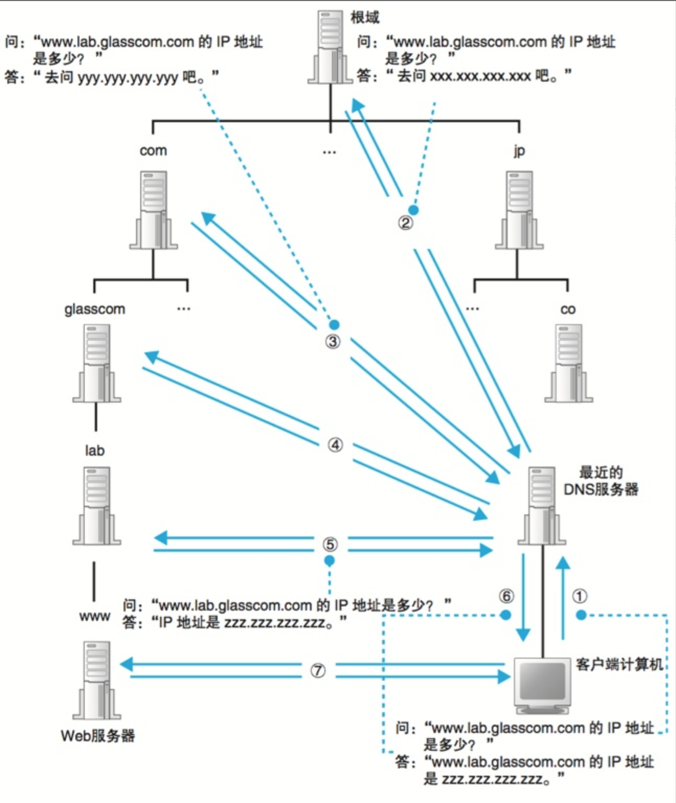

# 网络技术

### 浏览器工作原理

#### 浏览器格式化检查
  
浏览器对网址进行了格式化检验，首先确定这是一个有效的网址，才会进入下一步

#### DNS解析

##### 为什么需要DNS解析

DNS保存了互联网上所有域名与IP的映射关系，我们可以通过主机名获取对应主机的IP地址。那么为什么需要DNS解析这部分？这得分成两个子问题，为什么面向用户的部分需要使用域名，传输层却需要IP地址来标示一台主机。首先IP地址的长度为32比特(4字节），使用域名最少也要几十个字节，最长可达到255字节，如果传输层直接用域名增加了路由器的负担,传送数据也会花费更长的时间 ，整体效率很低。对于面向用户的应用层用IP地址来代替服务器名称也是能够正常工作的，但是,要记住一串由数字组成的IP地址显然难以记忆。

> 如果Web服务器使用了虚拟主机功能,有可能无法通过IP地址来访问。因为虚拟主机是寄存在服务器上的一个或多个没有实体的服务器，访问虚拟主机的域名的时候，先根据DNS解析的IP访问到实体主机，然后实体主机再根据域名把连接转发给对应的虚拟主机，DNS解析的IP只是实体主机的IP

##### DNS分层结构

我们日常解除的域名是分层的以 https://www.github.com/ 为例子: com 为顶级域名，github 为二级域名，www 为三级域名。相应的DNS结构也是采用分级树状系统创建域名数据库，从而提供域名解析服务。

- ****根域名服务器**** 是域名解析体系的核心，如果要查询域名，均需要从根域名服务器开始查询。全球 IPv4 的根域名服务器只有13台，1个为主根服务器，放置在美国。其余12个均为辅根服务器，其中9个放置在美国，欧洲2个位于英国和瑞典，亚洲1个，位于日本。实际上到目前为止，所谓的只有13台根域名服务器，只是逻辑上的，分别编号从a到m，而物理上的根域名服务器已远不止 13 台。可以通过如下网站查看根域名服务器网站分布情况[https://root-servers.org](https://root-servers.org)

- ****顶级域名服务器****
根域名服务器负责返回顶级域 (如 .com 等) 的权威域名服务器地址。在拿到顶级DNS服务器地址后，再向顶级域名服务器发起查询请求，其返回一级域 (如 example.com) 的权威域名服务器地址

- ****次级域名服务器****

##### DNS解析流程

  - [DNS域名解析解剖](https://zhuanlan.zhihu.com/p/86504259)
  - [DNS 原理入门](http://www.ruanyifeng.com/blog/2016/06/dns.html)
  - [DNS入门：域名解析流程详解](https://zhuanlan.zhihu.com/p/38499577)
  - [DNS 域名解析系统概述](https://blog.konghy.cn/2019/08/06/dns-overview/)
  - [DNS简单总结](https://github.com/hellorocky/blog/blob/master/network/5.dns%E7%AE%80%E5%8D%95%E6%80%BB%E7%BB%93.md)

#### 推荐文章：

- [当你在浏览器输入 baidu.com 并按下回车后发生了什么？](https://zhuanlan.zhihu.com/p/28262282)
- [当你在浏览器中输入了本站网址并回车后，产生了哪些技术步骤？](https://zhuanlan.zhihu.com/p/96505045)
- [在浏览器输入 URL 回车之后发生了什么](https://wsgzao.github.io/post/url/)
- [经典面试题：从 URL 输入到页面展现到底发生什么？](https://juejin.im/post/5c773dd251882519610194c1)
- [史上最全！图解浏览器的工作原理](https://www.infoq.cn/article/CS9-WZQlNR5h05HHDo1b)
- [图解浏览器的基本工作原理](https://zhuanlan.zhihu.com/p/47407398)
- [浏览器的工作原理](https://github.com/creeperyang/blog/issues/46)
- [深入浅出浏览器渲染原理](https://blog.fundebug.com/2019/01/03/understand-browser-rendering/)

#### HTTP、HTTPS、SPDY、HTTP2

- [HTTP 的前世今生：一次性搞懂 HTTP、HTTPS、SPDY、HTTP2](https://juejin.im/post/5be935f2e51d4570813b8cf0)

#### 浏览器原理

- [浏览器工作原理-webkit内核研究](https://juejin.im/entry/5a9a379af265da239d48c027)
- [深入剖析 WebKit](https://ming1016.github.io/2017/10/11/deeply-analyse-webkit/)

#### 网络分层

