# 计算机网络

### 浏览器工作原理


#### 浏览器格式化检查
  
浏览器对网址进行了格式化检验，首先确定这是一个有效的网址，才会进入下一步

#### DNS解析

##### 为什么需要DNS解析

DNS保存了互联网上所有域名与IP的映射关系，我们可以通过主机名获取对应主机的IP地址。那么为什么需要DNS解析这部分？这得分成两个子问题，为什么面向用户的部分需要使用域名，传输层却需要IP地址来标示一台主机。首先IP地址的长度为32比特(4字节），使用域名最少也要几十个字节，最长可达到255字节，如果传输层直接用域名增加了路由器的负担,传送数据也会花费更长的时间 ，整体效率很低。对于面向用户的应用层用IP地址来代替服务器名称也是能够正常工作的，但是,要记住一串由数字组成的IP地址显然难以记忆。

> 如果Web服务器使用了虚拟主机功能,有可能无法通过IP地址来访问。因为虚拟主机是寄存在服务器上的一个或多个没有实体的服务器，访问虚拟主机的域名的时候，先根据DNS解析的IP访问到实体主机，然后实体主机再根据域名把连接转发给对应的虚拟主机，DNS解析的IP只是实体主机的IP

##### DNS分层结构

我们日常解除的域名是分层的以 https://www.github.com/ 为例子: com 为顶级域名，github 为二级域名，www 为三级域名。相应的DNS结构也是采用分级树状系统创建域名数据库，从而提供域名解析服务。


- ****根域名服务器**** 是域名解析体系的核心，如果要查询域名，均需要从根域名服务器开始查询。全球 IPv4 的根域名服务器只有13台，1个为主根服务器，放置在美国。其余12个均为辅根服务器，其中9个放置在美国，欧洲2个位于英国和瑞典，亚洲1个，位于日本。实际上到目前为止，所谓的只有13台根域名服务器，只是逻辑上的，分别编号从a到m，而物理上的根域名服务器已远不止 13 台。可以通过如下网站查看根域名服务器网站分布情况[https://root-servers.org](https://root-servers.org)

- ****顶级域名服务器****
根域名服务器负责返回顶级域 (如 .com 等) 的权威域名服务器地址。在拿到顶级DNS服务器地址后，再向顶级域名服务器发起查询请求，其返回一级域 (如 example.com) 的权威域名服务器地址

- ****次级域名服务器****

##### DNS解析流程

- 查询浏览器自身的DNS缓存：
首先浏览器会去搜索自身的DNS缓存，如果不存在对应缓存或者缓存过期了，就进行下一步。

- 查询操作系统自身的DNS缓存：
如果上一步没有找到则浏览器就会搜索操作系统自身的缓存，没有找到或者过期则解析结束

- 查询本地的hosts文件：
若操作系统的缓存也没有找到或失效，浏览器就会去读取本地的hosts文件（Hosts文件也可以建立域名到IP地址的绑定关系，可以通过编辑Hosts文件来达到名称解析的目的。 例如，我们需要屏蔽某个域名时，就可以将其地址指向一个不存在IP地址，以达到屏蔽的效果）。

- 浏览器发起一个DNS的系统调用：
hosts中没有找到对应的配置项的话，浏览器向本地主控DNS服务发起一个DNS的调用。

###### 客户端如何向DNS服务器发送请求

向DNS服务器发送请求的过程如下图所示：


DNS解析的实际上就是调用 _gethostbyname_ 方法并将web服务的域名传入即可。调用解析器后,解析器会向运营商提供的DNS服务器发送查询消息。
运营商服务会先查找自身缓存找到对应条目，查看是否过期，如果没有过期则解析成功，若没找到对应条目，主控服务器会代替浏览器发起一个迭代的DNS解析的请求，先查找根域的，运营商服务器拿到域名的IP，返回给操作系统的内核，同时在自己的缓存区缓存一份，操作系统内核从DNS服务商拿来的IP地址返回给浏览器。浏览器再向 Web 服务器发送消息时,只要从该内存地址取出 IP地址,将它与 HTTP 请求消息一起交给操作系统.

那么DNS服务器的IP地址又是怎么确定的呢？其实DNS 服务器的IP地址是作为TCP/IP的一个设置项目事先设置好的,不需要再去查询了。

###### DNS服务器收到请求后的处理逻辑


客户端发给DNS服务器的信息包括：

- ****域名****：服务器、邮件服务器(邮件地址中@后面的部分)的名称 。
- ****Class****：用来识别网络的信息（在最早设计 DNS 方案时，DNS 在互联网以外的其他网络中的应用也被考虑到了。不过,如今除了互联网并没有其他的网络了，因此 Class 的值永远是代表互联网的 IN ）。
- ****记录类型**** ：表示域名对应何种类型的记录（例如，A ：表示域名对应的是 IP 地址,MX ：表示域名对应的是邮件服务器）

DNS服务器内部有一张表专门用来存储这些映射关系，那么这张表里面的最初条目是从哪里获取到的呢？这就涉及运营商DNS服务器发起的递归迭代请求。

运营商的服务器里面安装的DNS服务器程序的配置文件中保存了根域服务的IP地址。运营商DNS服务器检查本地对应缓存无数据后，运营商服务从已经配置好的信息中拿到根域名的IP地址，向根DNS服务器发起迭代查询请求。
根DNS服务器告诉运营商DNS服务器该域名已授权给某个顶级域名区域（比如com区）管理，应去对应的顶级DNS服务器查询，并给出了对应顶级DNS服务器的IP地址。运营商DNS先将目标顶级DNS服务器及其IP地址加入到缓存，下次DNS请求，在缓存未过期的情况下，直接往目标顶级DNS服务器发查询请求，不再向根DNS服务器请求。
紧接着运营商服务器根据根DNS服务器响应的结果向某个顶级DNS服务器发起迭代查询请求。目标顶级DNS服务器告诉运营商DNS服务器该域名已授权给某个下一级DNS域名区管理，，并给出下一级DNS域名区管理DNS服务器IP地址。运营商DNS服务器将下一级DNS域名区管理DNS服务器IP地址加入到缓存，下次DNS请求，在缓存未过期的情况下，直接往对应 DNS服务器发查询请求，不再向根DNS服务器及顶级DNS服务器请求。运营商DNS服务器根据下一级DNS域名区管理DNS服务器IP地址向下一级DNS域名区管理DNS服务器发起迭代查询请求。下一级DNS域名区管理DNS服务器返回最终的域名对应的IP地址。运营商DNS服务器将最终的IP地址加入到上面提到的表格上。下次相同的DNS请求，在缓存未过期的情况下，运营商DNS直接给出该域名的IP地址，不再向权威DNS服务器查询，运营商DNS将该域名对应的IP地址返回给客户端。


#### 分层网络结构


- ****物理层****
　物理层是参考模型的最低层。物理层的作用是实现相邻计算机节点之间[比特流的透明传送]，尽可能[屏蔽掉具体传输介质和物理设备的差异]。
  关键字：****比特流**** ，****屏蔽掉具体传输介质和物理设备的差异****

- ****数据链路层****
  在计算机网络中由于各种干扰的存在，物理链路是不可靠的,数据链路层的主要功能是：通过各种****差错控制**** 、****流量控制****等控制协议，将有差错的物理信道变为无差错的、能可靠传输数据帧的数据链路。数据链路层的具体工作是接收来自物理层的比特流形式的数据，并封装成帧，传送到上一层；同样，也将来自上层的数据帧，拆装为比特流形式的数据转发到物理层。
  关键字：****帧**** ，****无差错的、能可靠传输数据帧****

- ****网络层****
  网络层将数据链路层的数据在这一层被转换为数据包再通过路由选择算法将数据包从一个网络设备传送到另一个网络设备。一般地，数据链路层是解决同一网络内节点之间的通信，而网络层主要解决不同子网间的通信。例如在广域网之间通信时，必然会遇到路由（即两节点间可能有多条路径）选择问题。
  关键字：****数据包**** ，****不同子网间的通信****

- ****传输层****
  向用户提供可靠的端到端的差错和流量控制，保证报文的正确传输，该层常见的协议：TCP/IP中的TCP协议和UDP协议。传输层提供会话层和网络层之间的传输服务，这种服务从会话层获得数据，并在必要时，对数据进行分割。然后，传输层将数据传递到网络层，并确保数据能正确无误地传送到网络层。
  关键字：****报文**** ，****端到端的差错和流量控制****

- ****会话层****
  会话层主要功能是用来管理网络设备的会话连接，细分为三大功能：
  ****建立会话****：A，B两台网络设备之间要通信，要建立一条会话供他们使用，在建立会话的过程中也会有身份验证，权限鉴定等环节；
  ****保持会话****：通信会话建立后，通信双方开始传递数据，当数据传递完成后，OSI会话层不一定会立刻将两者这条通信会话断开，它会根据应用程序和应用层的设置对该会话进行维护，在会话维持期间两者可以随时使用这条会话传数据；
  ****断开会话****：当应用程序或应用层规定的超时时间到期后，OSI会话层才会释放这条会话。或者A、B重启、关机、手动执行断开连接的操作时，OSI会话层也会将A、B之间的会话断开。

- ****表示层****
　 表示层它用来对来自应用层的命令和数据进行解释，对各种语法赋予相应的含义，并按照一定的格式传送给会话层。其主要功能是处理用户信息的表示问题，如编码、数据格式转换和加密解密等。

- ****应用层****
　应用层的功能是直接向用户提供某项服务，完成用户希望在网络上完成的各种工作。


下面是YouTobe上找到的一个比较好的视频[『初探資訊』OSI 網路通訊架構](https://www.youtube.com/watch?v=kyARqyCjoYY)

##### OSI七层网络模型与TCP/IP 四层网络结构对应关系


#### 传输包的封装解封装


#### 数据包的传输


#### 传输层协议 - 如何在两个应用直接可靠传输

#### TCP协议的特点

- ****面向连接****:
  在服务端和客户端进行数据通信之前必须在两端通过三次握手建立连接。为数据的可靠传输打下基础。TCP的三次握手和四次挥手会在下面进行介绍：

- ****可靠传输****：
  对于可靠传输，判断丢包，误码靠的是TCP的段编号以及确认号。TCP为了保证报文传输的可靠，就给每个包一个序号，同时序号也保证了传送到接收端实体的包的按序接收。然后接收端实体对已成功收到的字节发回一个相应的确认(ACK)；如果发送端实体在合理的往返时延(RTT)内未收到确认，那么对应的数据将会被重传。

- ****面向字节流****：
  TCP不像UDP一样那样一个个报文独立地传输，而是在不保留报文边界的情况下以字节流方式进行传输。

- ****仅支持单播传输****：
  每条TCP传输连接只能有两个端点，只能进行点对点的数据传输，不支持多播和广播传输方式。
  
- ****提供拥塞控制****：
  当网络出现拥塞的时候，TCP能够减小向网络注入数据的速率和数量，缓解拥塞

#### TCP帧格式

不携带选项(option)的TCP头长为20bytes，携带选项的TCP头最长可到60bytes。


****TCP各字段意义****:

- ****源端口(Source Port)****：16位的源端口表示发送方应用程序对应的端口。
- ****目的端口(Destination port)****：16位的目的端口域用来指明报文接收计算机上的应用程序地址接口。
- ****序列号（SequenceNumber）****：32位的序列号标识了TCP报文中第一个byte在对应方向的传输中对应的字节序号。通过序列号，TCP接收端可以识别出重复接收到的TCP包，从而丢弃重复包，同时对于乱序数据包也可以依靠系列号进行重排序，进而对高层提供有序的数据流。简而言之就是用于去重和排序。
- ****应答号(Acknowledgment Number)****：32位的ACK Number标识了报文发送端期望接收的字节序列。如果设置了ACK控制位，这个值表示一个准备接收的包的序列码，注意是准备接收的包，比如当前接收端接收到一个净荷为12byte的数据包，SN为5，则会回复一个确认收到的数据包，如果这个数据包之前的数据也都已经收到了，这个数据包中的ACK Number则设置为12+5=17，表示之前的数据都已经收到了，准备接受SN=17的数据包。
- ****头长(Header Length)****：4位包括TCP头大小，指示TCP头的长度，即数据从何处开始。
- ****保留(Reserved)位****：4位值域，这些位必须是0。
- ****标志(Code Bits)位****：8位标志位
  - CWR(Congestion Window Reduce)：拥塞窗口减少标志，用来表明它接收到了设置ECE标志的TCP包。并且发送端在收到消息之后已经通过降低发送窗口的大小来降低发送速率。
  - ECE(ECN Echo)：ECN响应标志被用来在TCP3次握手时表明一个TCP端是具备ECN功能的。在数据传输过程中也用来表明接收到的TCP包的IP头部的ECN被设置为11。
  - URG(Urgent)：该标志位置位表示紧急(The urgent pointer) 标志有效。
  - ACK：取值1代表Acknowledgment Number字段有效，这是一个确认的TCP包，取值0则不是确认包。
  - PSH(Push)：该标志置位时，一般是表示发送端缓存中已经没有待发送的数据，接收端不将该数据进行队列处理，而是尽可能快将数据转由应用处理。
  - RST(Reset)：用于reset相应的TCP连接。通常在发生异常或者错误的时候会触发复位TCP连接。
  - SYN：同步序列编号(Synchronize Sequence Numbers)有效。该标志仅在三次握手建立TCP连接时有效。
  - FIN(Finish)：表示发送方没有数据要传输了。
- ****窗口大小(Window Size)****：16位，该值指示了从Ack Number开始还愿意接收多少byte的数据量，也即用来表示当前接收端的接收窗还有多少剩余空间，用于TCP的流量控制。
- ****校验位(Checksum)****：16位TCP头。发送端基于数据内容计算一个数值，接收端要与发送端数值结果完全一样，才能证明数据的有效性。接收端checksum校验失败的时候会直接丢掉这个数据包。CheckSum是根据伪头+TCP头+TCP数据三部分进行计算的。
- ****紧急数据指针（Urgent Pointer）****：16位，指向后面是优先数据的字节，在URG标志设置了时才有效。如果URG标志没有被设置，紧急域作为填充。
- ****选项(Option)****：长度不定，但长度必须以是32bits的整数倍。常见的选项包括MSS、SACK、Timestamp等等。


#### UDP特点

- ****面向无连接****：
  不需要三次握手建立连接，想发数据随时开始，

- ****不可靠传输****：
  收到什么数据就传递什么数据，它只是数据报文的搬运工，不会对数据报文进行任何拆分和拼接操作。在发送端，应用层将数据传递给传输层的UDP协议，UDP只会给数据增加一个UDP头标识下这是UDP协议，然后就传递给网络层了，在接收端，网络层将数据传递给传输层，UDP只去除IP报文头就传递给应用层，不会任何拼接操作。发送数据也不会关心对方是否已经正确接收到数据了，网络环境时好时坏的情况下，UDP因为没有拥塞控制，一直会以恒定的速度发送数据。即使网络条件不好，也不会对发送速率进行调整。这样实现的弊端就是在网络条件不好的情况下可能会导致丢包。

- ****头部开销小，传输报文数据高效实时****
  UDP的头部开销小，只有8字节，相比TCP的至少二十字节要少得多，在传输数据报文时是很高效的

- ****UDP是面向报文的****

- ****支持单播，多播，广播的功能****

#### UDP帧格式

UDP报文头长度是8个字节


****UDP各字段意义****:

- ****源端口****：这个字段表示发送数据报的应用程序所使用的 UDP 端口。接收端的应用程序利用这个字段的值作为发送响应的目的地址。这个字段是可选的，所以发送端的应用程序不一定会把自己的端口号写入该字段中。如果不写入端口号，则把这个字段设置为 0。这样，接收端的应用程序就不能发送响应了。
- ****目的端口****：接收端计算机上 UDP 数据使用的端口，占据 16 位。
- ****长度****：该字段占据 16 位，表示 UDP 数据报长度，包含UDP报文头和UDP数据长度。
- ****校验值****：该字段占据 16 位，可以检验数据在传输过程中是否被损坏。

#### TCP 和 UDP帧的区别

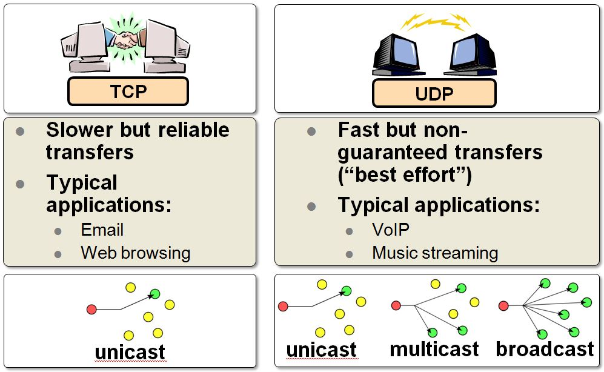
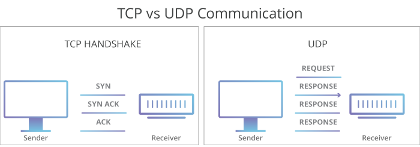


#### TCP中的一些关键技术

TCP 协议的主要目标就是保证数据的可靠传输，避免数据的破坏、丢包、重复以及分片顺序混乱等现象出现。让用户在上层看来是一个连续的数据流。为了达到这个目的，TCP 采用了三次握手四次挥手，窗口控制，流量控制，拥塞控制，重发机制等技术。这部分就来重点介绍下这部分技术。

#### 1. 连接控制 - TCP三次握手和四次挥手

##### 三次握手

三次握手是指建立一个TCP连接时，需要客户端和服务器之间总共发送3个包，它的作用就是在进行数据传输之前让双方都能明确自己和对方的收、发能力是正常的。实质上其实就是连接服务器指定端口，建立TCP连接，并同步连接双方的序列号和确认号，交换TCP窗口大小信息。


刚开始客户端处于 Closed 的状态，服务端处于 Listen 状态。

- 第一次握手：建立连接。客户端发送连接请求报文段，将SYN位置为1，Sequence Number为x；然后，客户端进入****SYN_SEND****状态，等待服务器的确认,服务器收到SYN报文段。
  这个阶段客户端发送网络包，服务端收到了。这样服务端就能得出结论：客户端的发送能力、服务端的接收能力是正常的。而客户端由于这个阶段服务端没有返回数据所以无法知道它的信息是否发送成功，服务端接收能力是否正常。

- 第二次握手：服务器收到客户端的SYN报文段，需要对这个SYN报文段进行确认，设置Acknowledgment Number为x+1(Sequence Number+1)；同时，自己还要发送SYN请求信息，将SYN位置为1，Sequence Number为y；服务器端将上述所有信息放到一个报文段（即SYN+ACK报文段）中，一并发送给客户端，此时服务器进入SYN_RECV状态，客户端收到该回复信息。
  这个阶段：服务端发包，客户端收到了。这样客户端就能得出结论：服务端的接收、发送能力，客户端的接收、发送能力是正常的。服务端目前只知道接收能力正常。
  
- 第三次握手：客户端收到服务器的SYN+ACK报文段。然后将Acknowledgment Number设置为y+1，向服务器发送ACK报文段，
  这个阶段：服务端能得出结论：客户端的接收、发送能力，服务端的发送、接收能力是正常的。这个报文段发送完毕以后，客户端和服务器端都进入ESTABLISHED状态，完成TCP三次握手。

经历了上面的三次握手过程，客户端和服务端都确认了自己的接收、发送能力是正常的。之后就可以正常通信了。


****两次握手会有什么问题：****

如客户端发出连接请求，但因连接请求报文丢失而未收到确认，于是客户端再重传一次连接请求。后来收到了确认，建立了连接。数据传输完毕后，就释放了连接，客户端共发出了两个连接请求报文段，其中第一个丢失，第二个到达了服务端，但是第一个丢失的报文段只是在某些网络结点长时间滞留了，延误到连接释放以后的某个时间才到达服务端，此时服务端误认为客户端又发出一次新的连接请求，于是就向客户端发出确认报文段，同意建立连接，不采用三次握手，只要服务端发出确认，就建立新的连接了，此时客户端忽略服务端发来的确认，也不发送数据，则服务端一致等待客户端发送数据，浪费资源。

****半连接队列****
服务器第一次收到客户端的 SYN 之后，就会处于 SYN_RCVD 状态，服务器会把此种状态下请求连接放在一个队列里，我们把这种队列称之为半连接队列。服务器发送完SYN-ACK包，如果未收到客户确认包，服务器进行首次重传，等待一段时间仍未收到客户确认包，进行第二次重传。如果重传次数超过系统规定的最大重传次数，系统将该连接信息从半连接队列中删除。每次重传等待的时间不一定相同，一般会是指数增长，例如间隔时间为 1s，2s，4s，8s……。

****建立连接时候的初始序列号是固定的吗****

ISN随时间而变化，因此每个连接都将具有不同的ISN。ISN可以看作是一个32比特的计数器，每4ms加1 。三次握手的其中一个重要功能是客户端和服务端交换 ISN，以便让对方知道接下来接收数据的时候如何按序列号组装数据。如果 ISN 是固定的，攻击者很容易猜出后续的确认号，从而发起网络攻击。

****三次握手过程中可以携带数据吗****

其实第三次握手的时候，是可以携带数据的。但是，第一次、第二次握手不可以携带数据。首先我们必须明确一点，服务端的存在是为了替客户端处理数据，所以最终的数据还是要返回给客户端的，如果还没法确认客户端的收发能力，服务端接受数据是没有意义的，我们回过头从服务端的角度看下三次握手的情况：第一次服务端只能知道客户端有发送数据的能力，第二次服务端依旧只知道客户端发送数据的能力，并不知道客户端接收数据的能力。所以这种情况下接收数据是没有意义的。

****什么是SYN攻击****

SYN攻击就是客户端在短时间内伪造大量不存在的IP地址，并向服务端断地发送SYN包，服务端则回复确认包，并等待客户端确认，由于源地址不存在，因此服务端需要不断重发直至超时，这些伪造的SYN包将长时间占用未连接队列，导致正常的SYN请求因为队列满而被丢弃，从而引起网络拥塞甚至系统瘫痪。这也是为什么当第三次握手失败时，服务器并不会重传ack报文，而是直接发送RST报文段，进入CLOSED状态。这样做的目的是为了防止SYN攻击。

##### 四次挥手


建立一个连接需要三次握手，而终止一个连接要经过四次挥手。这是由TCP的半关闭造成的。所谓的半关闭，其实就是TCP提供了连接的一端在结束它的发送后还能接收来自另一端数据的能力。也就是说这里要完成的任务是保证两边在关闭前都确保无数据发送给对方的诉求，并且已经完成了各自的收尾工作。


- ****第一次挥手****：客户端(可以是客户端，也可以是服务器端,这里以客户端先发起终止为例子) 发送一个 FIN 报文，报文中会指定一个序列号。此时客户端处于 FIN_WAIT1 状态。即发出连接释放报文段（FIN=1，序号seq=u），并停止再发送数据，主动关闭TCP连接，进入FIN_WAIT1（终止等待1）状态，等待服务端的确认。这表示客户端没有数据要发送给服务端了。
- ****第二次挥手****：服务端收到 FIN 之后，会发送 ACK 报文，且把客户端的序列号值 +1 作为 ACK 报文的序列号值，表明已经收到客户端的报文了，此时服务端处于 CLOSE_WAIT 状态。即服务端收到连接释放报文段后即发出确认报文段（ACK=1，确认号ack=u+1，序号seq=v），服务端进入CLOSE_WAIT（关闭等待）状态，此时的TCP处于半关闭状态，客户端到服务端的连接释放。客户端收到服务端的确认后，进入FIN_WAIT2（终止等待2）状态，等待服务端发出的连接释放报文段。这时候表示服务端告诉客户端：我同意你的关闭请求.
- ****第三次挥手****：如果服务端也想断开连接了，和客户端的第一次挥手一样，发给 FIN 报文，且指定一个序列号。此时服务端处于 LAST_ACK 的状态。
即服务端没有要向客户端发出的数据，服务端发出连接释放报文段（FIN=1，ACK=1，序号seq=w，确认号ack=u+1），服务端进入LAST_ACK（最后确认）状态，等待客户端的确认。这表示服务端没有数据要发送给客户端了。
- ****第四次挥手****：客户端收到 FIN 之后，一样发送一个 ACK 报文作为应答，且把服务端的序列号值 +1 作为自己 ACK 报文的序列号值，此时客户端处于 TIME_WAIT 状态。需要过一阵子以确保服务端收到自己的 ACK 报文之后才会进入 CLOSED 状态，服务端收到 ACK 报文之后，就处于关闭连接了，处于 CLOSED 状态。
即客户端收到服务端的连接释放报文段后，对此发出确认报文段（ACK=1，seq=u+1，ack=w+1），客户端进入TIME_WAIT（时间等待）状态。此时TCP未释放掉，需要经过时间等待计时器设置的时间2MSL后，客户端才进入CLOSED状态。这时候客户端的行为是：我收到了你的请求我等你2MSL后关闭，服务端收到这个消息后就关闭了。

所以整个过程可以通过如下对话来总结：

客户端：我没有数据要传的了
服务端：收到，我同意你那边的关闭请求,我这边的数据还没处理完所以现在不能直接关闭，你先等下我处理完成后会告诉你。
..... 等待中 ......
服务端：收尾工作已经处理完毕，我这边已经没有数据需要传递给你了。
客户端：收到，我这边会等2MSL后关闭。（服务端收到该消息后就立刻关闭，客户端等待2MSL后关闭）

对于这个地方有个比较困惑的问题：

- [为什么TCP4次挥手时等待为2MSL](https://www.zhihu.com/question/67013338)

2MSL等待的结果是在这个期间，这个连接两端的插口（客户的IP地址和端口号，服务器的IP地址和端口号）不能再被使用。这个连接只能在2MSL结束后才能再被使用。

那么为什么要等待2MSL 首先我们先要弄明白什么是MSL，MSL是Maximum Segment Lifetime的英文缩写，可译为“最长报文段寿命”，它是任何报文在网络上存在的最长时间，超过这个时间报文将被丢弃。而这里的2MSL = 去向ACK消息最大存活时间（MSL) + 来向FIN消息的最大存活时间(MSL) 。

客户端第四次握手发送ACK从客户端到服务端最多经过1MSL，超过这个时间服务端会重发FIN。服务端重发的FIN最多经过1MSL到达客户端。等待2MSL就保证了，如果由于某些原因导致客户端发出的ACK不能到达服务端，这时候服务端重发的FIN报文一定能够被客户端收到。


[面试官，不要再问我三次握手和四次挥手](https://yuanrengu.com/2020/77eef79f.html)


#### 2. 窗口控制

- ****为什么需要窗口****
  我们知道TCP的每个数据包都应该有ACK应答,如下图所示,这其实是一种串行模式，虽然可以保证数据的可靠传输，但是资源并没被合理利用：
  
  所以我们需要思考发送端必须是前一个数据包收到应答后才能发送后一个数据包吗。其实不是的，我们可以通过在发送方和接收方增加缓存的方式来解决这个问题，发送方将数据发送出去后在等到确认应答返回之前，将已发送的数据保留在缓存区中。如果按期收到确认应答，此时数据就可以从缓存区清除。这个缓存区域就是所谓的窗口。窗口大小就是指无需等待确认应答，就可以继续发送数据的最大值。
  
  
  使用窗口的另一个优点就是****累计应答****,如上图所示ACK 600 确认应答报文丢失，也没关系，因为可以通过下一个确认应答进行确认，只要发送方收到了 ACK 700 确认应答，就意味着 700 之前的所有数据都收到了。
  除此之外窗口还有一个用途是用于对传输层进行流控的一种措施，接收方通过通告发送方自己的窗口大小，从而控制发送方的发送速度，从而达到防止发送方发送速度过快而导致自己被淹没的目的。总的来说窗口的作用一是通过缓存将原先的串行形式转换为并行模式，二是作为流控手段调节发送方的发送速度。

- ****发送窗口和接收窗口的结构****
  
  我们来进一步看下发送方和接收方的窗口结构：

  
  整个缓存区域可以分成四个部分：
  * 已发送并收到ACK确认信号的请求
  * 已发送但并未收到ACK确认信号的请求
  * 未发送但在接收方处理能力范围之内的请求空位
  * 未发送但在接收方处理能力范围之外的请求空位
  
  TCP协议中用了三个字段来标示这四个区间：
  * ****SND.WND****：表示发送窗口的大小，大小由接收方指定的；
  * ****SND.UNA****：是一个绝对指针，它指向的是已发送但未收到确认的第一个字节的序列号，也就是 #2 的第一个字节。
  * ****SND.NXT****：也是一个绝对指针，它指向未发送但可发送范围的第一个字节的序列号，也就是 #3 的第一个字节。
  #4 的第一个字节是个相对指针，它需要 SND.NXT 指针加上 SND.WND 大小的偏移量，就可以指向 #4 的第一个字节了。

  可用窗口大小就等于SND.WND -（SND.NXT – SND.UNA）：
  我们前面提到了TCP 的 Window是一个16bit位字段，它代表的是窗口的字节容量，也就是TCP的标准窗口最大为2^16-1=65535个字节。另外在TCP的选项字段中还包含了一个TCP窗口扩大因子，option-kind为3，option-length为3个字节，option-data取值范围0-14。窗口扩大因子用来扩大TCP窗口，可把原来16bit的窗口，扩大为31bit。

  

  接收窗口相对简单一些它包含三个部分：
  - #1 + #2 是已成功接收并确认的数据（等待应用进程读取）；
  - #3 是未收到数据但可以接收的数据；
  - #4 未收到数据并不可以接收的数据；
  
  三个接收部分，使用两个指针进行划分:
  - RCV.WND：表示接收窗口的大小，它会通告给发送方。
  - RCV.NXT：是一个指针，它指向期望从发送方发送来的下一个数据字节的序列号，也就是 #3 的第一个字节。

  接下来我们以动态的视角看下整个窗口滑动的效果：
  
  

- ****发送窗口与接收窗口关系****
  
  TCP是双工的协议，会话的双方都可以同时接收、发送数据。TCP会话的双方都各自拥有一个“发送窗口”和一个“接收窗口”。各自的“发送窗口”则要求取决于对端通告的“接收窗口”。
  

#### 3. 流量控制

  前面介绍了窗口控制的概念的时候提到了窗口其中的一个用途是用于对传输层进行流量控制，接收方通知发送方自己的窗口大小，发送方根据收到的接收方发过来的窗口大小，控制请求的发送速度，从而达到防止发送方发送速度过快而导致自己被淹没的目的，接受方一旦被发送端发送过来的数据淹没就会触发发送方重发机制，从而导致网络流量的无端的浪费。为了解决这种现象发生，TCP 提供一种机制可以让发送方根据接收方的实际接收能力控制发送的数据量，这就是所谓的流量控制。
  随着数据的传输，窗口会发生移动，有三种运动方式：
  - ****关闭****：窗口左边界右移。发送数据得到 ACK 时窗口减小。
  - ****打开****：窗口右边界右移。当接收方可用缓存增大时，窗口增大。
  - ****收缩****：窗口右边界左移。一般来说不应发生，但必须能够处理此问题。
  不存在左边界左移，因为窗口左边是已确认的数据，不可能会再次发送。当 ACK 号不断增大，窗口大小保持不变时，则称窗口向前滑动。 

##### 流量控制过程

  

  从上图中可以很明显看出整个流量控制的过程，每次发送方在发送完数据还没收到回复的时候窗口会缩小，一旦收到回复的话便会增大窗口。上面是窗口大小不变的理想环境下的情况，但是实际上窗口对应的缓冲区都是放在操作系统内存缓冲区中的，会被操作系统调整。也就是说在系统资源紧张的时候有可能会收回一些内存缓冲区域，就会相应减少窗口区域。如果在未将窗口大小通知给对方之前，系统回收了对应作为窗口的缓冲区域，就会导致对方没有感知到窗口的缩小而继续发送大于接收方实际窗口的数据，从而导致数据的丢失。为了防止这种情况发生，TCP 规定是不允许同时减少缓存又收缩窗口的，而是采用先收缩窗口，过段时间再减少缓存，这样就可以避免了丢包情况。

##### 窗口关闭带来的死锁现象以及解决方案

窗口关闭带来的死锁现象,如下图所示：

它指的是当发生窗口关闭时，接收方处理完数据后，会向发送方通告一个窗口非 0 的 ACK 报文，如果这个通告窗口的 ACK 报文在网络中丢失了，由于发送方没感知到接收方窗口腾出空的信号，所以发送方不会向接收方发送数据，同时接收方也一直在等待发送方发数据，所以两边都陷入了僵持阶段，造成死锁。为了解决这个问题，可以引入窗口探测报文：


TCP 为每个连接设有一个持续定时器，只要TCP连接一方收到对方的零窗口通知，就启动持续计时器。如果持续计时器超时，就会发送窗口探测报文，而对方在确认这个探测报文时，给出自己现在的接收窗口大小。如果接收窗口仍然为 0，那么收到这个报文的一方就会重新启动持续计时器，如果接收窗口不是 0，那么死锁的局面就可以被打破了。窗口探查探测的次数一般为3次，每次大约 30-60 秒。如果 3 次过后接收窗口还是 0 的话，有的 TCP 实现就会发 RST 报文来中断连接。

##### 糊涂窗口与粘包拆包

如果接收方太忙了，来不及取走接收窗口里的数据，那么就会导致发送方的发送窗口越来越小。到最后，如果接收方腾出几个字节并告诉发送方现在有几个字节的窗口，发送方也会义无反顾地发送这几个字节，这就是糊涂窗口综合症。

所以糊涂窗口综合症的原因是由发送方和接收方共同造成的：
接收方可以通告一个小的窗口，发送方对应发送小数据。从而造成资源的浪费。

要解决糊涂窗口综合症，就解决上面两个问题就可以了

- 让接收方不通告小窗口给发送方
  当窗口大小Min(MSS，缓存空间/2) 向发送方通告窗口为 0，阻止发送方再发数据过来。当接收方处理了一些数据后，窗口大小 >= MSS，或者接收方缓存空间有一半可以使用，就可以把窗口打开让发送方发送数据过来。

- 让发送方避免发送小数据
  等到窗口大小 >= MSS 或是 数据大小 >= MSS 或者收到之前发送数据的 ack 回包的时候开始发送数据。同时为了满足将多个小数据包合成一个大数据包发送，就涉及到了粘包处理。

##### 什么是分包与粘包


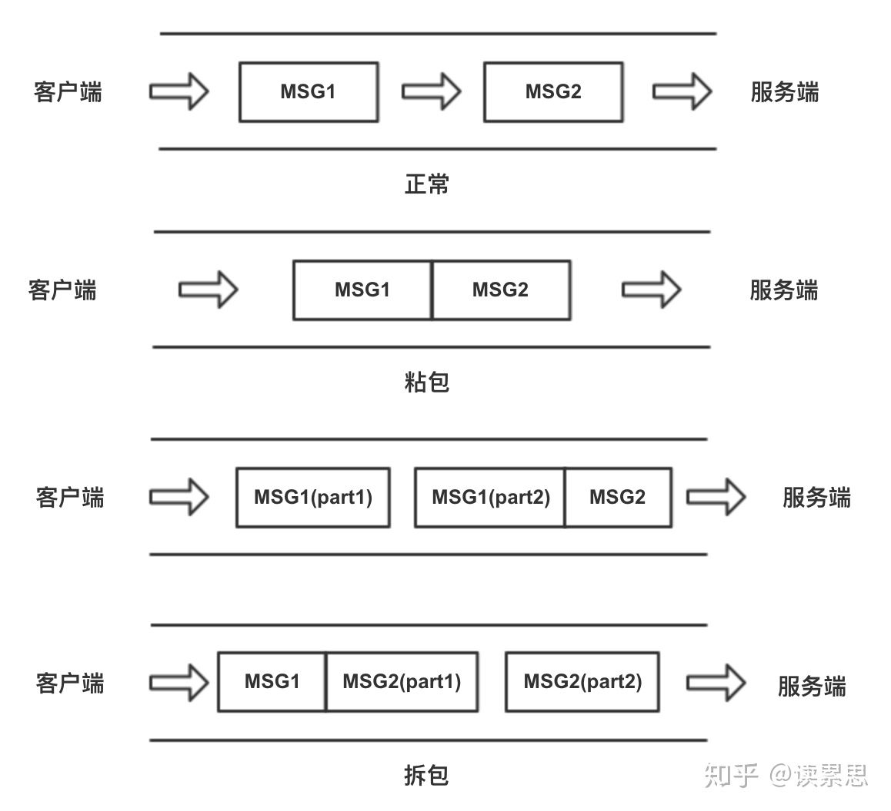

TCP是个字节流协议，是没有界限的一串数据。TCP底层并不了解上层业务数据的具体含义只保证数据可靠得从一个端传输到另一个端，并且应用层数据在送到TCP层到时候发送端为了将多个包，更有效的发到对方，使用了优化方法（Nagle算法）将多次间隔较小、数据量小的数据，合并成一个大的数据块，然后进行封包。同时由于套接字缓冲区，或者MSS(Max Segment Size),以太网帧的负载 MTU（Maximum Transmission Unit）的限制对于发送较大块数据的时候会先讲数据进行分割后发出。所以在业务上认为，一个完整的包可能会被TCP拆分成多个包进行发送，也有可能把多个小的包封装成一个大的数据包发送，这就是所谓的TCP粘包和拆包问题。粘包问题只会在流传输中出现，UDP不会出现粘包，因为它有消息边界。

粘包情况有两种，一种是粘在一起的包都是完整的数据包，另一种情况是粘在一起的包有不完整的包。不是所有的粘包现象都需要处理，若传输的数据为不带结构的连续流数据，则不必把粘连的包分开。

##### 造成粘包的原因

出现粘包现象的原因是多方面的，它既可能由发送方造成，也可能由接收方造成：

正如上面提到的发送方引起的粘包是由TCP协议本身造成的，TCP为提高传输效率，发送方往往要收集到足够多的数据后才发送一包数据。若连续几次发送的数据都很少，通常TCP会根据优化算法把这些数据合成一包后一次发送出去，这样接收方就收到了粘包数据。而接收方引起的粘包是由于接收方用户进程不及时接收数据，从而导致粘包现象。这是因为接收方先把收到的数据放在系统接收缓冲区，用户进程从该缓冲区取数据，若下一包数据到达时前一包数据尚未被用户进程取走，则下一包数据放到系统接收缓冲区时就接到前一包数据之后，而用户进程根据预先设定的缓冲区大小从系统接收缓冲区取数据，这样就一次取到了多包数据。

##### 如何解决粘包问题

上面我们提到了UDP是没有半包粘包的问题是因为它有边界协议，消息是有格式的。所以为解决粘包问题我们也可以在应用层上通过类似的解决方案，解决半包粘包的问题其实就是定义消息边界的问题。

- ****长度边界****
  应用层在发送消息的时候指定每个消息的固定长度，比如固定每个消息为1K，那么当发送时消息不满1K时，用固定的字符串填充，当接收方读取消息的时候，每次也截取1k长度的流作为一个消息来解析。这种方式的问题在于应用层不能发送超过1K大小的数据，所以使用这种方式的前提知道了消息大小会在哪个范围之内，如果不能确定消息的大小范围不太适合用这种方式，这样会导致大的消息发出去会有问题，小的消息又需要大量的数据填充，不划算。

- ****符号边界****
  应用层在发送消息前和发送消息后标记一个特殊的标记符，比如 &符号，当接收方读取消息时，根据&符号的流码来截取消息的开始和结尾。这种方式的问题在于发送的消息内容里面本身就包含用于切分消息的特殊符号，所以在定义消息切分符时候尽量用特殊的符号组合。
  
- ****组合边界****
  这种方式先是定义一个Header+Body格式，Header消息头里面定义了一个开始标记+一个内容的长度，这个内容长度就是Body的实际长度，Body里面是消息内容，当接收方接收到数据流时，先根据消息头里的特殊标记来区分消息的开始，获取到消息头里面的内容长度描述时，再根据内容长度描述来截取Body部分。

- ****利用TCP内置的机制****
  TCP提供了强制数据立即传送的操作指令push，TCP软件收到该操作指令后，就立即将本段数据发送出去，而不必等待发送缓冲区满

- ****接收方新增加预处理线程****
  接收方创建一个预处理线程，对接收到的数据包进行预处理，将粘连的包分开。


#### 4. 拥塞控制

##### 拥塞控制和流量控制的区别

前面介绍了流量控制，接下来在介绍拥塞控制之前对二者进行简单的区分：

****流量控制****是作用于接收者的，目标是调整两个连接的网络状况，接收方通知发送方自己的窗口大小，发送方根据收到的接收方发过来的窗口大小，控制请求的发送速度，从而达到防止发送方发送速度过快而导致接收方被淹没的目的。

而****拥塞控制****是作用于发送方，目标是调整整个网络的网络环境，我们知道计算机网络都处在一个共享的环境，任何一台机器都不能长期占用大量的网络资源，每个网络的结点都有义务做到防止过多的数据注入到网络中，避免出现网络负载过大的情况。在网络出现拥堵时，如果继续发送大量数据包，可能会导致数据包时延、丢失等，这时 TCP 就会重传数据，但是一重传就会导致网络的负担更重，于是会导致更大的延迟以及更多的丢包，这个情况就会进入恶性循环被不断放大，甚至导致整个网络瘫痪。

##### 拥塞窗口

拥塞窗口cwnd是发送方维护的一个的状态变量，它会根据网络的拥塞程度动态变化的。只要网络中没有出现拥塞，cwnd 就会增大，一旦网络中出现了拥塞cwnd就减小。判断是否网络拥塞的方法也很简单，只要发送方没有在规定时间内接收到ACK应答报文，也就是发生了超时重传，就会认为网络出现了拥塞。由于拥塞控制的存在发送方的最终窗口大小取决于拥塞窗口和流量控制窗口的最小值。

##### 拥塞控制算法

拥塞控制主要包含三个阶段四个算法：

- 慢启动阶段

慢启动阶段在包个数到达慢启动门限（ssthresh = 65535 字节）之前包的个数是指数性的增长。
- 当 cwnd < ssthresh 时，使用慢启动算法。
- 当 cwnd >= ssthresh 时，就会使用拥塞避免算法

整个过程如下图所示：


- 拥塞避免阶段

进入拥塞避免算法后，每当收到一个 ACK 时，cwnd 增加 1/cwnd。所以，拥塞避免算法就是将原本慢启动算法的指数增长变成了线性增长，还是增长阶段，但是增长速度缓慢了一些。随着cwnd的不断增加，网络就会慢慢进入了拥塞的状况了，于是就会出现丢包现象，这时就需要对丢失的数据包进行重传。这时候就会进入拥塞发生阶段。
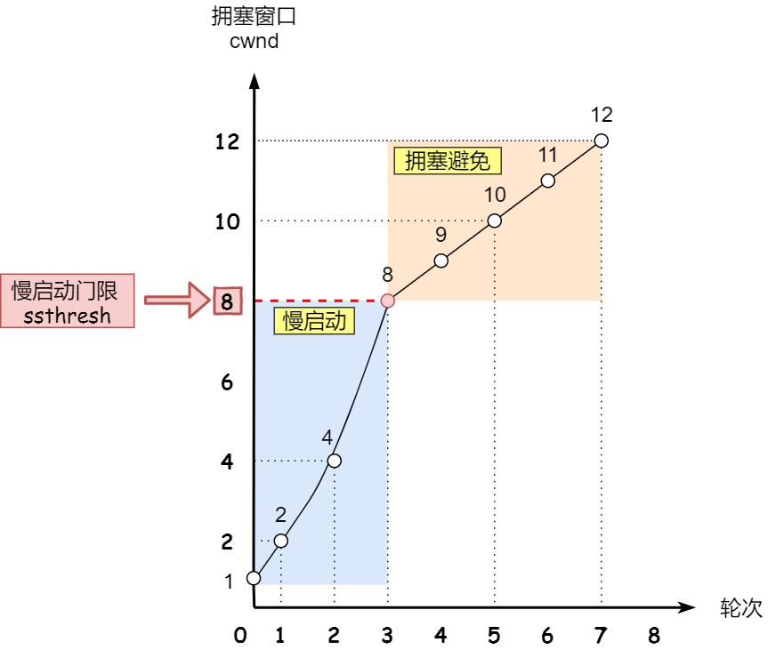


- 拥塞发生阶段

拥塞发生阶段也就是所处的网络出现拥塞导致的丢包现象，这时候需要对数据包重传，重传机制主要有两种：

- 超时重传
- 快速恢复

- 超时重传

当****发生网络超时****的时候会触发超时重传，它会将启动门限ssthresh设置为cwnd/2，并将cwnd重置为1。接着，就重新开始慢启动，慢启动是会突然减少数据流。有可能会造成网络卡顿。


- 快速恢复

当接收方发现****丢了一个中间包****的时候，发送三次前一个包的 ACK，于是发送端就会快速地重传，不必等待超时再重传。TCP 认为对方还能收到3个重复ACK说明网络也不那么糟糕，所以快速恢复cwnd和ssthresh进行如下更新：

```
cwnd = cwnd/2 
ssthresh = cwnd;
```
紧接着进入快速恢复算法如下：

拥塞窗口 cwnd = ssthresh + 3
重传丢失的数据包，接着进入了拥塞避免算法。

- 


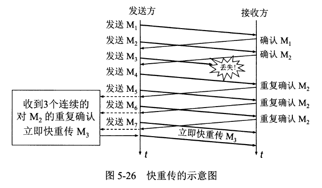


#### 5. 重发机制

前面的流量控制和拥塞控制的主要是用于缓解由于网络的原因导致的数据丢失，但是并不能根本上解决网络丢失的问题，TCP协议要保证所有的数据包都要到达，必需要借助重传确认应答机制。

在传输过程中每发送一个片段，就会开启一个重传倒计时定时器，并将该片段的一份复制放置于重传队列，重传队列按照重传计时器的剩余时间来排序，如果在计时器超时之前收到确认应答，则将该片段从重传队列中移除。

如果在超时之前没有收到确认信号，则自动重传信号。重传之后该片段还是保留在重传队列中，重传计时器会被重启，这样不断重复一定次数，如果还没有成功则判定为传输失败。

那我们如何知道是否确认对方是否有收到对应的片段？这就要靠TCP的确认机制：接收方在收到每个数据包之后都会回复一个ACK确认号，ACK不能跳着确认，只能确认最大的连续收到的包，也就是说ACK确认号表明所有低于该编号的sequence number已经被发送该编号的设备接收。所以每次收到一个ACK确认号后就可以将重传队列中小于该确认号的片段移除。

从接收方角度来看，如果前一个片段A丢失了，但是后一个片段B收到了，那么接收方将片段B放在接收缓存中不需要进行确认,而是要等到A收到之后回复。这就是所谓的累积确认，累积确认机制也有比较明显的缺点。假设服务器被告知它有一个10000字节窗口，20个片段每个片段500字节。第一个片段丢失了，其他19个被接收到了。但是由于第一个片段从没有接收到，其他19个也无法确认。

为了解决上面提到的其他19个也无法确认的问题，就涉及到处理未确认片段的策略：

有四种主要的策略：

- ****仅重传超时片段****：
仅重传超时的片段，希望其他片段都能够成功接收。如果该片段之后的其他片段实际上接收到了，这一方式是最佳的。

- ****重传所有片段****：
无论何时一个片段超时了，不仅重传该片段，还有所有其他尚未确认的片段。这一方式确保了任何时间都有一个等待确认的停顿时间，在所有未确认片段丢失的情况下，会刷新全部未确认片段，以使对端设备多一次接收机会。这一过程完成之后，任一设备都可以在常规TCP片段中使用SACK选项。这一选项包含一个关于已接收但未确认片段数据sequence number范围的列表。

上面两种方式也就是前面提到的超时重传，它有好也有不好，第一种会节省带宽，但是慢，第二种会快一点，但是会浪费带宽，也可能会有无用功。但总体来说都不好。因为都在等timeout。

- ****快速重传机制****：

为了解决超时重传的缺点，TCP引入了快速重传的机制，快速重传机制不以时间驱动，而以数据驱动重传。也就是说，如果包没有连续到达，就ACK最后那个可能被丢了的包，如果发送方连续收到3次相同的ACK，就重传。快速重传机制的好处是不用等超时了再重传。


比如上面例子：如果发送方发出了1，2，3，4，5份数据，第一份先到送了，于是就ACK回2，结果2因为某些原因没收到，3到达了，于是还是ACK回2，后面的4和5都到了，但是还是ACK回2，因为2还是没有收到，于是发送端收到了三个ACK=2的确认，知道了2还没有到，于是就马上重转2。然后，接收端收到了2，此时因为3，4，5都收到了，于是ACK回6。

Fast Retransmit只解决了一个问题，就是timeout的问题，它依然面临一个艰难的选择，就是，是重传之前的一个还是重传所有的问题。对于上面的示例来说，是重传#2呢还是重传#2，#3，#4，#5呢？因为发送端并不清楚这连续的3个ack(2)是谁传回来的？也许发送端发了20份数据，是#6，#10，#20传来的呢。这样，发送端很有可能要重传从2到20的这堆数据

- ****选择性确认 SACK 方法****：

前面的问题的关键在于无法确认非连续片段。要解决这个问题必须添加允许设备分别确认非连续片段的功能。这一功能称为选择确认（selective acknowledgment, SACK）。
如果要使用这个功能必须连接的两方设备同时支持这一功能，这个确定过程在连接的时候通过SYN片段来协商是否允许使用SACK。如果该片段已被选择确认过，则该片段中的SACK比特位置为1。该设备使用图2中激进方式的改进版本，一个片段重传之后，之后所有SACK比特位非1的片段都会被重传。


Duplicate SACK – 重复收到数据的问题

Duplicate SACK又称D-SACK，其主要使用了SACK来告诉发送方有哪些数据被重复接收了
D-SACK使用了SACK的第一个段来做标志，

```
如果SACK的第一个段的范围被ACK所覆盖，那么就是D-SACK
如果SACK的第一个段的范围被SACK的第二个段覆盖，那么就是D-SACK
```

#### IP协议 - 如何找到最合适的路径将数据送到

要标示一个应用和另一个应用的连接，会涉及到MAC地址，IP地址及端口。其中MAC地址具有设备唯一性，是物理地址，而IP地址是逻辑上的地址，一台机器有一个IP地址，但是一台主机上可能有多个应用所以，要标示某台机器上的某个应用就需要借助于端口，每个设备会为需要的应用分配单独的端口。接下来会重点从如下几个方面介绍IP协议相关的内容：

- ****IP地址MAC地址及端口划分**** :介绍IP地址的组成，IP头的组成，MAC地址相关，以及应用端口分配
- ****IP 相关技术**** : 介绍DNS，ARP，DHCP等和IP协议相关的技术。
- ****路由过程**** : 介绍一个包怎么从一个应用送往另一个应用。

##### IP 相关技术

- ****DNS****

域名和IP地址都可以唯一对应一台主机，我们可以使用它们中的任意一种形式来访问网络，但是由于IP地址难以记忆，所以就需要一个同样能够唯一标示一个主机地址的域名，但是我们协议部分使用的还是设备的IP地址，我们往浏览器中输入需要访问网站域名的时候，就需要有个中间对象将域名转换为IP地址，DNS就是充当这一对象，DNS如同网络中一个庞大的通讯录，它将自身具有意义的域名转换成不容易记住的IP地址。关于DNS详细的技术细节已经在前面介绍过了，大家可以查阅之前的内容。


- ****ARP****

在应用层我们输入某个网站对应的域名地址后，经过DNS解析转换为IP地址，有了IP地址就可以向这个目标地址发送IP数据报。但是在底层数据链路层,进行实际通信时,还需要知道每个IP地址所对应的MAC地址，ARP协议就是用于通过目标IP地址，定位下一个接收数据包的网络设备的MAC地址。如果目标主机处在同一个数据链路上，那么可以直接得到目标主机的MAC地址，否则会得到下一条路由器的MAC地址。

要通过ARP协议获得下一级的MAC地址，首先源主机需要通过广播发送一个ARP请求包：“我要与IP地址为xxx的主机通话，谁知道它的 MAC地址？”。
数据链路上的所有主机都会收到这条消息并检查自己的IP地址，如果与ARP请求包中的IP地址一致，主机就会发送ARP响应包：“我就是IP地址为xxx的主机，我的 MAC地址是xxxx”。

在实际的使用过程中，每次往目标主机发送数据都要使用ARP是很低效的，通常的做法是把获取到的MAC地址缓存一段时间。一般来说，一旦源主机向目标地址发送一个数据包，接下来继续发送多次的概率非常大，因此这种缓存非常容易命中。

当下一次发送ARP请求或超过一定时间后，缓存就会失效，从而保证了即使 MAC地址与IP地址的对应关系发生了变化，数据包依然能够被正确的发往目标地址的目的。


- ****ICMP****

ICMP(互联网控制消息协议（Internal Control Message Protocol）)，与IP协议一样同属TCP/IP模型中的网络层，并且ICMP数据包是包裹在IP数据包中的,它的作用是报告一些网络传输过程中的错误以及做一些同步工作。ICMP数据包有许多类型。每一个数据包只有前4个字节是相同域的，剩余的字段有不同的数据包类型的不同而不同。


类型字段：指明该数据包属于什么类型（大分类），长度1个字节。
代码字段：指明数据包属于大类里面的哪个小类，长度1个字节。类型字段与代码字段共同决定ICMP数据包类型，以及后续字段含义。
校验和： 指明该数据包的校验和，长度2个字节。该校验和覆盖整个ICMP数据包。


- ****DHCP****

DHCP（Dynamic Host Configuration Protocol）：动态主机配置协议，是一个局域网的网络协议，使用UDP协议工作， 主要有两个用途：

- 给内部网络或网络服务供应商自动分配IP地址
- 给用户或者内部网络管理员作为对所有计算机作中央管理的手段。

在IP网络中，每个连接网络的设备都需要分配唯一的IP地址。DHCP 使网络管理员能从中心结点监控和分配IP地址。当某台计算机移到网络中的其它位置时，能自动收到新的IP地址，而不用在每台计算机上单独配置固定的IP地址，这对移动设备普的今天显得尤为重要。

工作原理：

- ****发现阶段**** 即DHCP客户机寻找DHCP服务器的阶段。
DHCP客户机以广播方式（因为DHCP服务器的IP地址对于客户机来说是未知的）发送DHCP discover 发现信息来寻找DHCP服务器，网络上每一台安装了 TCP/IP协议的主机都会接收到这种广播信息，但只有DHCP服务器才会做出响应。

- ****提供阶段**** 即DHCP服务器提供IP地址的阶段。在网络中接收到DHCP discover发现信息的DHCP服务器都会做出响应，它从尚未出租的IP地址中挑选一个分配给DHCP客户机，向DHCP客户机发送一个包含出租的IP地址和其他设置的DHCP offer提供信息。

- ****选择阶段**** 即DHCP客户机选择某台DHCP服务器提供的IP地址的阶段。如果有多台DHCP服务器向DHCP客户机发来的DHCP offer提供信息，则DHCP客户机****只接受第一个收到的DHCP offer提供信息****，然后它以广播方式回答一个DHCP request请求信息，****该信息中包含向它所选定的DHCP服务器请求IP地址的内容****。之所以要以广播方式回答，是为了通知所有的DHCP服务器，他将选择某台DHCP服务器所提供的IP地址。

- ****确认阶段**** 即DHCP服务器确认所提供的IP地址的阶段。当DHCP服务器收到DHCP客户机回答的DHCP request请求信息之后，它便向DHCP客户机发送一个包含它所提供的IP地址和其他设置的DHCP ack确认信息，告诉DHCP客户机可以使用它所提供的IP地址。然后DHCP客户机便将其TCP/IP协议与网卡绑定，另外，除DHCP客户机选中的服务器外，其他的DHCP服务器都将收回曾提供的IP地址。

- ****重新登录**** 以后DHCP客户机每次重新登录网络时，就不需要再发送DHCP discover发现信息了，而是直接发送包含前一次所分配的IP地址的DHCP request请求信息。当DHCP服务器收到这一信息后，它会尝试让DHCP客户机继续使用原来的IP地址，并回答一个DHCP ack确认信息。如果此IP地址已无法再分配给原来的DHCP客户机使用时（比如此IP地址已分配给其它DHCP客户机使用），则DHCP服务器给DHCP客户机回答一个DHCP nack否认信息。当原来的DHCP客户机收到此DHCP nack否认信息后，它就必须重新发送DHCP discover发现信息来请求新的IP地址。

- ****更新租约**** DHCP服务器向DHCP客户机出租的IP地址一般都有一个租借期限，期满后DHCP服务器便会收回出租的IP地址。如果DHCP客户机要延长其IP租约，则必须更新其IP租约。DHCP客户机启动时和IP租约期限过一半时，DHCP客户机都会自动向DHCP服务器发送更新其IP租约的信息。


- ****NAT****
  
网络地址转换协议 (Network Address Translation) 在计算机网络中是一种在IP数据包通过路由器或防火墙时重写来源IP地址或目的IP地址的技术。这种技术被普遍使用在有多台主机但只通过一个公有IP地址访问互联网的私有网络中。
NAT最初的发展是为了解决IPv4地址短缺而流行起来的。NAT在家庭和小型办公室网络连接上的路由器成为了一个标准特征，因为对他们来说，申请独立的IP地址的代价要高于所带来的效益。

在一个典型的配置中，一个本地网络使用一个专有网络的指定子网（比如192.168.x.x或10.x.x.x）和连在这个网络上的一个路由器。这个路由器占有这个网络地址空间的一个专有地址（比如192.168.0.1），同时它还通过一个或多个因特网服务提供商提供的公有的IP地址连接到因特网上。当信息由本地网络向因特网传递时，源地址从专有地址转换为公用地址。由路由器跟踪每个连接上的基本数据，主要是目的地址和端口。当有回复返回路由器时，它通过输出阶段记录的连接跟踪数据来决定该转发给内部网的哪个主机；如果有多个公用地址可用，当数据包返回时，TCP或UDP客户机的端口号可以用来分解数据包。对于因特网上的通信，路由器本身充当源和目的。流行在网络上的一种看法认为，IPv6的广泛采用将使得NAT不再需要，因为NAT只是一个处理IPv4的地址空间不足的方法。


- ****VLSM****

VLSM的作用就是在类的IP地址的基础上，****从它们的主机号部分借出相应的位数来做网络号****，也就是增加网络号的位数。各类网络可以用来再划分子网的位数为：A类有二十四位可以借，B类有十六位可以借，C类有八位可以借（可以再划分的位数就是主机号的位数。实际上不可以都借出来，因为IP地址中必须要有主机号的部分，而且主机号部分剩下一位是没有意义的，所以在实际中可以借的位数是在上面那些数字中再减去2，借的位作为子网部分）

- ****CIDR****

CIDR主要是一个按位的、基于前缀的，用于解释IP地址的标准。它通过把多个地址块组合到一个路由表表项而使得路由更加方便。这些地址块叫做CIDR地址块。当用二进制表示这些地址时，它们有着在开头部分的一系列相同的位。IPv4的CIDR地址块的表示方法和IPv4地址的表示方法是相似的：由四部分组成的点分十进制地址，后跟一个斜线，最后是范围在0到32之间的一个数字：A.B.C.D/N。点分十进制的部分和IPv4地址一样是一个被分成四个八位位组的32位二进制数。斜线后面的数字就是前缀长度，因为IPv4地址的长度总是32位，N位长的CIDR前缀就意味着地址里前N位匹配，后32-N位不匹配。这些位有2^(32-N)种不同的组合，即2^(32-N)个IPv4地址与CIDR地址块的前缀匹配。前缀越短就能匹配越多的地址，越长就匹配得越少。一个地址可能与多个长度不同的CIDR前缀匹配。


  
- ****IP隧道****
  
IP隧道技术是路由器把一种网络层协议封装到另一个协议中以跨过网络传送到另一个路由器的处理过程，发送路由器将被传送的协议包进行封装，经过网络传送，接受路由器解开收到的包，取出原始协议，而在传输过程中的中间路由器并不在意封装的协议是什么。隧道技术是一种点对点的链接，因而必须在链接的两端配置隧道协议。


下面是关于VPN/L2TP/IPSec/PPTP的介绍视频：

- [L2TP/IPSec VPN Protocol vs PPTP - Which One Is Best?](https://www.youtube.com/watch?v=5pCYnFNxugE)

- [What is a VPN and How Does it Work?](https://www.youtube.com/watch?v=_wQTRMBAvzg)

- [VPN翻墙到底是什么原理？](https://www.youtube.com/watch?v=ZT-q6mJ-e3g)

##### IP地址MAC地址及端口划分

IP协议是一个****无连接的服务****，负责从源地址到目的地址之间传送数据报，为了适应不同网络对分组大小的要求，还可以对上层报文进行分割。

- ****公网IP地址****:
公网IP地址是可以被直接路由查找到的、并需要向IP地址管理机构申请、注册、购买，且保证全球唯一的地址。它就相当于身份证号.

- ****私网IP地址****:又称为局域网IP地址,它是仅可以在用户的局域网内部使用的IP地址，且可以重复使用，无需向IP地址管理机构申请、注册、购买的地址。

缓解公网IP地址枯竭的途径：

- ****NAT 网络地址转换 (Network Address Translation)****
- ****VLSM 可变长子网掩码 (Variable Length Subnet Mask)****
- ****CIDR 无类域间路由 (Classless Inter-Domain Routing)****

##### IPv4 地址结构 

IPv4使用32位4字节地址,理论上整个地址空间可容纳2^32^（约43亿）个地址。32个字节中共分成两大部分，网络地址和主机地址：


网络部分中使用部分位数来区分网络地址类别，IPv4共分为 A,B,C,D,E五组：


它们都有不同的网络类别长度，剩余部分就用来标识主机。网络ID用来确定不同类型的网络里面有的网络数量，而主机ID用来确定每个网络里面的IP地址数。

****_A类地址_****

网络ID占最高一个字节，主机ID则占用剩余的三个字节,A类地址的最高位固定为0,网络ID全为0的地址称为保留地址,全为1的（十进制的127）是本地环路地址。A类网络可构建的网络数量最少，但每个网络中拥有的地址数量是最多的.

****_B类地址_****

B类地址网络ID扩展到了16位，前两位固定为10

****_C类地址_****

B类地址网络ID扩展到了24位，前三位固定为110

****_D类地址_****

D类地址属于组播地址，用于组播通信。源主机只需要发送一次数据就可以使对应的组中所有主机都接受到这份数据。前4位固定为1110

****_E类地址_****

该地址是IANA（互联网号码分配局）保留地址，不分配给用户使用

从整体上看所有地址分成三大类：A、B、C类地址是单播地址，D类为组播地址，E类为保留地址

下面是一个整体的概图：


##### IPv6 地址结构 

IPv6的地址长度是128位（bit）,将这128位的地址按每16位划分为一个段，将每个段转换成十六进制数字，并用冒号隔开:

```
例如：2000:0000:0000:0000:0001:2345:6789:abcd
```

_地址压缩_：

_前导零压缩法_：

将每一段的前导零省略，但是每一段都至少应该有一个数字

```
例如：2000:0:0:0:1:2345:6789:abcd
```

_双冒号法_：

如果一个以冒号十六进制数表示法表示的IPv6地址中，如果几个连续的段值都是0，那么这些0可以简记为::。每个地址中只能有一个::。

```
例如：2000::1:2345:6789:abcd
```

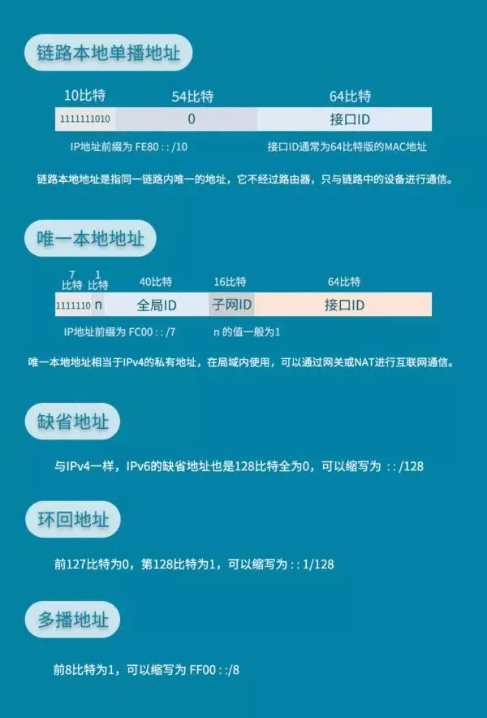

##### IP帧结构


****IPV4****

- ****版本(Version)****
  表示IP数据报中使用IP的版本，占4位。对于IPv4，其值为4

- ****头部长度(Header Length)****

  表示IP数据报头部的总长度，占4位。注意，这个长度的单位是4字节(Byte)，当报头不使用选项字段时，该值为5（即20字节）。通过该值可以发现，IP数据报头部最长为15个单位，也就是60字节，注意，报头长度必须是4字节的整数倍，如若不是，则需要使用填充字段补0凑足。

- ****区分服务(Differentiated Services)****

  表示优先级和服务类型标识，又叫做ToS字段，占8位。它包括3位的优先级、4位的标志位（标志分别为：Delay、Throughput、Reliability、Cost，分别标识延迟、吞吐量、可靠性、开销），剩余的1位不使用。
  
  但IETF的RFC2474中有另外的解释，其前6位定义为区分服务码点(DSCP, Differentiated Services Code Point)，是优先级和服务类型的组合，定义了共64个优先级，剩余2位不使用。
  
  无论是哪个版本，都必须在使用区分服务时有效，如不使用该字段值总为0。在目前的因特网中，多半不使用该服务。

- ****总长度(Total Length)****

  表示整个IP报文的长度（包括报头和数据），占16位（2字节）。这个长度的单位是字节，由此可得出，IP数据报最大长度为2^16^-1字节，即65535字节(64KB)。

- ****标识(Identification)****

  表示该IP数据报的ID号，占16位。每个数据报都有唯一的标识号，IP会维持一个全局变量来记录标识号，当该号码超出字段表示范围时重置为0。之所以要维持这样一个序号，是为了在数据报需要分段时，接收端可以根据该编号和段偏移正确的重组报文。

- ****标志(Flags)****

  表示该数据报后是否还有/允许分段，占3位。只有前两位有意义——最低位为MF(More Fragment)；中间位为DF(Don’t Fragment)。如果MF为1，则表示后面还有分段；如果DF为1，则表示该报文不允许分段，当不允许分段的报文超出MTU时中间节点会将该报文直接丢弃，并返回ICMP报告。

- ****段偏移(Fragment Offset)****

  表示该分段在数据报中的相对位置，占13位。即相对于用户数据字段的起点，该分段从何起始，要注意的是，段偏移以8字节为单位（分段也必须按8的整数倍来分段，最后一段除外）。如果无分段时，该值为0。

- ****生存时间(TTL, Time To Live)****

  表示该数据报的生存期，占8位。每经过一个路由器时，路由器都会将该值减1，如果该值为0，则分组被丢弃。设置这个值是为了避免路由表中的环路导致数据报文无休止的循环转发。有趣的是，该字段设计之初是用来表示数据报在网络中传输的时间的，以秒的单位。也就是说每经过一个路由器，就使该值减去在本路由器所耗费的时间，不足1秒减去1秒，最长为255秒。后来因为网络效率很高，一次转发全流程不过数十毫秒，于是就变为了现在的生存期。

- ****协议(Protocol)****

  表示该数据报在传输层使用的协议，占8位。该字段让主机的IP层可以对应的将数据上交给哪个处理过程，如TCP的协议号是6，UDP的协议号是17等等。

- ****校验和(Checksum)****

  用于该数据报头部部分的校验，占16位。要注意的是，该校验和只负责数据报头部的校验，每次经过路由器转发后一些值可能都会改变，所以每次转发都会重新计算该值。

- ****源地址/目的地址(Sources Address/Destination Address)****
  表示该数据报的发送者和目的地的地址，各占32位。在整个IP传输流程中，这两个字段永远保持不变。

- ****选项(Options)****

  预留作为扩展使用，可变长，占1~40个字节。让用户可以用作除错、测量、加密等使用，也可以完全不使用该字段。目前来说，该字段使用不多。

- ****填充(Padding)****

  如果使用了选项字段导致数据报并非32位(4字节)的整数倍，就需要用该字段补0来凑齐。

****总的来说IPV4的头包含了头部的长度，整个IP报文的长度，报文的id，以及在用户数据段中的偏移，要交给传输层的哪个协议，源地址/目的地址，生存时间。****

****IP6****

- ****Version****：此字段与IPv4的报文格式相同，4代表IPv4,6代表IPv6；

- ****Traffic Class****：流量区分，与IPv4中的服务类型类似；

- ****Flow Label****：流标签，用来表示数据包的一个流；

- ****Payload Length****：载荷长度；

- ****Next Header****：下一报文头，用来标识IPv6扩展报文头的信息；

- ****Hop Limit****：跳数限制，与IPv4中的TTL类似,最大路由接力数；

- ****Source Address****：源IP地址；

- ****Destination Address****：目的IP地址；

- ****Extension Headers****：扩展报文头信息。

关于IPV4和IPV6的区别这里有一篇文章介绍得很详细推荐给大家看下：[IPV4和IPV6的区别有哪些](https://zhuanlan.zhihu.com/p/50747832?utm_source=wechat_session&utm_medium=social&utm_oi=37388499812352)

1. ****IPV4 IPV6共有的区域****：
  
  - Version用来表明IP协议版本
  - Source Adrresss，Destination Address分别为发出地和目的地的IP地址。

2. ****名字发生变动的区域****：
  
  - Time to Live --> Hop Limit in IPv6:
  - Type of Service --> Traffic Class in IPv6
  Type of Service最初是用来给IP包分优先级，比如语音通话需要实时性，所以它的IP包应该比Web服务的IP包有更高的优先级。然而，这个最初不错的想法没有被微软采纳。在Windows下生成的IP包都是相同的最高优先级，所以在当时造成Linux 和 Windows混合网络中，Linux的IP传输会慢于Windows (仅仅是因为Linux更加守规矩!)。后来，Type of Service被实际分为两部分：Differentiated Service Field (DS, 前6位)和Explicit Congestion Notification (ECN, 后2位)，前者依然用来区分服务类型，而后者用于表明IP包途径路由的交通状况。IPv6的Traffic Class也被如此分成两部分。通过IP包提供不同服务的想法，并针对服务进行不同的优化的想法已经产生很久了，但具体做法并没有形成公认的协议。比如ECN区域，它用来表示IP包经过路径的交通状况。如果接收者收到的ECN区域显示路径上的很拥挤，那么接收者应该作出调整。但在实际上，许多接收者都会忽视ECN所包含的信息。交通状况的控制往往由更高层的比如TCP协议实现。

- Protocol 协议 --> Next Header in IPv6

  Protocol用来说明IP包Payload部分所遵循的协议，也就是IP包之上的协议是什么。它说明了IP包封装的是一个怎样的高层协议包(TCP 还是 UDP)。

3. ****IPv6中删除的区域****：

    IPv4和IPv6的长度信息：
    IPv4头部的长度，不考虑options的话，整个IPv4头部有20 bytes，有options的存在，整个头部的总长度是变动的。我们用IHL(Internet Header Length)来记录头部的总长度，用Total Length记录整个IP包的长度。IPv6没有options，它的头部是固定的长度40 bytes，所以IPv6中并不需要IHL区域。Payload Length用来表示IPv6的数据部分的长度。整个IP包为40 bytes + Payload Length。
    
    IPv4中还有一个Checksum区域。这个checksum用于校验IP包的头部信息。IPv6则没有checksum区域。IPv6包的校验依赖高层的协议来完成
    
    Identification, flags和fragment offset，这三个包都是为碎片化服务的。碎片化是指一个路由器将接收到的IP包分拆成多个IP包传送，而接收这些“碎片”的路由器或者主机需要将“碎片”重新组合成一个IP包。不同的局域网所支持的最大传输单元(MTU, Maximum Transportation Unit)不同。如果一个IP包的大小超过了局域网支持的MTU，就需要在进入该局域网时碎片化传输。碎片化会给路由器和网络带来很大的负担。最好在IP包发出之前探测整个路径上的最小MTU，IP包的大小不超过该最小MTU，就可以避免碎片化。IPv6在设计上避免碎片化。每一个IPv6局域网的MTU都必须大于等于1280bytes。IPv6的默认发送IP包大小为1280bytes。

4. ****IPv6新增区域****：
    ****Flow Label**** 是IPv6中新增的区域。它被用来提醒路由器来重复使用之前的接力路径。这样IP包可以自动保持出发时的顺序。这对于流媒体之类的应用有帮助。Flow label的进一步使用还在开发中。IPv6中的Flow Label可以建议路由器将一些IP包保持一样的接力路径。但这只是“建议”，路由器可能会忽略该建议。

##### IPV4已经枯竭了？是否意味着没有地址可以分配了？

对于这个问题大家可以看下下面网友在知乎上的回答：

- [既然ipv4已经枯竭，为什么我的手机还能分配到地址？](https://www.zhihu.com/question/385296850?utm_source=wechat_session&utm_medium=social&utm_oi=37388499812352)
- [如何看待2019年11月26日IPV4地址耗尽？会产生什么样的影响？](https://www.zhihu.com/question/357832973?utm_source=wechat_session&utm_medium=social&utm_oi=37388499812352)

前面提到IPv4地址理论上最多可提供2^32 =42.95亿个IP地址。但是剔除掉私有、保留、组播、测试、链路自动配置、本机环回IP，剩下可以用于互联网通信的IP地址实际只有不到30亿。并且美国等发达国家占用着一大半的IP资源，就公网IP来说资源确实十分紧缺。但是就理论而言有了NAT这类技术的存在，我们只需要有一个公网IP就可以在下面挂很多私有IP的主机，而且拥有私有IP主机下面还可以挂很多私有IP的主机，所以就像一颗树状结构一样，可以不断扩展，其实大部分手机和家庭用户，拿到的都是私有地址，然后在网络上路由的是被翻译过的地址，但是这种结构有个问题就是内网访问外网容易，外网访问内网就比较难了，必须由私网地址发起连接，在NAT上建立规则，才能收到外网发来的消息，内网的用户在互联网其实是隐身的，只有用户主动去访问互联网服务器，服务器才感受到用户电脑的存在。所以安卓手机的各个应用需要后台不时和服务器连接一下，搜索一下有没有消息通知更新。苹果手机则是所有应用都把通知发给苹果，由苹果一个服务器转发。所以苹果手机只需要后台和这个通知服务器连接即可。

##### IPV6的优点，各方对IPv4转IPV6的态度，以及IPv4转IPV6的技术

****IPV6的优点****

- ****支持更大的地址空间****
  IPv6把IP地址由32位增加到128位，从而能够支持更大的地址空间

- ****更快的传输速度****
 IPv6 是固定报头，不像IPv4那样携带一堆冗长的数据，简短的报头提升了网络数据转发的效率，以及减少了在传输过程中的校验的耗时。
 IPv6地址的编码采用类似于CIDR的分层分级结构，简化了路由，加快了路由速度，IPv6 的路由表更小，聚合能力更强，保证了数据转发的路径更短

 - ****更安全的传输方式****
  在IPv4协议中并没有强制使用IPSec加密数据，导致网站明文传输泄漏数据，而IPv6则是直接集成了IPSec，在网络层认证与加密数据，为用户提供端到端的数据安全，保证数据不被劫持。

- ****对可选项更大的支持****
  IPv6的可选项不放入报头，而是放在一个个独立的扩展头部。如果不指定路由器不会打开处理扩展头部。这大大改变了路由性能。IPv6放宽了对可选项长度的严格要求（IPv4的可选项总长最多为40字节），并可根据需要随时引入新选项，IPv6的很多新的特点就是由选项来提供的。

- ****IPv6的分段处理****
  在IPv4的网络中，数据包在传输过程中，路由器会根据其设置的MTU值(最大传输单元，默认为1500字节)来对数据包进行分片传输。
  而在IPv6的网络中，主机在发出数据包时，就已经对数据包进行分片处理(默认最小MTU为1280字节)，这样在数据传输的过程中就不需要路由器来担任分片工作，大大提高了数据传输的效率。

- ****QoS的功能****
  IPv4的报头虽然有服务类型的字段，实际上现在的路由器实现中都忽略了这一字段。在IPv6的头部，有两个相应的优先权和流标识字段，允许把数据报指定为某一信息流的组成部分，并可对这些数据报进行流量控制。如对于实时通信即使所有分组都丢失也要保持恒速，所以优先权最高，而一个新闻分组延迟几秒钟也没什么感觉，所以其优先权较低。IPv6指定这两字段是每一IPv6节点都必须实现的。

- ****即插即用****
  在IPv4的网络中，如果用户不想手动配置IP地址，就得依赖DHCP服务来进行地址自动分配。在IPv6中同样可以通过DHCPv6进行有状态地址分配，但是也可以不依赖DHCPv6来进行无状态地址分配(SLAAC)。
  IPv6可以通过NDP进行路由请求和通告，获取IPv6地址的网络前缀，而 IPv6地址的后64位是由网卡的物理地址(MAC)加上转换算法得来，本身就是全球唯一的地址，所以也就很难遇到IP地址冲突现象。

- [IPv4与IPv6的区别是什么？](https://zhuanlan.zhihu.com/p/71684181?utm_source=wechat_session&utm_medium=social&utm_oi=37388499812352)
- [干货|一文读懂IPv6到底是什么?](https://zhuanlan.zhihu.com/p/71008303)

****各方对IPv4转IPV6的态度****

- 美国等发达国家占用着大量的IP地址，对他们而言现阶段转IPV6的需求还没那么急缺。
- 对于我国由于IPV4根服务器都在发达国家手上，并且现阶段公网IP十分匮乏，如果不推行IPV6将会制约我国互联网，物联网，工业互联网的发展
- 物联网等技术的发展其实不论对发达国家还是发展中国家而言都需要IPV6的容量才能满足设备对IP的需求。

****IPv4转IPV6的技术****

- ****双协议栈技术****


- ****隧道技术****


- ****网络协议转换技术****


- ****IVI技术****


网络运营商通过对一部分IPv4和IPv6地址进行映射，生成IVI专用地址。IPv6网络的用户如果想访问IPv4网络，可以通过IVI网关的映射表获得IPv4地址来直接访问IPv4网络。而IPv4用户如果需要访问IPv6网络，则会通过IVI网关获得IVI-6地址来访问IPv6网络。

##### 一次完整的数据包传输过程

这里以一个简单案例来说明这个过程：

1. PC1 在应用层发起目标IP为192.168.2.2 的Https请求。
2. 传输层接到上层请求的数据，将数据分段并加上传输层报头（目的端口号为443）下传到网络层。
3. 网络接收来处上层的数据后，根据IP协议进行封装，添加PC1 的IP为源IP,PC2 IP为目标IP后封装成数据包，同时协议号位6（TCP的协议号，标识包头里面是TCP的内容）. 下传到数据链路层，因PC1的IP与PC2的IP不在同一网段，所以数据包将发往网关Router E0口。
4. 数据链路层接收数据包后，进行封装，源MAC地址为PC1的MAC地址，目标MAC地址则查询自己的ARP缓存表以获取网关MAC地址。如果PC1 ARP缓存表中没有网关对应的MAC地址，则PC1发出一个ARP广播报文。ARP报文中源MAC地址为PC1 MAC地址，源IP地址为PC1 IP，所要请求的是网关IP对应的MAC地址.
5. 交换机1从F0/1接收到ARP帧后，检查自己ARP缓存表中是否有与F0/1口相对应PC1的MAC地址。没有，则建立起PC1 MAC 地址与F0/1接口的映射关系存储到交换机1的ARP缓存表中。然后将该ARP请求报文进行除F0/1口以外的所有端口进行泛洪。
6. Router收到ARP广播后，进行解封装，发现所要请求的MAC地址是自己的。则Router将PC1的MAC地址写入ARP缓存表中。然后向 PC1发送一个ARP应答单播。该单播消息包括目标IP为PC1 IP，目标MAC为PC1 MAC地址，源IP为Router的E0口IP，源MAC为 Router的E0的MAC。
7. ARP帧F0/24口传给交换机，交换机同样检查MAC表，然后将F0/24口与Router的E0的MaC地址对应起来，存入MAC缓存表中，然后转发该帧。
8. PC1接收到Router的ARP应答帧后，将Router的E0的MAC地址存入ARP缓存中，并将Router的E0的MAC地址作为目标地址封装到数据帧中。发给下层进行网络传输。
9. Router的E0接收这个帧后，看目标MAC地址是否指向自己。是，PC2则将帧头去掉，然后检查目标IP地址，发现这个目标IP不是自己，则不再进行解封装。
10. Router在自己的route表中检查自己的是否有去往目标地址的路由，没有则丢弃该帧。有，路由器经检查发现是去往与E1口直连的网段。则路由器对数据包进行二层封装成帧，源IP为PC1的IP，源MAC地址为routerE1口的Mac地址，目标IP为PC2的IP，目标MAC地址则检查自己 的ARP缓存表获取。如果没有，则发送ARP请求报文。
11. 交换机收到报文后也检查ARP缓存表，然后存储对应接口的MAC地址后进行除接收端口外的泛洪。
12. PC2收到ARP广播后，进行解封装，发现所请求的MAC地址是自己的。则RouterE1的mac地址写入ARP缓存表中。然后向PC1发送一个ARP应答单播。该单播消息包括目标IP为RouterE1的IP，目标Mac为RouterE1的MAC地址，源IP为PC2的IP，源MAC为PC2 的Mac。
13. ARP帧经F0/24口传给交换机，交换机同样检查MAC表，然后将F0/24口与PC2的MaC地址对应起来，存入MAC缓存表中，然后转发该帧。
14. RouterE1口接收到PC2的ARP应答帧后，将PC2的MAC地址存入ARP缓存中，并将PC2的MAC地址作为目标地址封装到数据帧中，然后转发。
15. PC2网际层接收到这个信息包，查看包头，发现目标IP和自己匹配，则解封装，将数据向上层传输。
16. 传输层接收来自下层的Https请求TCP报文，则去掉TCP报头，向应用层传送。
17. 应用层收到Https请求后，发送一个Https回应报文给PC1

- ****网络硬件设备****

集线器，交换器,路由器所处的位置：


- ****集线器 - 物理层****

  集线器对于发过来的数据包，不做任何处理的转发出去。它就是把局域网中的设备相当于直接的连接到了一起，发出的数据同一个集线器连接的设备都可以收到，也正式这个原因，处于同一网络，只能一个设备发出数据，否则信息间会产生碰撞，引发错误，对这种情况，我们称为各设备处于同一冲突域内。

- ****交换器 - 数据链路层****

  交换器可以根据MAC地址来确认转发的端口是哪一个，而不需要像集线器一样，只能无脑的向所有的端口转发。交换机具有缓存区

  
  
- ****路由器 - 网路层、数据链路层、物理层****
  与工作在数据链路层的交换机不同，路由器有更加复杂的功能。包括查询路由表，分包，地址转换等.
  当分组从一个端口进入到路由器之中时，首先在数据链路层检测MAC是否为这个端口的MAC地址，如果符合，那么就将IP数据报上交到网络层，根据路由表，查找应该 从哪一个端口发送出去。路由表就是由IP地址组成的对应关系的表，根据这个表可以查到通过哪个端口发送出去，就能够到达IP数据报的目的IP地址。

#### 应用层协议

##### HTTP、HTTPS、HTTP2, SPDY、QUIC


##### HTTP

****HTTP 特点****

1. 一般情况下Http每次连接只处理一个请求。服务器处理完客户的请求，并收到客户的应答后，即断开连接。早期之所以这样设计是因为服务器需要处理同时面向全世界数十万、上百万客户端的网页访问，但每个客户端与服务器之间交换数据的间歇性较大（即传输具有突发性、瞬时性），并且客户端请求的数据关联性很低，导致大部分通道实际上会很空闲、无端占用资源。因此 HTTP 的设计者有意利用这种特点将协议设计为请求时建连接、请求完释放连接，以尽快将资源释放出来服务其他客户端。但是针对某些场景比如现在一个网页页面往往会嵌入了很多图片，这时候每次访问图片都需要建立一次连接就显得很低效。为了解决这种情况提出了Keep-Alive来解决这样的问题。Keep-Alive 功能使客户端到服务器端的只有在超过 Keep-Alive 规定的时间或者意外断电等情况才会自动断开，否则会一直保持连接持续有效，当出现对服务器的后继请求时，Keep-Alive 功能避免了建立或者重新建立连接。这对于提供静态内容的网站来说，这个功能通常很有用，但是，对于负担较重的网站来说会因为在处理暂停期间，本来可以释放的资源仍旧被占用，会增加无故的负担。

2. Http请求是无状态的，无状态是指协议对于事务处理没有记忆能力，每一个连接都是一个新的连接，服务器不知道客户端是什么状态，这意味着每个请求都是独立的。如果后续处理需要前面的信息，则它必须重传，这样可能导致每次连接传送的数据量增大。Http之所以设计成无状态也是为了减轻服务器的负担，从而高效处理各个请求。但是对于某些场景必须需要有状态的情况，比如购物车需求，登陆需求就需要有个状态来标记。为了解决这个问题Http引入了Cookie,Session进行状态管理。这部分见后续部分。

3. Http 请求是明文传输，是不安全的，它不提供Http请求，响应体加密功能，后续的Https 花了很大一部分精力在加强Http安全传输方面。

4. 存在队头阻塞(Head-Of-Line Blocking)现象:队头阻塞是指当顺序发送的请求序列中的一个请求因为某种原因被阻塞时，在后面排队的所有请求也一并被阻塞，会导致客户端迟迟收不到数据。这个阶段解决队头阻塞主要通过，将同一页面的资源分散到不同域名下，提升连接上限。通过内联一些资源，合并小文件来减少请求数量。

****HTTP 方法****


****HTTP 请求****

- HTTP 请求结构:


- HTTP 请求头字段介绍:

  ****Accept****:
  客户端期望服务器返回的媒体格式,客户端期望的资源类型服务器可能没有，所以客户端会期望多种类型，并且设置优先级，服务器根据优先级寻找相应的资源返回给客户端.
  ```
  Accept: audio/*; q=0.2, audio/basic
  ```
  先逗号分割类型，再分号分割属性，上面例子中用来表示优先级，q的取值范围是(0-1]，其具体值并没有意义，它仅用来排序优先级，如果没有q，默认q=1，也就是最高优先级。

  ****Accept-Charset****:
  表示客户端期望服务器返回的内容的编码格式。
  ```
  Accept-Charset: utf8, gbk; q=0.6
  ```

  ****Accept-Language****:
  表示客户端期望服务器返回的内容的语言。
  ```
  Accept-Language:zh-CN,en-US;q=0.8,zh-TW;q=0.6
  ```

  ****Content-Type****:
  Content-Type是****服务器向客户端发送的头****，代表内容的媒体类型和编码格式，是对Accept头和Accept-Charset头的统一应答。

  ```
  Content-Type: text/html; charset=utf8
  ```

  ****Content-Language****:
  Content-Language是****服务器向客户端发送的头****，服务器通过此字段告知客户端返回的Body信息的语言，是对Accept-Language的统一应答。

  ****Content-Length****:

  表示传输的请求／响应的Body的长度。对于可以提前知道Body长度的请求／响应必须带上这个字段，以便对方可以方便的分辨出报文的边界，也就是Body数据何时结束。但是对于GET请求因为没有Body，所以不需要这个头。还有一种情况如果Body太大，需要边计算边传输，不到最后计算结束是无法知道整个Body大小的，这个时候可以使用http分块传输，这个时候也是不需要指定Content-Length字段。

  ****Date****：
  如果当前respone是及时生成的则Date就是响应的即时生成时间，如果是从缓存中获取的那么Date就是响应内容被缓存的时间。

  ```
  Date: Tue, 15 Nov 1994 08:12:31 GMT
  ```

  ****Last-Modified****：
  标记资源的最近修改时间
  
  ****Age*****:
  表示资源缓存的年龄，也就是资源自缓存以来到现在已经过去了多少时间，单位是秒。

  ```
  Age: 86400
  ```

  *****Expires****:

  服务器使用Expires头来告知对方资源何时失效。如果它的值等于Date头的值，就表示资源已经失效。

  ```
  Expires: Thu, 01 Dec 1994 16:00:00 GMT
  ```

  ****Allow****:

  表示资源支持访问的HTTP Method类型。它是服务器对客户端的建议，告知对方请使用Allow中提到的Method来访问资源。

  ```
  Allow: GET, HEAD, PUT
  ```

  ****Connection****:
    当客户端和服务器需要协商连接的属性时，可以使用Connection头部
    ```
    Connection: close
    ```

  ****Expect****:
  用于请求发送之前向服务器询问许可。譬如要向服务器发送一个很大的文件而不确定是否超出限制，就可以在请求头里携带一个Expect头部.如果服务器说不行，就会返回417 Expectation Failed错误告知客户端放弃。
  
  ****From****:
  用来标记请求发起者的邮件地址，相当于给请求赋予一个责任人。如果服务器发现请求存在问题，就会通过此字段联系到发起人进行处理。因为邮件地址涉及到隐私信息，所以请求携带From头需要征得用户的同意。

  ****Host****:
  RFC协议规定所有的HTTP请求必须携带Host头
  
****HTTP 响应****

- HTTP 响应体结构:


- HTTP 状态码:


****HTTP 状态管理****

- ****Cookie****:
  
  HTTP Cookie是服务器发送到用户浏览器并保存在本地的一小块数据，它会在浏览器下次向同一服务器再发起请求时被携带并发送到服务器上。
  
  ****Cookie 作用****：
  - 识别用户身份
  - 记录历史
  
  ****Cookie 在浏览器与服务器之间的交流过程****：
  - 生成Cookie：Client 第一次访问 Server，Server 在响应头中通过setCookie设置一个 Cookie 并给Cookie一个有效期，返回给 Client
  - 保存Cookie：Client 在接收到 Server 返回的 Cookie 后，将 Cookie 保存下来，过了有效期，Cookie 就会失效。
  - 传递Cookie：Client 再次访问 Server 将会在请求头中带上保存的 Cookie，将 Cookie 传递到 Server
  - 解析Cookie：Server 得到 Client 传递的 Cookie 之后，会解析 Cookie，然后使用Cookie中存的内容做对应的逻辑判断,比如判断是处于登陆状态等。
  
  ****Cookie 存在的问题****:
  - 只有在保存了Cookie的那个浏览器上能够使用该Cookie。同一设备不同浏览器之间，Cookie 不通用.
  - Cookie 的存储大小有限制： 最大可存4KB 左右。
  - 由于Cookie是明文保存在客户端的数据，可能会被客户端修改.
  - 客户端可以禁用Cookie导致Cookie机制不生效.

- ****Session****:
  
  Session是一种在服务器端保存数据的机制。服务器会将开辟一个Session并分配一个Session ID 与当前Session相关的数据会保存到与Session ID关联的服务器内存中，对应的Session ID 会通过前面介绍的Cookie保存到客户端，后续客户端通过Cookie机制来带上对应的Session ID.

  ****Session 的工作原理****:

  - 生成 SessionID：Client第一次访问Server，Server 生成一个随机数，命名为 SessionID，并将其放在响应头里，以Cookie 的形式返回给Client
  - 保存 SessionID：Server将要保存的数据保存在相对应的SessionID 之下，再将 SessionID 保存到服务器端的特定的保存Session 的内存中
  - 使用 Session： Client 再次访问 Server的时候会通过Cookie将SessionID带上（当然还可以通过URL参数带上），服务端拿到SessionID 就会通过SessionID关联到内存上对应的保存该Session数据的内存中查找数据。

- ****Session 与 Cookie 的区别****:
  - Session 在服务器端，Cookie 在客户端。
  - Session 用户无法查看和修改，Cookie 用户可以查看修改。
  - Session 和 Cookie 的存储容量不同。
  - Session 是基于 Cookie 实现的一种数据存储方式。
  


##### HTTPS = HTTP + SSL/TLS

SSL/TLS和HTTP，HTTPS协议一样都是应用层协议，SSL是 _Secure Sockets Layer_ (安全套接层) 的缩写。它是为了解决HTTP协议采用的是明文传输，存在很多比如传输内容会被窃取、篡改，身份会被冒充缺点这些问题而提出的。因为SSL 应用广泛，IETF 就把 SSL 标准化。标准化之后的名称改为 TLS _Transport Layer Security_(传输层安全协议)。TLS 协议是从Netscape SSL 3.0协议演变而来的,这两者可以视作同一个东西的不同阶段。不过随着这两种协议不断发展后续逐渐出现了不兼容现象，目前SSL已经逐渐被TLS取代，所以大多数情况下说的安全层指的就是TLS。我们通常所说的 HTTPS 协议，其实就是就是"HTTP 协议"和"SSL/TLS 协议"的组合。可以理解为"HTTP over SSL"或"HTTP over TLS"。


****SSL/TLS原理****

SSL/TLS主要用于传输数据加密，数据完整性校验，对方身份校验。


SSL/TLS 它主要依赖于三类基本算法：

- 散列函数Hash（MD5、SHA1、SHA256）:
  函数单向****不可逆****、****对输入非常敏感****、****输出长度固定****，针对数据的任何修改都会改变散列函数的结果，用于防止信息篡改并验证数据的完整性。但是需要注意的是在信息传输过程中，散列函数不能单独实现信息防篡改，因为明文传输，中间人可以修改信息之后重新计算信息摘要，因此需要对传输的信息以及信息摘要进行加密。
- 对称加密（AES-CBC、DES、3DES、AES-GCM）:
  相同的密钥可以用于信息的加密和解密，掌握密钥才能获取信息，能够防止信息窃听，在HTTPS中****用于通信数据的加密****。对称加密的优势是信息传输1对1，需要共享相同的密码，密码的安全是保证信息安全的基础，服务器和N个客户端通信，需要维持N个密码记录，且缺少修改密码的机制。但是相对非对称加密而言它的加密****速度较快****。
- 非对称加密（RSA，ECC、DH）: 
  用于身份认证和密钥协商,它的密钥是成对出现的，公钥加密的信息只能私钥解开，私钥加密的信息只能公钥解开。因此掌握公钥的不同客户端之间不能互相解密信息，只能和掌握私钥的服务器进行加密通信，服务器可以实现1对多的通信，客户端也可以用来验证掌握私钥的服务器身份。它的缺点就是****算法计算复杂，加密速度慢****。
  
总而言之SSL/TLS的工作机制如下：
客户端使用非对称加密与服务器进行通信，实现身份验证并协商对称加密使用的密钥，然后对称加密算法采用协商密钥对信息以及信息摘要进行加密通信，不同的节点之间采用的对称密钥不同，从而可以保证信息只能通信双方获取。


****HTTPS如何利用SSL/TLS保证通信的安全****

这部分建议大家可以看下《我的一本算法书》第5章，结合图来理解会理解得比较深刻：

网络数据传输的四个问题：

- ****窃听****：双方传输过程中会被第三者窃取数据监听。


- ****篡改****：通信的数据在传输过程中被第三方中途更改了
  


- ****假冒****：第三方会假冒通信的另一方与自己进行通信从而窃取到数据。

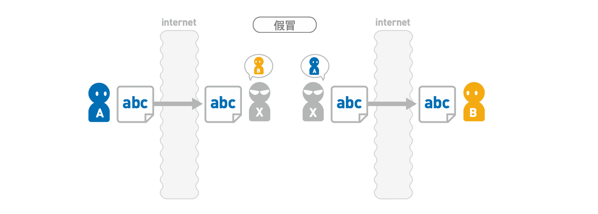

- ****事后否认****：通信一方否认收到的消息是自己发送的。


为了保证传输过程中数据的安全需要对传输数据进行加密：


加密方法有两大类：

- 对称加密：
  加密和解密密钥相同

- 非对称加密：加密和解密密钥不同，一把称为公钥匙，一把称为私钥，
  每个用户都有一对私钥和公钥。私钥用来进行解密和签名，是给自己用的。公钥由本人公开，用于加密和验证签名，是给别人用的。
  当该用户发送文件时，用私钥签名，别人用他给的公钥解密，可以保证该信息是由他发送的。即数字签名。
  当该用户接受文件时，别人用他的公钥加密，他用私钥解密，可以保证该信息只能由他看到。即安全传输。

如果使用对称加密来解决窃听问题，会存在一个问题：对称加密的密钥本身也是数据，它的传输也是不安全的。


为进一步解决这个问题，在密钥传输上使用非对称加密，将公钥发布出去，别人用他的公钥加密，他用私钥解密这样就避免了对内容加密的密钥交换过程引入的密钥窃取问题。


这种就是所谓的混合加密方法：


这种方式安全了吗？其实还不安全，这里还会存在“中间人攻击”看下面情景：


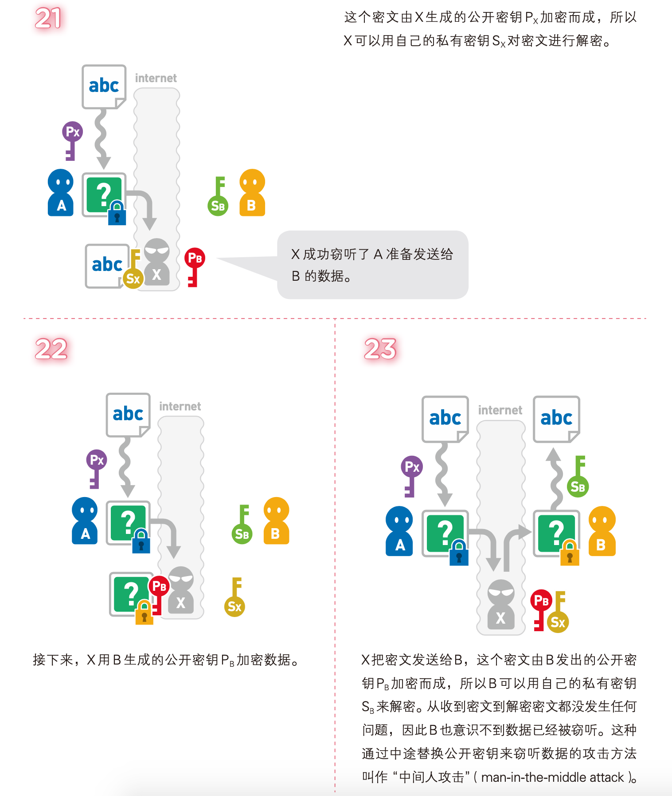

要解决“中间人攻击”可以引入“数字证书认证”的手段：


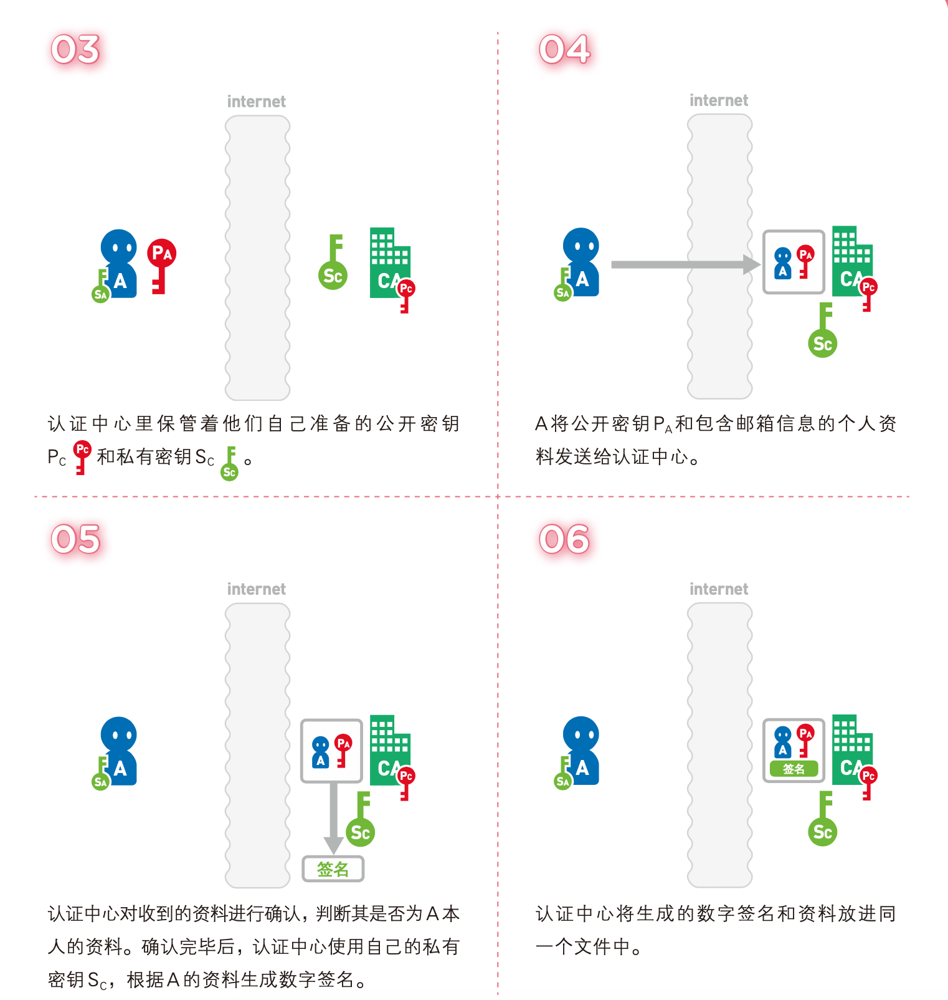


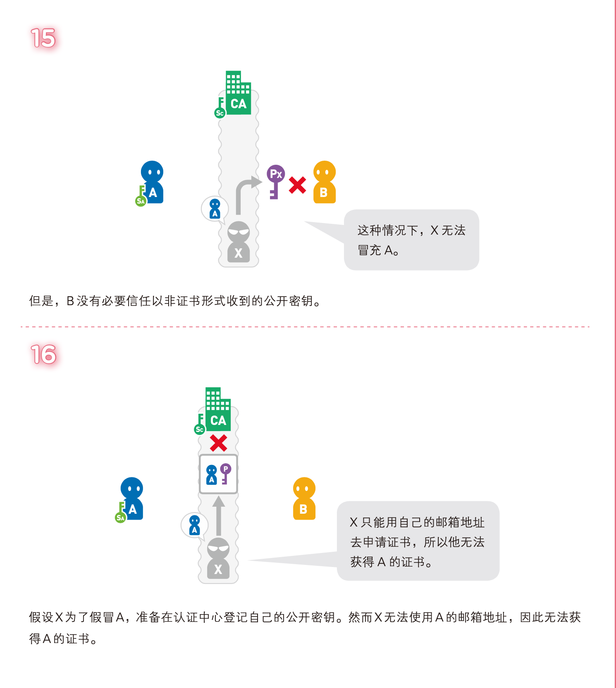

数字证书认证有一套认证体系，并不是随意的机构都有能力进行证书认证。整个认证体系是一个树状结构：

最顶端的认证中心被称为“根认证中心”(root CA)，其自身的正当性由自己证明。对 根认证中心自身进行证明的证书为“根证书”。如果根认证中心不被信任，整个组织就无法 运转。因此根认证中心多为大型企业，或者与政府关联且已经取得了社会信赖的组织。根认证中心授权下面的子认证机构。就这样一层层逐级授权形成最终的认证体系。


****CA使用具体的流程****


- 服务器方向第三方认证机构CA提交公钥、组织信息、个人信息(域名)等信息并申请认证
- CA通过线上、线下等多种手段验证申请者提供信息的真实性，如组织是否存在、企业是否合法，是否拥有域名的所有权等
- 如信息审核通过，CA会向申请者签发认证文件-证书。证书包含以下信息：申请者公钥、申请者的组织信息和个人信息、签发机构CA的信息、有效时间、证书序列号等信息的明文，同时包含一个签名；签名的产生算法：首先，使用散列函数计算公开的明文信息的信息摘要，然后，采用CA的私钥对信息摘要进行加密，密文即签名
- 客户端向服务器发出请求时，S返回证书文件；
- 客户端读取证书中的相关的明文信息，采用相同的散列函数计算得到信息摘要，然后，利用对应CA的公钥解密签名数据，对比证书的信息摘要，如果一致，则可以确认证书的合法性，即公钥合法；
- 客户端然后验证证书相关的域名信息、有效时间等信息；
- 客户端会内置信任CA的证书信息(包含公钥)，如果CA不被信任，则找不到对应CA的证书，证书也会被判定非法。


最终大致的结构如下所示：


****SSL/TLS握手过程****

在SSL/TLS握手过程中，主要是为了完成如下的任务，最终协商出一份对称加密的秘钥：

- 确定双方通信所使用的的TLS版本
- 客户端通过服务器的公钥和数字证书上的数字签名验证服务端的身份
- 确定双方所要使用的密码组合
- 生成会话密钥，该密钥将用于握手结束后的对称加密。

握手过程如下：


采用HTTPS协议的服务器必须要有一套数字证书，可以自己制作，也可以向组织申请。区别就是自己颁发的证书需要客户端验证通过，才可以继续访问，而使用受信任的公司申请的证书则不会弹出提示页面。

- ****客户端发起HTTPS请求****

  用户在浏览器里输入一个HTTPS网址，然后连接到server的443端口.

- ****Client_Hello****

  客户端以明文的形式发起请求，请求中包含版本信息，加密套件候选列表，随机数，扩展字段等信息，说得白话一点就是：
  这个阶段客户端会给服务器发送这样一条消息："我要建立一个安全的加密通道，这是我这边支持的套件列表，以及SSL/TLS版本"。
  我们再具体看下所发送消息的内容部分：
  ****支持的最高TSL协议版本version****，从低到高依次 SSLv2 SSLv3 TLSv1 TLSv1.1 TLSv1.2，当前基本不再使用低于TLSv1 的版本;
  ****客户端支持的加密套件列表****：每个加密套件对应TLS认证算法，密钥交换算法，对称加密算法，信息摘要四个功能的组合
  ****随机数 Random1****：用于后续的密钥的生成;

  

- ****Server_Hello****

  这个阶段服务器会根据自己的实际情况，返回协商的信息结果，包括选择使用的协议版本version，加密套件(这个套件决定了后续加密和生成摘要时具体使用哪些算法)，以及生成的随机数 Random2等，其中随机数用于后续的对称秘钥协商;
  说得形象点就是服务端收到客户端发出的Client_Hello消息后，会作出如下回复："我看了你发的版本信息，加密套件信息，我确认了下我们可以使用TLSVxxx版本的协议，这是我的认证证书，里面包含了后续用于和我进行密钥交换的加密算法的公钥"

  

- ****Certificate Request****

  Certificate Request 是服务端要求客户端上报证书，这一步是可选的。

- ****Server Hello Done****

  通知客户端 Server Hello 过程结束。
  
  
- ****Certificate Verify****

  客户端收到从服务端发送过来的证书后验证证书链的可信性，证书是否吊销，有效期，域名等信息，只有验证通过才会进行后续通信，否则根据错误情况不同做出提示和操作。验证通过后取出证书中的服务端公钥，再生成一个随机数 Random3，再用服务端公钥非对称加密 Random3 生成 PreMaster Key。

  

  
- ****Client Key Exchange****

  上面客户端根据服务器传来的公钥生成了PreMaster Key，Client Key Exchange 就是将这个key传给服务端，服务端再用自己的私钥解出这个PreMaster Key 得到客户端生成的 Random3。至此，客户端和服务端都拥有 Random1 + Random2 + Random3，两边再根据同样的算法就可以生成一份秘钥，握手结束后的应用层数据都是使用这个秘钥进行对称加密。为什么要使用三个随机数呢？这是因为 SSL/TLS 握手过程的数据都是明文传输的，并且多个随机数种子来生成秘钥不容易被暴力破解出来。客户端将 PreMaster Key 传给服务端的过程如下图所示：

  

- ****Change Cipher Spec(Client)****

  客户端通过一条事件消息通知服务端后面再发送的消息都会使用前面协商出来的秘钥加密了。
  
  
- ****Encrypted Handshake Message(Client)****

  客户端将前面的握手消息生成摘要再用协商好的秘钥加密，这是客户端发出的第一条加密消息。服务端接收后会用秘钥解密，能解出来说明前面协商出来的秘钥是一致的。
  
  
- ****Change Cipher Spec(Server)****
  服务端通过一条事件消息通知客户端后面再发送的消息都会使用前面协商出来的秘钥加密了。

- ****Encrypted Handshake Message(Server)****

  这一步对应的是 Server Finish 消息，服务端也会将握手过程的消息生成摘要再用秘钥加密，这是服务端发出的第一条加密消息。客户端接收后会用秘钥解密，能解出来说明协商的秘钥是一致的。
  

- ****Application Data****

  双方已安全地协商出了同一份秘钥，所有的应用层数据都会用这个秘钥加密后再通过 TCP 进行可靠传输。

##### HTTP2

HTTP/2最大的特点是不改动原有HTTP的语义，HTTP 方法、状态码、URI 及首部字段，等核心概念的情况下提升整体性能。

****二进制传输****

HTTP/1.1的头信息是ASCII编码的文本，body数据体可以是文本，也可以是二进制数据。而在HTTP/2中，新增了二进制分帧层，将所有数据打散为数个小片的二进制帧数据，以帧为单位在二进制分帧层中传输，协议看到的只是一个个的二进制碎片。而不再是Header+Body形式组织的数据。多个帧之间可以乱序发送，根据帧首部的流标识可以重新组装。


HTTP/2共定义了十种帧：

- ****HEADERS****: 报头帧 (type=0x1)，用来打开一个流或者携带一个首部块片段
- ****DATA****: 数据帧 (type=0x0)，装填主体信息，可以用一个或多个 DATA 帧来返回一个请求的响应主体
- ****PRIORITY****: 优先级帧 (type=0x2)，指定发送者建议的流优先级，可以在任何流状态下发送PRIORITY 帧，包括空闲 (idle) 和关闭 (closed) 的流
- ****RST_STREAM****: 流终止帧 (type=0x3)，用来请求取消一个流，或者表示发生了一个错误，payload 带有一个 32 位无符号整数的错误码 (Error Codes)，不能在处于空闲 (idle) 状态的流上发送 RST_STREAM 帧
- ****SETTINGS****: 设置帧 (type=0x4)，设置此 连接 的参数，作用于整个连接
- ****PUSH_PROMISE****: 推送帧 (type=0x5)，服务端推送，客户端可以返回一个 RST_STREAM 帧来选择拒绝推送的流
- ****PING****: PING 帧 (type=0x6)，判断一个空闲的连接是否仍然可用，也可以测量最小往返时间 (RTT)
- ****GOAWAY****: GOWAY 帧 (type=0x7)，用于发起关闭连接的请求，或者警示严重错误。GOAWAY 会停止接收新流，并且关闭连接前会处理完先前建立的流
- ****WINDOW_UPDATE****: 窗口更新帧 (type=0x8)，用于执行流量控制功能，可以作用在单独某个流上 (指定具体 Stream Identifier) 也可以作用整个连接 (Stream Identifier 为 0x0)，只有 DATA 帧受流量控制影响。初始化流量窗口后，发送多少负载，流量窗口就减少多少，如果流量窗口不足就无法发送，WINDOW_UPDATE 帧可以增加流量窗口大小
- ****CONTINUATION****: 延续帧 (type=0x9)，用于继续传送首部块片段序列

深入理解可以看[HTTP/2 中的帧定义](https://halfrost.com/http2-http-frames-definitions/)这一篇文章。
HTTP 2.0最大的特点： 不会改动HTTP 的语义，HTTP 方法、状态码、URI 及首部字段，等等这些核心概念上一如往常，却能致力于突破上一代标准的性能限制，改进传输性能，实现低延迟和高吞吐量。

****首部压缩 HPACK算法****


****索引表****

  ****静态索引****:静态索引表是固定的，对于客户端服务端都一样，目前协议商定的静态索引包含[61个键值](https://httpwg.org/specs/rfc7541.html#static.table.definition)
  ****动态索引****:动态索引表是一个FIFO队列维护的有空间限制的表,一个 HTTP2 连接有且仅有一份动态表,当一个首部匹配不到索引时，可以选择把它插入动态索引表中，下次同名的值就可能会在表中查到索引并替换。但是并非所有首部键值都会存入动态索引，因为动态索引表是有空间限制的，最大值由SETTING帧中的SETTINGS_HEADER_TABLE_SIZE (默认 4096 字节) 设置.动态索引用于弥补出现一些在静态索引表中不存在的头部。

  ****索引表地址空间****:

  ```
  <----------  Index Address Space ---------->
  <-- Static  Table -->  <-- Dynamic Table -->
  +---+-----------+---+  +---+-----------+---+
  | 1 |    ...    | s |  |s+1|    ...    |s+k|
  +---+-----------+---+  +---+-----------+---+
                         ⍋                   |
                         |                   ⍒
                  Insertion Point      Dropping Point
```


当要发送一个请求时，会先将其头部和静态表对照，对于完全匹配的键值对，可以直接使用一个数字表示，如上图中的2：method: GET，对于头部名称匹配的键值对，可以将名称使用一个数字传输，如上图中的19：path: /resource，同时告诉服务端将它添加到动态表中，以后的相同键值对就用一个数字表示了。这样不经常变动的值，只用发送一次就好了。


****多路复用****

多路复用指的是所有请求的都通过一个TCP连接并发完成，不但减少了TCP/IP建立时间，同时解决了浏览器限制同一个域名下的请求数量的问题。在介绍HTTP2多路复用之前，必须明确帧和流两个概念，前面已经介绍了帧的概念，接下来我们看下什么是流：

流是一个虚拟的概念，它是对连接中虚拟通道的抽象，每个流都有一个唯一的整数ID，客户端发起的流的ID都是奇数，服务端发起的流的ID则是偶数，流中可以是双向的可同时发送和接受数据，多个帧之间可以乱序发送，根据帧首部的流标识可以重新组装。流可以是客户端或服务器单方面建立，也可以被任意一方关闭。

同域名下所有通信都在单个连接上完成，同个域名只需要占用一个TCP连接，使用一个连接并行发送多个请求和响应。单个连接可以承载任意数量的双向数据流。

介绍完流的概念我们再来看下HTTP是怎么从最初的形态进化为多路复用的：

1. 最早的时候我们每次发起一个请求都要建立一个连接，经过TCP三次握手，结束请求后立即断开连接。这样就存在一个问题，频繁的请求建立连接会浪费大量的时间。

2. 为了解决上面的问题，引入了Keep-Alive：Keep-Alive使用复用连接池，一定时间内，同一域名多次请求数据，只建立一次 HTTP 请求，其他请求可复用每一次建立的连接通道，以达到提高请求效率的问题。HTTP 1.0 中默认是关闭的，需要在HTTP头加入"Connection: Keep-Alive"，才能启用Keep-Alive；HTTP 1.1中默认启用Keep-Alive，只有在头部加入"Connection: close "，才关闭。那么在Keep-Alive模式下，如何判断当前响应数据是否接收完毕？我们知道不使用Keep-Alive的情况下可以通过看连接是否关闭。在使用Keep-Alive后，就不能这样了，这就要求服务器对Keep-Alive的响应头部一定要返回content-length标识body的长度，供浏览器判断界限。有时content-length的方法并不太适用也可以使用 Transfer-Encoding: chunked 头部发送一串一串的数据，最后收到长度为 0 的chunked标示结束。

但是这种情况还是存在队头阻塞问题：HTTP1.0 中 下个请求必须在前一个请求返回后才能发出，request-response对按序发生。如果中途某个请求长时间没有返回就会导致接下来的请求就全部阻塞了。

3. 为了解决上面的问题，引入了管线化：HTTP管线化是建立在持久连接之上，把多个请求一并发给服务器，但是服务器需要按照顺序一个一个响应，而不是等到一个响应回来才能发下一个请求，这样就节省了很多请求到服务器的时间。不过HTTP 管线化仍旧有阻塞的问题，若上一响应迟迟不回，后面的响应都会被阻塞到。


4. 为了彻底解决队头阻塞引入了多路复用技术，在一个TCP连接上建立起多个数据流，这些流上可以并行，双向传输帧数据，所有的HTTP2.0的请求都在这个连接上进行。在HTTP2.0上，客户端和服务器可以把HTTP 消息分解为互不依赖的帧，然后乱序发送，最后再在另一端把它们重新组合起来。需要注意的是，同一链接上有多个不同方向的数据流在传输。客户端可以一边乱序发送stream，也可以一边接收者服务器的响应，而服务器那端同理。采用了多路复用技术后"域名分区"(由于浏览器的限制，同一个域下最多只能建立6个连接。我们通常使用子域名来减少所有资源在只有一个连接时的产生的排队延迟。)这种优化手段对于HTTP2.0是无用的，因为资源都是并行交错发送，且没有限制，不需要额外的多域名并行下载。


****服务端推送****

服务端推送是指服务器可以对一个客户端请求发送多个响应。服务器向客户端推送资源无需客户端明确的请求。
比较典型的例子，服务端根据客户端的请求，提前返回多个响应，推送额外的资源给客户端。如下图，客户端请求stream 1(/page.html)。服务端在返回stream 1的消息的同时推送了stream 2(/script.js)和stream 4(/style.css)

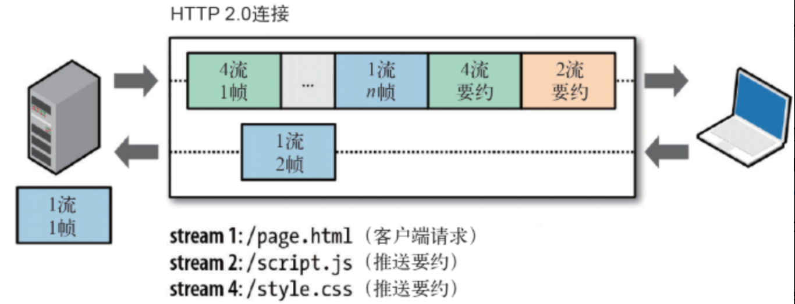

- 服务器推送工作原理：

  - PUSH_PROMISE帧是服务端向客户端主动推送资源的信号。
  - PUSH_PROMISE帧中只包含预推送资源的首部。如果客户端对PUSH_PROMISE帧没有意见，服务端在PUSH_PROMISE帧后发送响应的DATA帧。如果客户端已经缓存了该资源，不需要推送，可以拒绝PUSH_PROMISE帧。
  - _PUSH-PROMISE必须遵循请求-响应原则，只能借着对请求的响应推送资源_。
  - PUSH_PROMISE帧必须在返回响应之前发送.
  - 所有推送的资源都必须遵守同源策略。换句话说，服务器不能随便将第三方资源推送给客户端，而必须是经过双方的确认才行。

****请求优先级****
  HTTP2中每个流都可以带有一个31bit的优先值：0表示最高优先级；2的31次方-1表示最低优先级。可以通过它针对每个流设置对应的优先级。但是在使用的时候需要注意避免引起队首阻塞问题，比如高优先级的慢响应请求会阻塞其他资源的交互等情况

****流量控制****
  HTTP2中一个连接上可以存在多个流，这里提到的流量控制是针对每个流的，对不同的流进行流量控制可以避免某个流的传输不会阻塞其他流。

##### HTTP2 的不足

- TCP 以及 TCP+TLS 建立连接的延时
- TCP 的队头阻塞并没有彻底解决
- 多路复用导致服务器压力上升，容易导致Timeout

##### SPDY

SPDY是HTTP2的前身，SPDY位于HTTP之下，TCP和SSL之上，这样可以轻松兼容老版本的HTTP协议同时可以使用已有的SSL功能，HTTP2 大部分协议都是基于SPDY进行的扩展，包括服务器端推送，多路复用和帧作为传输的最小单位。但SPDY与HTTP2 也有一些实现上的不同，比如 SPDY 的头部压缩使用的是DEFLATE算法，而HTTP2 使用的是HPACK算法，压缩率更高。


##### QUIC/HTTP3

QUIC 是 Quick UDP Internet Connection 的简称，它是由Google提出的使用UDP进行多路并发传输的协议,它的目的是减少连接和传输延迟，并且提供与TLS/SSL相同的安全性，整个组成结构如下所示：


##### QUIC的优势

##### 使用多路复用+前向纠错解决队头阻塞问题

队头阻塞存在于HTTP协议层和TCP协议层，HTTP2.0通过多路复用技术，解决了HTTP层面的队头阻塞问题，但是TCP层面的队头问题依然存在，这主要是TCP 协议的丢包重传导致的，因为一旦有了前后顺序，队头阻塞问题将不可避免。


QUIC通过前向恢复技术，利用冗余数据包的形式通过已有数据进行错误恢复。但是这并不意味着完全不用重传技术，在某些非常重要的数据或者丢失两个包的情况还是需要借助重传机制来恢复。

##### 快速建立连接


- ****使用UDP 替代 TCP缩短握手时间****

在开始介绍介绍之前我们先看下不使用TFO + Session Ticket的情况下基于TCP传输层的HTTP协议整个数据传输过程大致需要的时间，时间以RTT作为度量（RTT表示客户端从发出一个请求数据，到接收到响应数据之间间隔的时间，一般情况下，一个RTT大约在几十毫秒左右，网络很好的情况下可以达到几毫秒，恶劣网络环境下达到几百毫秒）：

```
- 建立TCP虚拟通需要三次握手 => 需要 1.5 RTT
- TLS: 客户端发送Client Hello消息 -> 服务端回复Server Hello消息 -> 客户端发送Key Exchange消息 => 需要 1.5 RTT（TLS 连接有两个版本 --TLS1.2 和 TLS1.3，每个版本建立连接所花的时间不同，大致需要 1~2个RTT）
- 在虚拟通道发出请求到收到服务器的HTTP Response => 需要 1 RTT
所以这种情况下总时间为4RTT

但是浏览器从服务端获取一个页面，通常会嵌入很多资源，这些资源往往需要重新建立一条连接，这里也需要4RTT,所以一般整个页面下来，至少需要8RTT,HTTPS2由于复用连接的使用可以减少1.5RTT + 1.5RTT共 3 RTT.所以这种情况下需要5 RTT.
```

这是由于传输层瓶颈导致的，所以需要有一个传输协议来替换TCP协议，所以就将目标放在了UDP协议，UDP不需要三次握手，不会带来附加的RTT时间，优化了连接建立的握手延迟。

- ****集成了 性能更佳的TLS 1.3****

在完全握手情况下需要 1-RTT 建立连接。TLS1.3 借助TFO (TCP Fast Open) + Session Ticket 恢复会话可以直接发送加密后的应用数据，不需要额外的TLS握手，也就是 0-RTT。

接下来看下****Session Ticket****的工作原理：

在使用Session Ticket的时候所有服务器预先设定相同的Ticket Key,而Session Ticket是服务器利用Ticket Key对Session Key进行加密再加上其他相关信息生成.每个Session Ticket都对应着相应的加密参数，服务端可以根据Session Ticket在缓存里面查找对应的加密参数，来完成加密。它的工作原理如下图所示：


那么TFO (TCP Fast Open)又是什么呢？我们知道正常情况下发送SYN时不能携带数据，TFO (TCP Fast Open)，是对TCP的拓展，不仅可以在发送SYN时携带数据，还可以保证安全性。QUICK就是通过TFO将先前的Session Ticket发送给服务端，服务端根据Session Ticket在缓存里面查找对应的加密参数，来完成后续加密。

##### 多路复用及连接层面的优化

QUIC 是为多路复用从头设计的，携带个别流的的数据的包丢失时，通常只影响该流。QUIC 连接上的多个 stream 之间并没有依赖，也不会有底层协议限制。假如 stream2 丢了一个包，也只会影响 stream2 的处理。区别于TCP需要按照4要素（客户端 IP、端口, 服务器 IP、端口）确定一个连接的，QUIC 则是通过客户端生成的一个64 位 Connection ID来区别不同连接。只要 Connection ID不变，连接就不需要重新建立，即便是客户端的网络发生变化。由于迁移客户端继续使用相同的会话密钥来加密和解密数据包，QUIC 还提供了迁移客户端的自动加密验证。

- ****在多路复用的基础上提供基于流和连接级别的流量控制****

多路复用意味着在一条 Connetion 上会同时存在多条 Stream。

QUIC 接收者会通告每个流中最多想要接收到的数据的绝对字节偏移。随着数据在特定流中的发送，接收和传送，接收者发送 WINDOW_UPDATE帧，该帧增加该流的通告偏移量限制，允许对端在该流上发送更多的数据。

除了每个流的流控制外，QUIC 还实现连接级的流控制，以限制QUIC接收者愿意为连接分配的总缓冲区。连接的流控制工作方式与流的流控制一样，但传送的字节和最大的接收偏移是所有流的总和。

这样我们就可以在内存不足或者上游处理性能出现问题时，通过流量控制来限制传输速率，保障服务可用性。


#### 改进的拥塞控制、可靠传输

- ****应用程序层面就能实现可插拔的多种拥塞控制算法****

可以针对不同业务，不同网络，不同连接，甚至不同的RTT配置不同的拥塞控制算法。应用程序不需要停机和升级就能实现拥塞控制的变更

- ****使用单调递增的 Packet Number 代替了 TCP 的 seq****

每个Packet Number都严格递增，也就是说就算Packet N丢失了重传的 Packet N 的 Packet Number 已经不是N，而是一个比N大的值。而 TCP重传策略存在二义性，比如客户端发送了一个请求，一个 RTO 后发起重传，而实际上服务器收到了第一次请求，并且响应已经在路上了，当客户端收到响应后，得出的 RTT 将会比真实 RTT 要小。当 Packet N 唯一之后，就可以计算出正确的 RTT。

- ****一个Packet只要被Ack，就认为它一定被正确接收****

Reneging 的意思是，接收方有权把已经报给发送端 SACK（Selective Acknowledgment 里的数据给丢了（_如接收窗口不够而丢弃乱序的包_）。
QUIC 中的 ACK 包含了与 TCP 中 SACK 等价的信息，但 QUIC 不允许任何（包括被确认接受的）数据包被丢弃。这样不仅可以简化发送端与接收端的实现难度，还可以减少发送端的内存压力。

- ****增加Ack Delay时间,使得RTT时间更加准确****

TCP 的 Timestamp 选项存在一个问题：发送方在发送报文时设置发送时间戳，接收方在确认该报文段时把时间戳字段值复制到确认报文时间戳，但是没有计算接收端接收到包到发送 Ack 的时间。这个时间可以简称为 Ack Delay，会导致 RTT 计算误差。


##### 各个版本速度对比


##### WebSocket

****WebSocket Vs Https****

WebSocket是与HTTP一样同是处于应用层的网络协议，它是一种在单个TCP连接上进行全双工通讯的协议，只要通过一次握手就可以跟WebSocket服务器建立全双工通信的连接，连接建立成功之后，客户端可以向服务器端发送数据，服务端也可以主动向客户端推送数据。它和HTTP相比它是持久的，双向的，只需要一次握手就可以建立连接。

或许大家有个疑问前面介绍的HTTP2不是也介绍了服务端推送功能吗？HTTP1.1 的 keep-alive不是可以建立一个持久的连接吗？为什么还需要WebSocket。其实不是这样的HTTP的生命周期通过Request来界定，也就是一个Request 一个Response，一次HTTP请求就结束了。在HTTP1.1中进行了改进，增加了一个keep-alive，它的作用就是在一个HTTP连接中，可以发送多个Request，接收多个Response。达到复用连接的目的，但是不论哪种情况一个Request都对应Response，并且这个response也是被动的，不能主动发起。HTTP2的服务端推送也是由对应的请求后触发的。

****其他方案****

- 轮询

轮询是在特定的的时间间隔（如每1秒），由浏览器对服务器发出HTTP请求，然后由服务器返回最新的数据给客户端。轮询的方式有一个轮询时间间隔的问题，间隔长了服务端的数据不能及时更新到客户端，间隔短了就会有许多无用的请求，增加服务器压力，浪费服务器以及带宽资源。同时HTTP请求可能包含较长的头部，其中真正有效的数据可能只是很小的一部分，同样会浪费很多的带宽等资源。

- 长轮询 Long-Polling


客户端发送一个超时时间很长的 Request，服务器 hold 住这个连接，在有新数据到达时返回Response，相比频繁轮询，占用的网络带宽少了。但是这种情况即使没有数据传输也占用着服务的连接。

****建立WebSocket连接****

WebSocket连接只需一次成功握手即可建立:

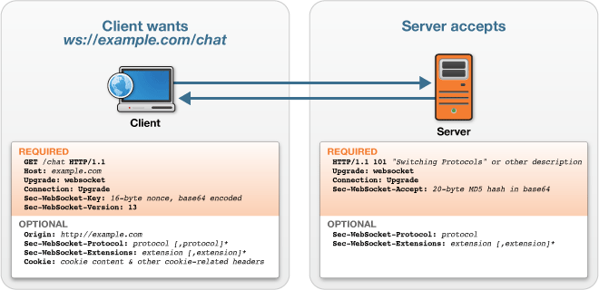


客户端发出建立连接的请求：

```
GET /chat HTTP/1.1
Host: server.example.com
Upgrade: websocket
Connection: Upgrade
Sec-WebSocket-Key: x3JJHMbDL1EzLkh9GBhXDw==
Sec-WebSocket-Protocol: chat, superchat
Sec-WebSocket-Version: 13
Origin: http://example.com
```

上面的请求HTTP版本必须是1.1或更高，方法必须是GET。
Connection: Upgrade表示这是一个协议升级包，需要升级到的协议用如下字段表示：
```
Upgrade: websocket
```
Sec-WebSocket-Version:表示要升级到的Websocket协议版本.
Sec-WebSocket-Key是浏览器生成的一个Base64 encode的值，主要用于验证服务端的身份。

服务端返回对应的响应报文：

```
HTTP/1.1 101 Switching Protocols
Upgrade: websocket
Connection: Upgrade
Sec-WebSocket-Accept: HSmrc0sMlYUkAGmm5OPpG2HaGWk=
Sec-WebSocket-Protocol: chat
```

状态码为101，表示协议切换成功。
Sec-WebSocket-Accept需要服务器通过客户端发送的Sec-WebSocket-Key计算出来。它把客户发送的 Sec-WebSocket-Key 和 "258EAFA5-E914-47DA-95CA-C5AB0DC85B11"连接起来，把结果用SHA-1编码，再用base64编码一次，就可以了。

一旦服务器发送这个请求头，握手就完成了，WebSocket连接就建立起来了。后续就可以在这个连接上进行传输数据了。

****数据传输****

```
Frame format:  
​​
0                   1                   2                   3
0 1 2 3 4 5 6 7 8 9 0 1 2 3 4 5 6 7 8 9 0 1 2 3 4 5 6 7 8 9 0 1
+-+-+-+-+-------+-+-------------+-------------------------------+
|F|R|R|R| opcode|M| Payload len |    Extended payload length    |
|I|S|S|S|  (4)  |A|     (7)     |             (16/64)           |
|N|V|V|V|       |S|             |   (if payload len==126/127)   |
| |1|2|3|       |K|             |                               |
+-+-+-+-+-------+-+-------------+ - - - - - - - - - - - - - - - +
|     Extended payload length continued, if payload len == 127  |
+ - - - - - - - - - - - - - - - +-------------------------------+
|                               |Masking-key, if MASK set to 1  |
+-------------------------------+-------------------------------+
| Masking-key (continued)       |          Payload Data         |
+-------------------------------- - - - - - - - - - - - - - - - +
:                     Payload Data continued ...                :
+ - - - - - - - - - - - - - - - - - - - - - - - - - - - - - - - +
|                     Payload Data continued ...                |
+---------------------------------------------------------------+
```

1. ****FIN****

1个bit位，用来标记当前数据帧是不是最后一个数据帧，因为一个消息可能会分成多个数据帧来传递，当然，如果只需要一个数据帧的话，第一个数据帧也就是最后一个。

2. ****RSV1, RSV2, RSV3****

这三个，各占用一个bit位，根据RFC的介绍，这三个bit位是用做扩展用途，没有这个需求的话设置位0。

3. ****Opcode****

帧操作码，占用4个bit位，也就是一个16进制数，它用来描述要传递的数据的用途：

0x0 标示当前数据帧为分片的数据帧，也就是当一个消息需要分成多个数据帧来传送的时候，需要将opcode设置位0x0。
0x1 标示当前数据帧传递的内容是文本
0x2 标示当前数据帧传递的是二进制内容，不要转换成字符串
0x8 标示请求关闭连接
0x9 标示Ping请求
0xA 标示Pong数据包，当收到Ping请求时自动给回一个Pong

4. ****MASK****

占用一个bit位，标示数据有没有使用掩码，RFC中有说明，服务端发送给客户端的数据帧不能使用掩码，客户端发送给服务端的数据帧必须使用掩码。
如果一个帧的数据使用了掩码，那么在Maksing-key部分必须是一个32个bit位的掩码，用来给服务端解码数据。

5. ****Payload len****

数据的长度，默认位7个bit位。
如果数据的长度小于125个字节（注意：是字节）则用默认的7个bit来标示数据的长度。
如果数据的长度为126个字节，则用后面相邻的2个字节来保存一个16bit位的无符号整数作为数据的长度。
如果数据的长度大于126个字节，则用后面相邻的8个字节来保存一个64bit位的无符号整数作为数据的长度。

6. ****Masking-key****

数据掩码，如果MASK设置位0，则该部分可以省略，如果MASK设置位1，怎Masking-key位一个32位的掩码。用来解码客户端发送给服务端的数据帧。

7. ****Payload data****

该部分也是最后一部分，是帧真正要发送的数据，可以是任意长度。

****Pings和Pongs：WebSockets的心跳****

在使用websocket的过程中，有时候会遇到网络断开的情况，但是在网络断开的时候服务器端并没有触发onclose的事件。这样会有：服务器会继续向客户端发送多余的链接，并且这些数据还会丢失。所以就需要一种机制来检测客户端和服务端是否处于正常的链接状态。因此就有了websocket的心跳了。在经过握手之后的任意时刻里，无论客户端还是服务端都可以选择发送一个ping给另一方。 当ping消息收到的时候，接受的一方必须尽快回复一个pong消息。还有心跳，说明还活着，没有心跳说明已经挂掉了。如果挂掉了这时候我们使用ws.close关闭连接，在一段时间后可以通过onclose事件监听到。因此在onclose事件内，我们可以调用 reconnect事件进行重连操作。

#### 浏览器原理

#### 客户端渲染，服务端渲染

- ****客户端渲染 CSR:****


- ****服务端渲染 SSR:****


CSR首屏加载时间比较长，在CSR 的页面渲染流程中，首先要加载 HTML 文件，之后要下载页面所需的 JavaScript 文件，然后 JavaScript 文件渲染生成页面,所以在网络差的情况下这种情况第一次进去会有白屏现象。
并且CSR项目的SEO(搜索引擎优化)能力极弱，在搜索引擎中基本上不可能有好的排名。因为目前大多数搜索引擎主要识别的内容还是HTML，对JavaScript文件内容的识别都还比较弱。如果一个项目的流量入口来自于搜索引擎，这个时候你使用 CSR进行开发，就非常不合适了。


SSR的产生，主要就是为了解决上面所说的两个问题。在React中使用SSR技术，我们让React代码在服务器端先执行一次，使得用户下载的HTML已经包含了所有的页面展示内容，这样页面首屏加载时间得到一倍以上的缩减。
并且由于从服务端下载下来的HTML中已经包含了网页的所有内容，所以SEO能力得到极大提高。之后，我们让React代码在客户端再次执行，为HTML网页中的内容添加数据及事件的绑定，页面就具备了 React 的各种交互能力。

#### 跨域问题

跨域是指一个域下的文档或脚本试图去请求另一个域下的资源，由于浏览器同源策略要求不允许从一个域上加载的脚本获取或操作另一个域上的文档属性。也就是不允许跨域的存在。那么同源中的源又是什么意思？ 这里的源由协议（protocal）、主机（host）和端口（port）组成。只有三者都一直才称为同源。

#### 前后端分离

#### 前后端分离开发流程


#### 前后端分离开发职责划分

1 后端java工程师：

后段开发负责Model层，业务处理/数据等，接口数据出错，数据没有提交成功，应答超时等问题，全部由后端工程师来解决。

```
把精力放在java基础，设计模式，jvm原理，spring+springmvc原理及源码，linux，mysql事务隔离与锁机制，mongodb，http/tcp，多线程，分布式架构，弹性计算架构，微服务架构，java性能优化，以及相关的项目管理等等。

后端追求的是：三高（高并发，高可用，高性能），安全，存储，业务等等。
```

2 前端工程师：

前端开发负责View和Controller层关于页面逻辑，跳转错误，浏览器兼容性问题，脚本错误，页面样式等问题都是前端负责处理。

```
把精力放在html5，css3，jquery，angularjs，bootstrap，reactjs，vuejs，webpack，less/sass，gulp，nodejs，Google V8引擎，javascript多线程，模块化，面向切面编程，设计模式，浏览器兼容性，性能优化等等。

前端追求的是：页面表现，速度流畅，兼容性，用户体验等等。

```

#### 前后端分离架构图


前端服务器使用nginx,前端/WEB服务器放的是CSS，JS，图片等等一系列静态资源（可以考虑放到类似于阿里云的oss这类文件服务器上，再在oss上配cdn不但页面速度加快，同时nginx的负载会进一步降低）,前端服务器负责控制页面引用/跳转/路由，在需要数据的时候前端通过ajax来调用http请求调用后端的restful api接口。后段负责数据处理逻辑，最终以json的形式向前端提供数据。

#### 前后端分离的优点：

- 在大并发情况下，可以同时水平扩展前后端服务器
- 职责分工明确，支持并行开发
- 减少后端服务器的并发/负载压力：除了接口以外的其他所有http请求全部转移到前端nginx上。而前端页面除了第一次页面请求外，会大量调用本地缓存。即使后端服务暂时超时或者宕机了，前端页面也会正常访问，只不过数据刷不出来而已。
- 可以支持多端应用

[深入浅出：了解前后端分离优势、前后端接口联调以及优化问题](https://my.oschina.net/u/4405743/blog/3843221)


#### Nginx 负载均衡


1. 正向代理


正向代理是一个位于客户端和目标服务器之间的服务器(代理服务器)，为了从目标服务器取得内容，客户端向代理服务器发送一个请求并指定目标，然后代理服务器向目标服务器转交请求并将获得的内容返回给客户端。

正向代理的应用场景：

- 突破访问限制: 通过代理服务器，可以突破自身IP访问限制，访问国外网站，教育网等
- 提高访问速度: 通常代理服务器都设置一个较大的硬盘缓冲区，会将部分请求的响应保存到缓冲区中，当其他用户再访问相同的信息时， 则直接由缓冲区中取出信息，传给用户，以提高访问速度。
- 隐藏客户端的行踪: 借助代理隐藏自己的IP，免受攻击。
- 对客户端访问授权，上网进行认证
- 记录用户访问记录

2. 反向代理


反向代理以代理服务器来接受网络的连接请求，然后将请求转发给内部网络上的服务器，并将从服务器上得到的结果返回给internet上请求连接的客户端，此时代理服务器对外就表现为一个服务器。客户端是无感知代理的存在的，反向代理对外都是透明的，访问者者并不知道自己访问的是一个代理。因为客户端不需要任何配置就可以访问。

反向代理的应用场景：

- 保护和隐藏原始资源服务器，保证内网的安全，阻止web攻击大型网站，通常将反向代理作为公网访问地址，Web服务器是内网。
- 负载均衡，通过反向代理服务器来优化网站的负载

****Nginx架构****

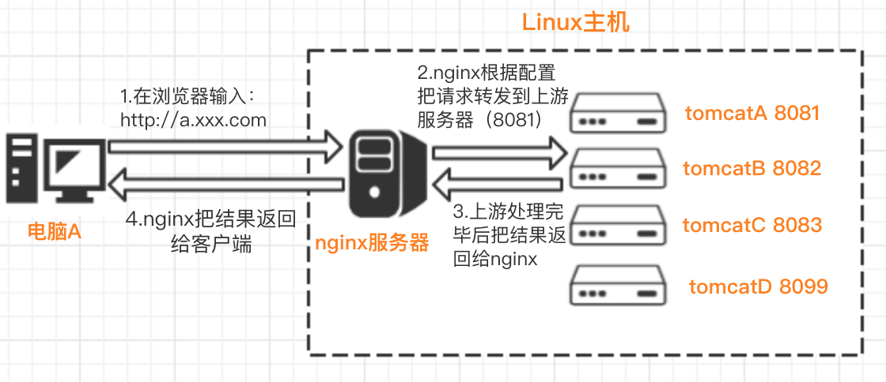

Nginx是一个免费的，开源的，高性能的HTTP服务器和反向代理。


Nginx里有一个master进程和多个worker进程。master 进程并不处理网络请求，主要负责如下整体调度工作：

- 接收来自外界的信号。
- 向各worker进程发送信号。
- 监控woker进程的运行状态。
- 当woker进程退出后（异常情况下），会自动重新启动新的woker进程。

而woker进程主要用来处理基本的网络事件，多个worker进程之间是对等且相互独立的，一个请求，只可能在一个worker进程中处理，一个worker进程，不可能处理其它进程的请求。

Nginx 之所以高效高性能是通过：
- 基于异步及非阻塞的事件驱动模型
- 多进程机制 进程之间不共享资源，不需要加锁，减少了使用锁对性能造成的影响，可以让进程互相之间不会影响，如果一个进程发生异常退出时，其它进程正常工作
- 使用内存池把多次向系统申请内存的操作整合成一次，大大减少了CPU资源的消耗，以及向操作系统申请内存的次数，同时减少了内存碎片。

****Nginx 应用场景****

- 反向代理

真实的服务器不直接被外部网络访问，所有的请求都需要经过反向代理，反向代理能被外部网络访问的同时又跟真实服务在同一个网络环境，当然也可能是同一台服务器，端口不同而已。Nginx反向代理通过****proxy_pass****指令来实现。

简单的一个例子：当我们访问localhost的时候，就相当于访问 localhost:8081了

```
server {
    listen       80;
    server_name  localhost;

    location / {
        proxy_pass http://localhost:8081;
        proxy_set_header Host $host:$server_port;
        # 设置用户ip地址
         proxy_set_header X-Forwarded-For $remote_addr;
         # 当请求服务器出错去寻找其他服务器
         proxy_next_upstream error timeout invalid_header http_500 http_502 http_503; 
    }

} 
```

- 负载均衡

负载均衡指的是当有2台或以上服务器时根据规则随机的将请求分发到指定的服务器上处理，负载均衡配置一般都需要同时配置反向代理，通过反向代理跳转到负载均衡。而Nginx目前支持自带3种负载均衡策略，还有2种常用的第三方策略。负载均衡通过****upstream****指令来实现。

```
upstream web_servers {  
   server localhost:8081;  
   server localhost:8082;  
}

server {
    listen       80;
    server_name  localhost;
    #access_log  logs/host.access.log  main;


    location / {
        proxy_pass http://web_servers;
        # 必须指定Header Host
        proxy_set_header Host $host:$server_port;
    }
 }

```

负载均衡策略：

- ****RR轮询****

每个请求按时间顺序逐一分配到不同的后端服务器，也就是说第一次请求分配到第一台服务器上，第二次请求分配到第二台服务器上，如果只有两台服务器，第三次请求继续分配到第一台上，这样循环轮询下去，也就是服务器接收请求的比例是 1:1， 如果后端服务器down掉，能自动剔除。轮询是默认配置，不需要太多的配置

```
upstream web_servers {  
   server localhost:8081;  
   server localhost:8082;  
}
```

- ****权重****

指定轮询几率，weight和访问比率成正比, 也就是服务器接收请求的比例就是各自配置的weight的比例，用于后端服务器性能不均的情况,比如服务器性能差点就少接收点请求，服务器性能好点就多处理点请求。

```
upstream test {
    server localhost:8081 weight=1;
    server localhost:8082 weight=3;
    server localhost:8083 weight=4 backup;
}
```

上面例子中如果4次请求只有一次被分配到8081上，其他3次分配到8082上。backup是指热备，只有当8081和8082都宕机的情况下才走8083

- ****ip_hash****

上面的2种方式都有一个问题，那就是下一个请求来的时候请求可能分发到另外一个服务器，当我们的程序不是无状态的时候(采用了session保存数据)，这时候就有一个很大的很问题了，比如把登录信息保存到了session中，那么跳转到另外一台服务器的时候就需要重新登录了，所以很多时候我们需要一个客户只访问一个服务器，那么就需要用iphash了，iphash的每个请求按访问ip的hash结果分配，这样每个访客固定访问一个后端服务器，可以解决session的问题。

```
upstream test {
    ip_hash;
    server localhost:8080;
    server localhost:8081;
}
```

- ****fair(第三方)****

按后端服务器的响应时间来分配请求，响应时间短的优先分配。这个配置是为了更快的给用户响应

```
upstream backend {
    fair;
    server localhost:8080;
    server localhost:8081;
}
```

- ****url_hash(第三方)****

按访问url的hash结果来分配请求，使每个url定向到同一个后端服务器，后端服务器为缓存时比较有效。 在upstream中加入hash语句，server语句中不能写入weight等其他的参数，hash_method是使用的hash算法

```
upstream backend {
    hash $request_uri;
    hash_method crc32;
    server localhost:8080;
    server localhost:8081;
}
```

- 动静分离

动静分离是让动态网站里的动态网页根据一定规则把不变的资源和经常变的资源区分开来，动静资源做好了拆分以后，我们就可以根据静态资源的特点将其做缓存操作，这就是网站静态化处理的核心思路。

使用静态服务器及反向代理2个功能，静态资源由Nginx本地提供，动态的资源反向代理到后端的Web容器提供,其中Web容器可以和Nginx在同一台服务器也可以在不同服务器上 。


```
upstream web_servers {  
       server localhost:8081;  
       server localhost:8082;  
}

server {
    listen       80;
    server_name  localhost;

    set $doc_root /usr/local/var/www;

    location ~* \.(gif|jpg|jpeg|png|bmp|ico|swf|css|js)$ {
       root $doc_root/img;
    }

    location / {
        proxy_pass http://web_servers;
        # 必须指定Header Host
        proxy_set_header Host $host:$server_port;
    }

    error_page 500 502 503 504  /50x.html;  
    location = /50x.html {  
        root $doc_root;
    }

 }
```

- HTTP服务器/静态服务器

Nginx本身也是一个静态资源的服务器，当只有静态资源的时候，就可以使用Nginx来做服务器，如果一个网站只是静态页面的话，那么就可以通过这种方式来实现部署。在公司中经常会遇到静态服务器，通常会提供一个上传的功能，其他应用如果需要静态资源就从该静态服务器中获取。

- 前后端分离中解决跨域问题

```
server {
  listen 80;
  server_name host.test;
  root /data/project/;
  index index.html index.php;

  location ^~ /api {
    root /data/project/service/web/;
    fastcgi_pass 127.0.0.1:9000;
    include fastcgi.conf;
    fastcgi_param  SCRIPT_FILENAME /data/project/service/web/index.php;
    fastcgi_param  SCRIPT_NAME     /api/index.php;
    access_log logs/service-access.log;
    error_log logs/service-error.log;
  }

  location ^~ / {
    alias /data/project/web/dist/;
    access_log logs/web-access.log;
    error_log logs/web-error.log;
  }
}
```

#### CDN 内容分发网络

- ****CDN是什么****

CDN 是内容分发网络的简称，其目的是通过在源服务器和用户之间增加一层新的网络架构，将网站的内容分发到最接近用户的网络“边缘”，使用户可以就近取得所需的内容，提高用户访问网站的响应速度。

- ****为什么需要CDN****

  1. 加速网站的访问，提升用户体验。
  我们之前提到要为了增加网站的访问速度，可以采用浏览器缓存等策略，但是浏览器缓存只是为了提升页面再次被访问的速度，而对于提升首次访问的响应能力，通常是采用CDN进行加速。可以毫不夸张得说互联网上的任何内容都可以通过CDN 加速。

  2. 跨运营商，全网覆盖
  为了实现跨运营商、跨地域的全网覆盖互联不互通、区域 ISP 地域局限、出口带宽受限制等种种因素都造成了网站的区域性无法访问。CDN 加速可以覆盖全球的线路，通过和运营商合作，部署IDC资源，在全国骨干节点商，合理部署CDN边缘分发存储节点，充分利用带宽资源，平衡源站流量。从而顺利实现跨运营商、跨地域的全网数据传输。

  3. 大部分请求在边缘节点完成，CDN起到了分流作用，减少远程访问的带宽、分担网络流量、减轻原站点web服务器负载等功能，减轻了源站压力

  4. 广泛分布的CDN节点加上节点之间的智能冗余机制，可以有效地预防黑客入侵。

- ****CDN工作原理****


1. 当用户点击网站页面上的内容URL，经过本地DNS系统解析，DNS系统会最终将域名的解析权交给CNAME指向的CDN专用DNS服务器。
2. CDN的DNS服务器将CDN的全局负载均衡设备IP地址返回用户。
3. 用户向CDN的全局负载均衡设备发起内容URL访问请求。
4. CDN全局负载均衡设备根据用户IP地址，以及用户请求的内容URL，选择一台用户所属区域的区域负载均衡设备，告诉用户向这台设备发起请求。区域负载均衡设备会为用户选择一台合适的缓存服务器提供服务，选择的依据包括：根据用户IP地址，判断哪一台服务器距用户最近；根据用户所请求的URL中携带的内容名称，判断哪一台服务器上有用户所需内容；查询各个服务器当前的负载情况，判断哪一台服务器尚有服务能力。基于以上这些条件的综合分析之后，区域负载均衡设备会向全局负载均衡设备返回一台缓存服务器的IP地址。
5. 全局负载均衡设备把服务器的IP地址返回给用户。
6. 用户向缓存服务器发起请求，缓存服务器响应用户请求，将用户所需内容传送到用户终端。如果这台缓存服务器上并没有用户想要的内容，而区域均衡设备依然将它分配给了用户，那么这台服务器就要向它的上一级缓存服务器请求内容，直至追溯到网站的源服务器将内容拉到本地。

- ****CDN缓存策略****

CDN边缘节点缓存策略因服务商不同而不同，但一般是通过http响应头中的Cache-control: max-age的字段来设置CDN边缘节点数据缓存时间。当客户端向CDN节点请求数据时，CDN节点会判断缓存数据是否过期，若缓存数据并没有过期，则直接将缓存数据返回给客户端；否则，CDN节点就会向源站发出回源请求，从源站拉取最新数据，更新本地缓存，并将最新数据返回给客户端。
CDN缓存时间会对“回源率”产生直接的影响。若CDN缓存时间较短，CDN边缘节点上的数据会经常失效，导致频繁回源，增加了源站的负载，同时也增大的访问延时；若CDN缓存时间太长，会带来数据更新时间慢的问题。开发者需要对特定的业务，来做特定的数据缓存时间管理。 


#### 网络缓存技术

#### 常见Web攻击

#### 网站架构

- ****初始阶段的网站架构****


应用程序、数据库、文件等所有资源都在一台服务器上

- ****应用服务和数据服务分离****


随着访问数据量增加，单台服务器性能及存储空间不足，需要将应用和数据分离

- ****应用服务和数据服务分离,针对不同服务选择不同特点的硬件设备****


```
- 应用服务器 要处理大量的业务逻辑，所以需要更好更快更强大的 CPU
- 数据库服务器 需要快速的进行磁盘检索和数据缓存，因此需要更快的硬盘和更大的内存
- 文件服务器 需要存储用户上传的文件资源，因此需要更大的硬盘存储空间
```

- ****使用缓存改善网站性能****


- 本地缓存 的访问速度会快一些，但是受应用服务器内存限制，缓存数据量很有限，而且会出现内存争用的情况
- 远程分布式缓存 可以使用集群的方式，部署大内存的服务器作为专门的缓存服务器，可以在理论上做到不受内存容量限制的缓存服务

- ****使用应用服务器集群和负载均衡改善网站的并发处理能力****


- ****数据库读写分离****


在使用了缓存后，大多数的操作不经过数据库访问就能完成，但在缓存访问未命中或者缓存过期以及所有的写操作需要访问数据库，当用户达到一定规模后，数据库因为负载压力过高而成为网站的瓶颈。而目前主流的数据库都提供主从热备功能，通过配置两台数据库主从关系，可以将一台数据库的数据更新同步到另一台服务器上。网站利用数据库这一功能实现数据库读写分离，从而改善数据库负载压力。应用服务器在写操作的时候，访问主数据库，主数据库通过主从复制机制把数据同步更新到从数据库，这样当应用服务器进行读操作的时候，就能访问从数据库获取数据

- ****使用反向代理和CDN****

提高网站的访问速度，主要手段有使用CDN和反向代理。CDN和反向代理的基本原理都是缓存，区别在于CDN部署在网络提供商的机房，而反向代理是部署在网站的中心机房，当用户请求到达中心机房后，首先访问的反向代理，如果反向代理缓存着用户请求的资源，则直接返回给用户。


- ****使用分布式文件系统和分布式数据库系统****

分布式数据库是网站数据库拆分的最后手段，只用在单表数据规模非常大的时候才使用。网站更常用的数据库拆分手段是业务拆分，将不同业务的数据部署在不同的物理服务器上。


- ****使用NoSQL和搜索引擎****


- ****业务拆分****

同时我们将一个网站根据模块划分拆分成多个应用，每个应用进行单独的部署和维护，应用之间通过超链接建立关系（指向不同的应用地址），最后通过相同的数据存储系统来构成一个互相关联的完整系统


- ****分布式服务****

随着业务拆分，整个系统越来越大，应用的整体复杂度呈指数级增加，部署维护越来越困难，并且所有的应用服务器都要与数据库服务连接， 在数万台服务器规模的情况下，这些连接的数目是服务器规模的平方，导致资源不足
这时候就要对相同的业务进行提取，独立部署，把这些可重用的业务和连接数据库等，提取出来作为公共业务服务，而应用系统只需要通过分布式服务访问公共业务服务完成业务操作


- ****微服务****

****保佑这篇文章不要挂掉，后面好好整理下，先暂时放个链接：****
[一文详解微服务架构](https://www.cnblogs.com/skabyy/p/11396571.html)

- ****Serverless****

Serverless 是指用户在使用对应的服务时，不需要关心服务器的硬件资源、软件资源、稳定性等等，这些通常已经由云计算厂商提供设施、服务和 SLA 保障，完全托管给云计算厂商。而用户只需要专注自己应用代码本身，上传执行函数到相应云计算平台，按照函数运行的时长按量付费即可.当前比较成熟的 Serverless 云产品主要有 Amazon Lambda(Amazon)、Google Cloud Function(、Google)、Azure Function(MicroSoft)、AliCloud Function Compute(Alibaba)

下面是Serverless的结构图：


最顶层的 Serverless 主要由 FaaS 和 BaaS 构成

```
Serverless = FaaS + BaaS
```


****FaaS（Function-as-a-Service）**** 即为函数运行平台，用户无需搭建庞大的服务系统，只需要上传自己的逻辑函数如一些定时任务、数据处理任务等到云函数平台，配置执行条件触发器、路由等等，完成基础函数的注册。
也就是说只要负责上传代码逻辑，并配置什么时候触发这段逻辑即可。

****BaaS（Backend-as-a-Service）**** 包含了后端服务组件，它是基于 API 的第三方服务，用于实现应用程序中的核心功能，包含常用的数据库、对象存储、消息队列、日志服务等等。
也就是一些公共的支持服务组成。


Serverless 的技术特点:

1. 事件驱动:


Serverless 其实是通过事件驱动的，当一个任务被触发时，比如 HTTP 请求，API Gateway 接受请求、解析和认证，传递对应参数给云函数平台，平台中执行对应回调函数，配合 DB、MQ 等 BaaS 服务在特定容器中完成计算，最终将结果返回给用户。函数执行完成后，一般会被 FaaS 平台销毁，释放对应容器，等待下一个函数运行。事件的定义可以很丰富，一次 http 请求，一个文件上传，一次数据库条目修改，一条消息发送，都可以定义为事件.

2. 单事件处理:


云函数由事件触发，而触发启动的一个云函数实例，一次仅处理一个事件,通过云函数实例的高并发能力，实现业务高并发，这就导致无需在代码内考虑高并发高可靠性，代码可以专注于业务，开发更简单。

3. 自动弹性伸缩：


由于云函数事件驱动及单事件处理的特性，云函数通过自动的伸缩来支持业务的高并发,针对业务的实际事件或请求数，云函数自动弹性合适的处理实例来承载实际业务量,在没有事件或请求时，无实例运行，不占用资源

4. 无状态开发

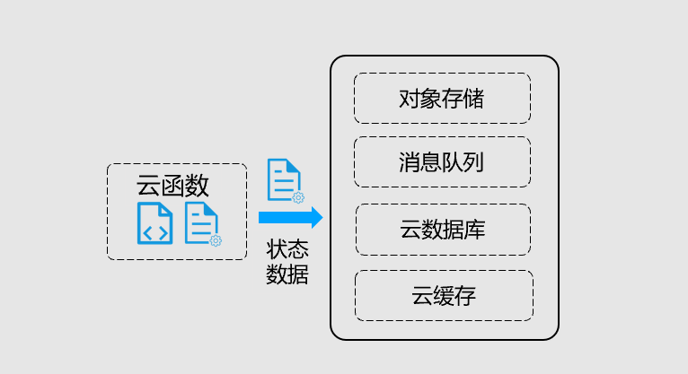
云函数运行时根据业务弹性，可能伸缩到 0，无法在运行环境中保存状态数据,分布式应用开发中，均需要保持应用的无状态，以便于水平伸缩,可以利用外部服务、产品，例如数据库或缓存，实现状态数据的保存


下图是目前主流的Serverless解决方案对比：


Serverless 的优缺点:

优点：


缺点：

- 云厂商强绑定 当你决定使用公有云的 Serverless 产品时，它们常常会和厂商的其他云产品相绑定，如对象存储、消息等等，这意味你需要同时开通其他的服务，将导致你的应用与平台强绑定，迁移成本剧增。
- 不适合长时间任务 云函数平台会限制函数执行时间，如阿里云 Function Compute 最大执行时长为 10min，如果你的任务时间超长，那么你需要拆分编排你的函数执行流程，并在一个函数执行结束时唤起另一个函数执行。这将增加编码的复杂度，而且花费上可能高于购买一个长时间运行的实例。
- 冷启动时间 函数运行时，执行容器和环境需要一个准备的时间，尤其是第一次启动时时间可能会较长。对一个 HTTP 请求来讲，可能会带来响应时延的增加，产生性能毛刺。
- 调试与测试 由于本地环境和平台运行环境的差异性，开发者需要不断调整代码，打印日志，并提交到函数平台运行测试，会带来一些开发成本和产生一些费用。

# 书籍推荐


# ONE MORE THINGS

#### 5G
#### 物联网iot
#### 音视频协议
#### 即时通讯协议
#### 边缘计算
#### 前端技术
#### 服务端技术

### 参考文档：

- [十张图带你了解大型网站架构](https://blog.csdn.net/baidu_39511645/article/details/78345573)
- [什么是微服务架构？](https://www.zhihu.com/question/65502802)
- [浏览器工作原理-webkit内核研究](https://juejin.im/entry/5a9a379af265da239d48c027)
- [深入剖析 WebKit](https://ming1016.github.io/2017/10/11/deeply-analyse-webkit/)
- [「一道面试题」输入URL到渲染全面梳理上-网络通信篇](https://juejin.im/post/5e9c48b2f265da47c558566b)
- [「一道面试题」输入URL到渲染全面梳理中-页面渲染篇](https://juejin.im/post/5e9f1db86fb9a03c85463560)
- [「一道面试题」输入URL到渲染全面梳理下-总结篇](https://juejin.im/post/5ebabbf96fb9a043586c8f9e)
- [HTTP 的前世今生：一次性搞懂 HTTP、HTTPS、SPDY、HTTP2](https://juejin.im/post/5be935f2e51d4570813b8cf0)
- [Guidelines & Best Practices for Design RESTful API](https://bytenbit.com/best-guidelines-design-restful-api/)
- [Technology-Computer Networking[2]-Application Layer](http://www.linyibin.cn/2017/02/14/technology-ComputerNetworking-ApplicationLayer/)
- [鲜为人知的HTTP协议头字段详解大全「原创」](https://juejin.im/post/5ab341e06fb9a028c6759ce0)
- [详解cookie、session和HTTP缓存](https://juejin.im/post/5a7c6c415188257a780da590)
- [图解 HTTP 缓存](https://juejin.im/post/5eb7f811f265da7bbc7cc5bd)
- [HTTPS 详解一：附带最精美详尽的 HTTPS 原理图](https://segmentfault.com/a/1190000021494676)
- [HTTPS详解二：SSL / TLS 工作原理和详细握手过程](https://segmentfault.com/a/1190000021559557)
- [HTTPS加密协议详解(四)：TLS/SSL握手过程](https://www.wosign.com/FAQ/faq2016-0309-04.htm)
- [详解 HTTPS、TLS、SSL、HTTP区别和关系](https://www.wosign.com/Info/https_tls_ssl_http.htm)
- [HTTPS原理探讨（一）](https://segmentfault.com/a/1190000016624341)
- [Inspecting TLS/SSL](https://www.java2depth.com/2019/04/transport-layer-security-tls-and-secure.html)
- [图解 SSL/TLS 协议](https://neotan.github.io/ssl-tls/)
- [SSL/TLS 握手过程详解](https://www.jianshu.com/p/7158568e4867)
- [TLS 握手优化详解](https://imququ.com/post/optimize-tls-handshake.html)
- [HTTP2 详解](https://juejin.im/post/5b88a4f56fb9a01a0b31a67e#heading-69)
- [再谈HTTP2性能提升之背后原理—HTTP2历史解剖](https://juejin.im/post/5c4e6d11e51d4534dc477f05)
- [解开 HTTP/2 的面纱：HTTP/2 是如何建立连接的](https://halfrost.com/http2_begin/)
- [HTTP/2 幕后原理](https://www.ibm.com/developerworks/cn/web/wa-http2-under-the-hood/index.html)
- [解密HTTP/2与HTTP/3 的新特性](https://juejin.im/post/5d9abde7e51d4578110dc77f)
- [从理论到实践，全方位认识HTTP/2](https://juejin.im/post/5c09d0d66fb9a049dc020cc7)
- [HTTP----HTTP2.0新特性](https://juejin.im/post/5a4dfb2ef265da43305ee2d0)
- [Halfrost-Field HTTP](https://github.com/halfrost/Halfrost-Field/tree/master/contents/Protocol)
- [HTTP3详解](https://www.kancloud.cn/kancloud/http3-explained#/catalog)
- [一文读懂 HTTP/1HTTP/2HTTP/3](https://zhuanlan.zhihu.com/p/102561034)
- [React 中同构（SSR）原理脉络梳理](https://juejin.im/post/5bc7ea48e51d450e46289eab)
- [写给前端工程师的 Serverless 入门](https://juejin.im/post/5d9c47dce51d4578045a3569)
- [探索 Serverless 中的前端开发模式](https://juejin.im/post/5cdc3dc2e51d453b6c1d9d3a)
- [Serverless 系列（一）：基本概念入门](https://www.infoq.cn/article/s101GtcCV05_2AgKo8GD)
- [Nginx的几个应用场景](https://www.cnblogs.com/wmqiang/p/10565052.html)
- [Nginx应用场景](https://blog.csdn.net/vbirdbest/article/details/80913319)
- [Nginx通关攻略](https://juejin.im/post/5df721a3e51d45582c27c523)
- [Nginx源码笔记之流程分析](http://www.mikewootc.com/wiki/sw_develop/web/nginx_note_sourcecode_and_module_dev.html)
- [IP协议相关技术--图解TCP/IP](https://blog.csdn.net/sinat_37138973/article/details/72767558)
- [IP地址](https://juejin.im/post/5c8e3e426fb9a070ab7e1a73)
- [一文看懂IP地址：含义、分类、子网划分、查与改、路由器与IP地址](https://network.51cto.com/art/201911/605681.htm)
- [网络编程懒人入门(十一)：一文读懂什么是IPv6](https://zhuanlan.zhihu.com/p/132411396)
- [协议森林](https://www.cnblogs.com/vamei/archive/2012/12/05/2802811.html)
- [ICMP协议详解](https://blog.csdn.net/baidu_37964071/article/details/80514340)
- [协议森林06 瑞士军刀 (ICMP协议)](https://www.cnblogs.com/vamei/archive/2012/12/05/2801991.html)
- [DHCP协议原理及其实现流程](https://blog.csdn.net/wuruixn/article/details/8282554)
- [IP 隧道技术：基础篇](https://blog.csdn.net/bat603/article/details/779842)
- [详解一次完整的数据包传输过程 -- 层层递进](https://blog.csdn.net/u011563903/article/details/90116368?utm_medium=distribute.pc_relevant.none-task-blog-BlogCommendFromMachineLearnPai2-3.nonecase&depth_1-utm_source=distribute.pc_relevant.none-task-blog-BlogCommendFromMachineLearnPai2-3.nonecase)
- [数据包在网络设备之间的传递流程-数据包走向问题](https://blog.csdn.net/u011563903/article/details/90116368?utm_medium=distribute.pc_relevant.none-task-blog-BlogCommendFromMachineLearnPai2-3.nonecase&depth_1-utm_source=distribute.pc_relevant.none-task-blog-BlogCommendFromMachineLearnPai2-3.nonecase)
- [DNS域名解析解剖](https://zhuanlan.zhihu.com/p/86504259)
- [DNS 原理入门](http://www.ruanyifeng.com/blog/2016/06/dns.html)
- [DNS入门：域名解析流程详解](https://zhuanlan.zhihu.com/p/38499577)
- [DNS 域名解析系统概述](https://blog.konghy.cn/2019/08/06/dns-overview/)
- [DNS简单总结](https://github.com/hellorocky/blog/blob/master/network/5.dns%E7%AE%80%E5%8D%95%E6%80%BB%E7%BB%93.md)
- [当你在浏览器中输入了本站网址并回车后，产生了哪些技术步骤？](https://zhuanlan.zhihu.com/p/96505045)
- [在浏览器输入 URL 回车之后发生了什么](https://wsgzao.github.io/post/url/)
- [经典面试题：从 URL 输入到页面展现到底发生什么？](https://juejin.im/post/5c773dd251882519610194c1)
- [史上最全！图解浏览器的工作原理](https://www.infoq.cn/article/CS9-WZQlNR5h05HHDo1b)
- [图解浏览器的基本工作原理](https://zhuanlan.zhihu.com/p/47407398)
- [浏览器的工作原理](https://github.com/creeperyang/blog/issues/46)
- [深入浅出浏览器渲染原理](https://blog.fundebug.com/2019/01/03/understand-browser-rendering/)
- [TCP协议的滑动窗口具体是怎样控制流量的？](https://www.zhihu.com/question/32255109)
- [你还在为 TCP 重传、滑动窗口、流量控制、拥塞控制发愁吗？看完图解就不愁了](https://www.javashitang.com/?p=577)
- [TCP 的那些事儿（上）](https://coolshell.cn/articles/11564.html)
- [TCP 的那些事儿（下）](https://coolshell.cn/articles/11609.html)
- [这一次,让我们再深入一点 - TCP协议](https://juejin.im/post/5a49d95af265da430a50ed8c)
- [TCP 进阶](https://juejin.im/post/5a49d95af265da430a50ed8c)
- [TCP协议 读后感](https://www.todayios.com/impression-of-tcp-in-geekbang/)
- [一篇文章带你熟悉 TCP/IP 协议（网络协议篇二）](https://juejin.im/post/5a069b6d51882509e5432656)
- [一篇文章带你详解 HTTP 协议（网络协议篇一）](https://www.jianshu.com/p/6e9e4156ece3)
- [网络编程懒人入门](https://yq.aliyun.com/articles/670062?spm=a2c4e.11153940.0.0.72e87584UZ2aDo)

