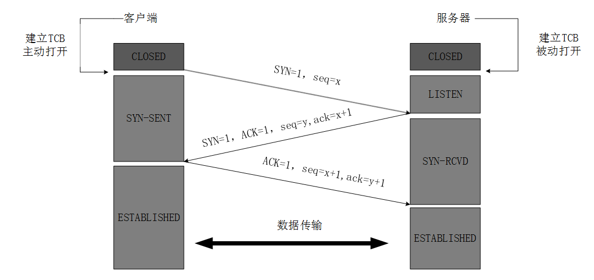
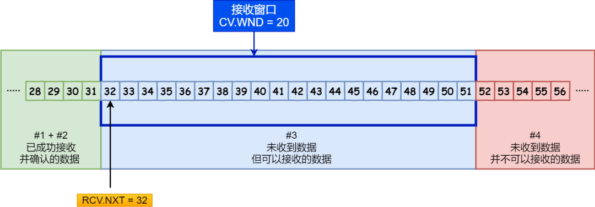

# 计算机网络

### 浏览器工作原理

#### 浏览器格式化检查
  
浏览器对网址进行了格式化检验，首先确定这是一个有效的网址，才会进入下一步

#### DNS解析

##### 为什么需要DNS解析

DNS保存了互联网上所有域名与IP的映射关系，我们可以通过主机名获取对应主机的IP地址。那么为什么需要DNS解析这部分？这得分成两个子问题，为什么面向用户的部分需要使用域名，传输层却需要IP地址来标示一台主机。首先IP地址的长度为32比特(4字节），使用域名最少也要几十个字节，最长可达到255字节，如果传输层直接用域名增加了路由器的负担,传送数据也会花费更长的时间 ，整体效率很低。对于面向用户的应用层用IP地址来代替服务器名称也是能够正常工作的，但是,要记住一串由数字组成的IP地址显然难以记忆。

> 如果Web服务器使用了虚拟主机功能,有可能无法通过IP地址来访问。因为虚拟主机是寄存在服务器上的一个或多个没有实体的服务器，访问虚拟主机的域名的时候，先根据DNS解析的IP访问到实体主机，然后实体主机再根据域名把连接转发给对应的虚拟主机，DNS解析的IP只是实体主机的IP

##### DNS分层结构

我们日常解除的域名是分层的以 https://www.github.com/ 为例子: com 为顶级域名，github 为二级域名，www 为三级域名。相应的DNS结构也是采用分级树状系统创建域名数据库，从而提供域名解析服务。

- ****根域名服务器**** 是域名解析体系的核心，如果要查询域名，均需要从根域名服务器开始查询。全球 IPv4 的根域名服务器只有13台，1个为主根服务器，放置在美国。其余12个均为辅根服务器，其中9个放置在美国，欧洲2个位于英国和瑞典，亚洲1个，位于日本。实际上到目前为止，所谓的只有13台根域名服务器，只是逻辑上的，分别编号从a到m，而物理上的根域名服务器已远不止 13 台。可以通过如下网站查看根域名服务器网站分布情况[https://root-servers.org](https://root-servers.org)

- ****顶级域名服务器****
根域名服务器负责返回顶级域 (如 .com 等) 的权威域名服务器地址。在拿到顶级DNS服务器地址后，再向顶级域名服务器发起查询请求，其返回一级域 (如 example.com) 的权威域名服务器地址

- ****次级域名服务器****

##### DNS解析流程

- 查询浏览器自身的DNS缓存：
首先浏览器会去搜索自身的DNS缓存，如果不存在对应缓存或者缓存过期了，就进行下一步。

- 查询操作系统自身的DNS缓存：
如果上一步没有找到则浏览器就会搜索操作系统自身的缓存，没有找到或者过期则解析结束

- 查询本地的hosts文件：
若操作系统的缓存也没有找到或失效，浏览器就会去读取本地的hosts文件（Hosts文件也可以建立域名到IP地址的绑定关系，可以通过编辑Hosts文件来达到名称解析的目的。 例如，我们需要屏蔽某个域名时，就可以将其地址指向一个不存在IP地址，以达到屏蔽的效果）。

- 浏览器发起一个DNS的系统调用：
hosts中没有找到对应的配置项的话，浏览器向本地主控DNS服务发起一个DNS的调用。

###### 客户端如何向DNS服务器发送请求

向DNS服务器发送请求的过程如下图所示：

DNS解析的实际上就是调用 _gethostbyname_ 方法并将web服务的域名传入即可。调用解析器后,解析器会向运营商提供的DNS服务器发送查询消息。
运营商服务会先查找自身缓存找到对应条目，查看是否过期，如果没有过期则解析成功，若没找到对应条目，主控服务器会代替浏览器发起一个迭代的DNS解析的请求，先查找根域的，运营商服务器拿到域名的IP，返回给操作系统的内核，同时在自己的缓存区缓存一份，操作系统内核从DNS服务商拿来的IP地址返回给浏览器。浏览器再向 Web 服务器发送消息时,只要从该内存地址取出 IP地址,将它与 HTTP 请求消息一起交给操作系统.

那么DNS服务器的IP地址又是怎么确定的呢？其实DNS 服务器的IP地址是作为TCP/IP的一个设置项目事先设置好的,不需要再去查询了。

###### DNS服务器收到请求后的处理逻辑

客户端发给DNS服务器的信息包括：

- ****域名****：服务器、邮件服务器(邮件地址中@后面的部分)的名称 。
- ****Class****：用来识别网络的信息（在最早设计 DNS 方案时，DNS 在互联网以外的其他网络中的应用也被考虑到了。不过,如今除了互联网并没有其他的网络了，因此 Class 的值永远是代表互联网的 IN ）。
- ****记录类型**** ：表示域名对应何种类型的记录（例如，A ：表示域名对应的是 IP 地址,MX ：表示域名对应的是邮件服务器）

DNS服务器内部有一张表专门用来存储这些映射关系，那么这张表里面的最初条目是从哪里获取到的呢？这就涉及运营商DNS服务器发起的递归迭代请求。

运营商的服务器里面安装的DNS服务器程序的配置文件中保存了根域服务的IP地址。运营商DNS服务器检查本地对应缓存无数据后，运营商服务从已经配置好的信息中拿到根域名的IP地址，向根DNS服务器发起迭代查询请求。
根DNS服务器告诉运营商DNS服务器该域名已授权给某个顶级域名区域（比如com区）管理，应去对应的顶级DNS服务器查询，并给出了对应顶级DNS服务器的IP地址。运营商DNS先将目标顶级DNS服务器及其IP地址加入到缓存，下次DNS请求，在缓存未过期的情况下，直接往目标顶级DNS服务器发查询请求，不再向根DNS服务器请求。
紧接着运营商服务器根据根DNS服务器响应的结果向某个顶级DNS服务器发起迭代查询请求。目标顶级DNS服务器告诉运营商DNS服务器该域名已授权给某个下一级DNS域名区管理，，并给出下一级DNS域名区管理DNS服务器IP地址。运营商DNS服务器将下一级DNS域名区管理DNS服务器IP地址加入到缓存，下次DNS请求，在缓存未过期的情况下，直接往对应 DNS服务器发查询请求，不再向根DNS服务器及顶级DNS服务器请求。运营商DNS服务器根据下一级DNS域名区管理DNS服务器IP地址向下一级DNS域名区管理DNS服务器发起迭代查询请求。下一级DNS域名区管理DNS服务器返回最终的域名对应的IP地址。运营商DNS服务器将最终的IP地址加入到上面提到的表格上。下次相同的DNS请求，在缓存未过期的情况下，运营商DNS直接给出该域名的IP地址，不再向权威DNS服务器查询，运营商DNS将该域名对应的IP地址返回给客户端。

  - [DNS域名解析解剖](https://zhuanlan.zhihu.com/p/86504259)
  - [DNS 原理入门](http://www.ruanyifeng.com/blog/2016/06/dns.html)
  - [DNS入门：域名解析流程详解](https://zhuanlan.zhihu.com/p/38499577)
  - [DNS 域名解析系统概述](https://blog.konghy.cn/2019/08/06/dns-overview/)
  - [DNS简单总结](https://github.com/hellorocky/blog/blob/master/network/5.dns%E7%AE%80%E5%8D%95%E6%80%BB%E7%BB%93.md)

#### 推荐文章：

- [当你在浏览器中输入了本站网址并回车后，产生了哪些技术步骤？](https://zhuanlan.zhihu.com/p/96505045)
- [在浏览器输入 URL 回车之后发生了什么](https://wsgzao.github.io/post/url/)
- [经典面试题：从 URL 输入到页面展现到底发生什么？](https://juejin.im/post/5c773dd251882519610194c1)
- [史上最全！图解浏览器的工作原理](https://www.infoq.cn/article/CS9-WZQlNR5h05HHDo1b)
- [图解浏览器的基本工作原理](https://zhuanlan.zhihu.com/p/47407398)
- [浏览器的工作原理](https://github.com/creeperyang/blog/issues/46)
- [深入浅出浏览器渲染原理](https://blog.fundebug.com/2019/01/03/understand-browser-rendering/)

#### 分层网络结构

- ****物理层****
　物理层是参考模型的最低层。物理层的作用是实现相邻计算机节点之间[比特流的透明传送]，尽可能[屏蔽掉具体传输介质和物理设备的差异]。
  关键字：****比特流**** ，****屏蔽掉具体传输介质和物理设备的差异****

- ****数据链路层****
  在计算机网络中由于各种干扰的存在，物理链路是不可靠的,数据链路层的主要功能是：通过各种****差错控制**** 、****流量控制****等控制协议，将有差错的物理信道变为无差错的、能可靠传输数据帧的数据链路。数据链路层的具体工作是接收来自物理层的比特流形式的数据，并封装成帧，传送到上一层；同样，也将来自上层的数据帧，拆装为比特流形式的数据转发到物理层。
  关键字：****帧**** ，****无差错的、能可靠传输数据帧****

- ****网络层****
  网络层将数据链路层的数据在这一层被转换为数据包再通过路由选择算法将数据包从一个网络设备传送到另一个网络设备。一般地，数据链路层是解决同一网络内节点之间的通信，而网络层主要解决不同子网间的通信。例如在广域网之间通信时，必然会遇到路由（即两节点间可能有多条路径）选择问题。
  关键字：****数据包**** ，****不同子网间的通信****

- ****传输层****
  向用户提供可靠的端到端的差错和流量控制，保证报文的正确传输，该层常见的协议：TCP/IP中的TCP协议和UDP协议。传输层提供会话层和网络层之间的传输服务，这种服务从会话层获得数据，并在必要时，对数据进行分割。然后，传输层将数据传递到网络层，并确保数据能正确无误地传送到网络层。
  关键字：****报文**** ，****端到端的差错和流量控制****

- ****会话层****
  会话层主要功能是用来管理网络设备的会话连接，细分为三大功能：
  ****建立会话****：A，B两台网络设备之间要通信，要建立一条会话供他们使用，在建立会话的过程中也会有身份验证，权限鉴定等环节；
  ****保持会话****：通信会话建立后，通信双方开始传递数据，当数据传递完成后，OSI会话层不一定会立刻将两者这条通信会话断开，它会根据应用程序和应用层的设置对该会话进行维护，在会话维持期间两者可以随时使用这条会话传数据；
  ****断开会话****：当应用程序或应用层规定的超时时间到期后，OSI会话层才会释放这条会话。或者A、B重启、关机、手动执行断开连接的操作时，OSI会话层也会将A、B之间的会话断开。

- ****表示层****
　 表示层它用来对来自应用层的命令和数据进行解释，对各种语法赋予相应的含义，并按照一定的格式传送给会话层。其主要功能是处理用户信息的表示问题，如编码、数据格式转换和加密解密等。

- ****应用层****
　应用层的功能是直接向用户提供某项服务，完成用户希望在网络上完成的各种工作。

下面是YouTobe上找到的一个比较好的视频[『初探資訊』OSI 網路通訊架構](https://www.youtube.com/watch?v=kyARqyCjoYY)

##### OSI七层网络模型与TCP/IP 四层网络结构对应关系

#### 传输包的封装解封装

#### 数据包的传输

#### 传输层协议

#### TCP协议的特点

- ****面向连接****:
  在服务端和客户端进行数据通信之前必须在两端通过三次握手建立连接。为数据的可靠传输打下基础。TCP的三次握手和四次挥手会在下面进行介绍：

- ****可靠传输****：
  对于可靠传输，判断丢包，误码靠的是TCP的段编号以及确认号。TCP为了保证报文传输的可靠，就给每个包一个序号，同时序号也保证了传送到接收端实体的包的按序接收。然后接收端实体对已成功收到的字节发回一个相应的确认(ACK)；如果发送端实体在合理的往返时延(RTT)内未收到确认，那么对应的数据将会被重传。

- ****面向字节流****：
  TCP不像UDP一样那样一个个报文独立地传输，而是在不保留报文边界的情况下以字节流方式进行传输。

- ****仅支持单播传输****：
  每条TCP传输连接只能有两个端点，只能进行点对点的数据传输，不支持多播和广播传输方式。
  
- ****提供拥塞控制****：
  当网络出现拥塞的时候，TCP能够减小向网络注入数据的速率和数量，缓解拥塞

#### TCP帧格式

不携带选项(option)的TCP头长为20bytes，携带选项的TCP头最长可到60bytes。

****TCP各字段意义****:

- ****源端口(Source Port)****：16位的源端口表示发送方应用程序对应的端口。
- ****目的端口(Destination port)****：16位的目的端口域用来指明报文接收计算机上的应用程序地址接口。
- ****序列号（SequenceNumber）****：32位的序列号标识了TCP报文中第一个byte在对应方向的传输中对应的字节序号。通过序列号，TCP接收端可以识别出重复接收到的TCP包，从而丢弃重复包，同时对于乱序数据包也可以依靠系列号进行重排序，进而对高层提供有序的数据流。简而言之就是用于去重和排序。
- ****应答号(Acknowledgment Number)****：32位的ACK Number标识了报文发送端期望接收的字节序列。如果设置了ACK控制位，这个值表示一个准备接收的包的序列码，注意是准备接收的包，比如当前接收端接收到一个净荷为12byte的数据包，SN为5，则会回复一个确认收到的数据包，如果这个数据包之前的数据也都已经收到了，这个数据包中的ACK Number则设置为12+5=17，表示之前的数据都已经收到了，准备接受SN=17的数据包。
- ****头长(Header Length)****：4位包括TCP头大小，指示TCP头的长度，即数据从何处开始。
- ****保留(Reserved)位****：4位值域，这些位必须是0。
- ****标志(Code Bits)位****：8位标志位
  - CWR(Congestion Window Reduce)：拥塞窗口减少标志，用来表明它接收到了设置ECE标志的TCP包。并且发送端在收到消息之后已经通过降低发送窗口的大小来降低发送速率。
  - ECE(ECN Echo)：ECN响应标志被用来在TCP3次握手时表明一个TCP端是具备ECN功能的。在数据传输过程中也用来表明接收到的TCP包的IP头部的ECN被设置为11。
  - URG(Urgent)：该标志位置位表示紧急(The urgent pointer) 标志有效。
  - ACK：取值1代表Acknowledgment Number字段有效，这是一个确认的TCP包，取值0则不是确认包。
  - PSH(Push)：该标志置位时，一般是表示发送端缓存中已经没有待发送的数据，接收端不将该数据进行队列处理，而是尽可能快将数据转由应用处理。
  - RST(Reset)：用于reset相应的TCP连接。通常在发生异常或者错误的时候会触发复位TCP连接。
  - SYN：同步序列编号(Synchronize Sequence Numbers)有效。该标志仅在三次握手建立TCP连接时有效。
  - FIN(Finish)：表示发送方没有数据要传输了。
- ****窗口大小(Window Size)****：16位，该值指示了从Ack Number开始还愿意接收多少byte的数据量，也即用来表示当前接收端的接收窗还有多少剩余空间，用于TCP的流量控制。
- ****校验位(Checksum)****：16位TCP头。发送端基于数据内容计算一个数值，接收端要与发送端数值结果完全一样，才能证明数据的有效性。接收端checksum校验失败的时候会直接丢掉这个数据包。CheckSum是根据伪头+TCP头+TCP数据三部分进行计算的。
- ****紧急数据指针（Urgent Pointer）****：16位，指向后面是优先数据的字节，在URG标志设置了时才有效。如果URG标志没有被设置，紧急域作为填充。
- ****选项(Option)****：长度不定，但长度必须以是32bits的整数倍。常见的选项包括MSS、SACK、Timestamp等等。

#### UDP特点

- ****面向无连接****：
  不需要三次握手建立连接，想发数据随时开始，

- ****不可靠传输****：
  收到什么数据就传递什么数据，它只是数据报文的搬运工，不会对数据报文进行任何拆分和拼接操作。在发送端，应用层将数据传递给传输层的UDP协议，UDP只会给数据增加一个UDP头标识下这是UDP协议，然后就传递给网络层了，在接收端，网络层将数据传递给传输层，UDP只去除IP报文头就传递给应用层，不会任何拼接操作。发送数据也不会关心对方是否已经正确接收到数据了，网络环境时好时坏的情况下，UDP因为没有拥塞控制，一直会以恒定的速度发送数据。即使网络条件不好，也不会对发送速率进行调整。这样实现的弊端就是在网络条件不好的情况下可能会导致丢包。

- ****头部开销小，传输报文数据高效实时****
  UDP的头部开销小，只有8字节，相比TCP的至少二十字节要少得多，在传输数据报文时是很高效的

- ****UDP是面向报文的****

- ****支持单播，多播，广播的功能****

#### UDP帧格式

UDP报文头长度是8个字节

****UDP各字段意义****:

- ****源端口****：这个字段表示发送数据报的应用程序所使用的 UDP 端口。接收端的应用程序利用这个字段的值作为发送响应的目的地址。这个字段是可选的，所以发送端的应用程序不一定会把自己的端口号写入该字段中。如果不写入端口号，则把这个字段设置为 0。这样，接收端的应用程序就不能发送响应了。
- ****目的端口****：接收端计算机上 UDP 数据使用的端口，占据 16 位。
- ****长度****：该字段占据 16 位，表示 UDP 数据报长度，包含UDP报文头和UDP数据长度。
- ****校验值****：该字段占据 16 位，可以检验数据在传输过程中是否被损坏。

#### TCP 和 UDP帧的区别

#### TCP中的一些关键技术

TCP 协议的主要目标就是保证数据的可靠传输，避免数据的破坏、丢包、重复以及分片顺序混乱等现象出现。让用户在上层看来是一个连续的数据流。为了达到这个目的，TCP 采用了三次握手四次挥手，窗口控制，流量控制，拥塞控制，重发机制等技术。这部分就来重点介绍下这部分技术。

#### 1. 连接控制 - TCP三次握手和四次挥手

##### 三次握手

三次握手是指建立一个TCP连接时，需要客户端和服务器之间总共发送3个包，它的作用就是在进行数据传输之前让双方都能明确自己和对方的收、发能力是正常的。实质上其实就是连接服务器指定端口，建立TCP连接，并同步连接双方的序列号和确认号，交换TCP窗口大小信息。

刚开始客户端处于 Closed 的状态，服务端处于 Listen 状态。

- 第一次握手：建立连接。客户端发送连接请求报文段，将SYN位置为1，Sequence Number为x；然后，客户端进入****SYN_SEND****状态，等待服务器的确认,服务器收到SYN报文段。
  这个阶段客户端发送网络包，服务端收到了。这样服务端就能得出结论：客户端的发送能力、服务端的接收能力是正常的。而客户端由于这个阶段服务端没有返回数据所以无法知道它的信息是否发送成功，服务端接收能力是否正常。

- 第二次握手：服务器收到客户端的SYN报文段，需要对这个SYN报文段进行确认，设置Acknowledgment Number为x+1(Sequence Number+1)；同时，自己还要发送SYN请求信息，将SYN位置为1，Sequence Number为y；服务器端将上述所有信息放到一个报文段（即SYN+ACK报文段）中，一并发送给客户端，此时服务器进入SYN_RECV状态，客户端收到该回复信息。
  这个阶段：服务端发包，客户端收到了。这样客户端就能得出结论：服务端的接收、发送能力，客户端的接收、发送能力是正常的。服务端目前只知道接收能力正常。
  
- 第三次握手：客户端收到服务器的SYN+ACK报文段。然后将Acknowledgment Number设置为y+1，向服务器发送ACK报文段，
  这个阶段：服务端能得出结论：客户端的接收、发送能力，服务端的发送、接收能力是正常的。这个报文段发送完毕以后，客户端和服务器端都进入ESTABLISHED状态，完成TCP三次握手。

经历了上面的三次握手过程，客户端和服务端都确认了自己的接收、发送能力是正常的。之后就可以正常通信了。

****两次握手会有什么问题：****

如客户端发出连接请求，但因连接请求报文丢失而未收到确认，于是客户端再重传一次连接请求。后来收到了确认，建立了连接。数据传输完毕后，就释放了连接，客户端共发出了两个连接请求报文段，其中第一个丢失，第二个到达了服务端，但是第一个丢失的报文段只是在某些网络结点长时间滞留了，延误到连接释放以后的某个时间才到达服务端，此时服务端误认为客户端又发出一次新的连接请求，于是就向客户端发出确认报文段，同意建立连接，不采用三次握手，只要服务端发出确认，就建立新的连接了，此时客户端忽略服务端发来的确认，也不发送数据，则服务端一致等待客户端发送数据，浪费资源。

****半连接队列****
服务器第一次收到客户端的 SYN 之后，就会处于 SYN_RCVD 状态，服务器会把此种状态下请求连接放在一个队列里，我们把这种队列称之为半连接队列。服务器发送完SYN-ACK包，如果未收到客户确认包，服务器进行首次重传，等待一段时间仍未收到客户确认包，进行第二次重传。如果重传次数超过系统规定的最大重传次数，系统将该连接信息从半连接队列中删除。每次重传等待的时间不一定相同，一般会是指数增长，例如间隔时间为 1s，2s，4s，8s……。

****建立连接时候的初始序列号是固定的吗****

ISN随时间而变化，因此每个连接都将具有不同的ISN。ISN可以看作是一个32比特的计数器，每4ms加1 。三次握手的其中一个重要功能是客户端和服务端交换 ISN，以便让对方知道接下来接收数据的时候如何按序列号组装数据。如果 ISN 是固定的，攻击者很容易猜出后续的确认号，从而发起网络攻击。

****三次握手过程中可以携带数据吗****

其实第三次握手的时候，是可以携带数据的。但是，第一次、第二次握手不可以携带数据。首先我们必须明确一点，服务端的存在是为了替客户端处理数据，所以最终的数据还是要返回给客户端的，如果还没法确认客户端的收发能力，服务端接受数据是没有意义的，我们回过头从服务端的角度看下三次握手的情况：第一次服务端只能知道客户端有发送数据的能力，第二次服务端依旧只知道客户端发送数据的能力，并不知道客户端接收数据的能力。所以这种情况下接收数据是没有意义的。

****什么是SYN攻击****

SYN攻击就是客户端在短时间内伪造大量不存在的IP地址，并向服务端断地发送SYN包，服务端则回复确认包，并等待客户端确认，由于源地址不存在，因此服务端需要不断重发直至超时，这些伪造的SYN包将长时间占用未连接队列，导致正常的SYN请求因为队列满而被丢弃，从而引起网络拥塞甚至系统瘫痪。这也是为什么当第三次握手失败时，服务器并不会重传ack报文，而是直接发送RST报文段，进入CLOSED状态。这样做的目的是为了防止SYN攻击。

##### 四次挥手

建立一个连接需要三次握手，而终止一个连接要经过四次挥手。这是由TCP的半关闭造成的。所谓的半关闭，其实就是TCP提供了连接的一端在结束它的发送后还能接收来自另一端数据的能力。也就是说这里要完成的任务是保证两边在关闭前都确保无数据发送给对方的诉求，并且已经完成了各自的收尾工作。

- ****第一次挥手****：客户端(可以是客户端，也可以是服务器端,这里以客户端先发起终止为例子) 发送一个 FIN 报文，报文中会指定一个序列号。此时客户端处于 FIN_WAIT1 状态。即发出连接释放报文段（FIN=1，序号seq=u），并停止再发送数据，主动关闭TCP连接，进入FIN_WAIT1（终止等待1）状态，等待服务端的确认。这表示客户端没有数据要发送给服务端了。
- ****第二次挥手****：服务端收到 FIN 之后，会发送 ACK 报文，且把客户端的序列号值 +1 作为 ACK 报文的序列号值，表明已经收到客户端的报文了，此时服务端处于 CLOSE_WAIT 状态。即服务端收到连接释放报文段后即发出确认报文段（ACK=1，确认号ack=u+1，序号seq=v），服务端进入CLOSE_WAIT（关闭等待）状态，此时的TCP处于半关闭状态，客户端到服务端的连接释放。客户端收到服务端的确认后，进入FIN_WAIT2（终止等待2）状态，等待服务端发出的连接释放报文段。这时候表示服务端告诉客户端：我同意你的关闭请求.
- ****第三次挥手****：如果服务端也想断开连接了，和客户端的第一次挥手一样，发给 FIN 报文，且指定一个序列号。此时服务端处于 LAST_ACK 的状态。
即服务端没有要向客户端发出的数据，服务端发出连接释放报文段（FIN=1，ACK=1，序号seq=w，确认号ack=u+1），服务端进入LAST_ACK（最后确认）状态，等待客户端的确认。这表示服务端没有数据要发送给客户端了。
- ****第四次挥手****：客户端收到 FIN 之后，一样发送一个 ACK 报文作为应答，且把服务端的序列号值 +1 作为自己 ACK 报文的序列号值，此时客户端处于 TIME_WAIT 状态。需要过一阵子以确保服务端收到自己的 ACK 报文之后才会进入 CLOSED 状态，服务端收到 ACK 报文之后，就处于关闭连接了，处于 CLOSED 状态。
即客户端收到服务端的连接释放报文段后，对此发出确认报文段（ACK=1，seq=u+1，ack=w+1），客户端进入TIME_WAIT（时间等待）状态。此时TCP未释放掉，需要经过时间等待计时器设置的时间2MSL后，客户端才进入CLOSED状态。这时候客户端的行为是：我收到了你的请求我等你2MSL后关闭，服务端收到这个消息后就关闭了。

所以整个过程可以通过如下对话来总结：

客户端：我没有数据要传的了
服务端：收到，我同意你那边的关闭请求,我这边的数据还没处理完所以现在不能直接关闭，你先等下我处理完成后会告诉你。
..... 等待中 ......
服务端：收尾工作已经处理完毕，我这边已经没有数据需要传递给你了。
客户端：收到，我这边会等2MSL后关闭。（服务端收到该消息后就立刻关闭，客户端等待2MSL后关闭）

对于这个地方有个比较困惑的问题：

- [为什么TCP4次挥手时等待为2MSL](https://www.zhihu.com/question/67013338)

2MSL等待的结果是在这个期间，这个连接两端的插口（客户的IP地址和端口号，服务器的IP地址和端口号）不能再被使用。这个连接只能在2MSL结束后才能再被使用。

那么为什么要等待2MSL 首先我们先要弄明白什么是MSL，MSL是Maximum Segment Lifetime的英文缩写，可译为“最长报文段寿命”，它是任何报文在网络上存在的最长时间，超过这个时间报文将被丢弃。而这里的2MSL = 去向ACK消息最大存活时间（MSL) + 来向FIN消息的最大存活时间(MSL) 。

客户端第四次握手发送ACK从客户端到服务端最多经过1MSL，超过这个时间服务端会重发FIN。服务端重发的FIN最多经过1MSL到达客户端。等待2MSL就保证了，如果由于某些原因导致客户端发出的ACK不能到达服务端，这时候服务端重发的FIN报文一定能够被客户端收到。

[面试官，不要再问我三次握手和四次挥手](https://yuanrengu.com/2020/77eef79f.html)

#### 2. 分包与粘包

##### 什么是分包与粘包

TCP是个字节流协议，是没有界限的一串数据。TCP底层并不了解上层业务数据的具体含义只保证数据可靠得从一个端传输到另一个端，并且应用层数据在送到TCP层到时候发送端为了将多个包，更有效的发到对方，使用了优化方法（Nagle算法）将多次间隔较小、数据量小的数据，合并成一个大的数据块，然后进行封包。同时由于套接字缓冲区，或者MSS(Max Segment Size),以太网帧的负载 MTU（Maximum Transmission Unit）的限制对于发送较大块数据的时候会先讲数据进行分割后发出。所以在业务上认为，一个完整的包可能会被TCP拆分成多个包进行发送，也有可能把多个小的包封装成一个大的数据包发送，这就是所谓的TCP粘包和拆包问题。粘包问题只会在流传输中出现，UDP不会出现粘包，因为它有消息边界。

粘包情况有两种，一种是粘在一起的包都是完整的数据包，另一种情况是粘在一起的包有不完整的包。不是所有的粘包现象都需要处理，若传输的数据为不带结构的连续流数据，则不必把粘连的包分开。

##### 造成粘包的原因

出现粘包现象的原因是多方面的，它既可能由发送方造成，也可能由接收方造成：

正如上面提到的发送方引起的粘包是由TCP协议本身造成的，TCP为提高传输效率，发送方往往要收集到足够多的数据后才发送一包数据。若连续几次发送的数据都很少，通常TCP会根据优化算法把这些数据合成一包后一次发送出去，这样接收方就收到了粘包数据。而接收方引起的粘包是由于接收方用户进程不及时接收数据，从而导致粘包现象。这是因为接收方先把收到的数据放在系统接收缓冲区，用户进程从该缓冲区取数据，若下一包数据到达时前一包数据尚未被用户进程取走，则下一包数据放到系统接收缓冲区时就接到前一包数据之后，而用户进程根据预先设定的缓冲区大小从系统接收缓冲区取数据，这样就一次取到了多包数据。

##### 如何解决粘包问题

上面我们提到了UDP是没有半包粘包的问题是因为它有边界协议，消息是有格式的。所以为解决粘包问题我们也可以在应用层上通过类似的解决方案，解决半包粘包的问题其实就是定义消息边界的问题。

- ****长度边界****
  应用层在发送消息的时候指定每个消息的固定长度，比如固定每个消息为1K，那么当发送时消息不满1K时，用固定的字符串填充，当接收方读取消息的时候，每次也截取1k长度的流作为一个消息来解析。这种方式的问题在于应用层不能发送超过1K大小的数据，所以使用这种方式的前提知道了消息大小会在哪个范围之内，如果不能确定消息的大小范围不太适合用这种方式，这样会导致大的消息发出去会有问题，小的消息又需要大量的数据填充，不划算。

- ****符号边界****
  应用层在发送消息前和发送消息后标记一个特殊的标记符，比如 &符号，当接收方读取消息时，根据&符号的流码来截取消息的开始和结尾。这种方式的问题在于发送的消息内容里面本身就包含用于切分消息的特殊符号，所以在定义消息切分符时候尽量用特殊的符号组合。
  
- ****组合边界****
  这种方式先是定义一个Header+Body格式，Header消息头里面定义了一个开始标记+一个内容的长度，这个内容长度就是Body的实际长度，Body里面是消息内容，当接收方接收到数据流时，先根据消息头里的特殊标记来区分消息的开始，获取到消息头里面的内容长度描述时，再根据内容长度描述来截取Body部分。

- ****利用TCP内置的机制****
  TCP提供了强制数据立即传送的操作指令push，TCP软件收到该操作指令后，就立即将本段数据发送出去，而不必等待发送缓冲区满

- ****接收方新增加预处理线程****
  接收方创建一个预处理线程，对接收到的数据包进行预处理，将粘连的包分开。

#### 3. 窗口控制

- ****为什么需要窗口****
  我们知道TCP的每个数据包都应该有ACK应答,如下图所示,这其实是一种串行模式，虽然可以保证数据的可靠传输，但是资源并没被合理利用：
  
  所以我们需要思考发送端必须是前一个数据包收到应答后才能发送后一个数据包吗。其实不是的，我们可以通过在发送方和接收方增加缓存的方式来解决这个问题，发送方将数据发送出去后在等到确认应答返回之前，将已发送的数据保留在缓存区中。如果按期收到确认应答，此时数据就可以从缓存区清除。这个缓存区域就是所谓的窗口。窗口大小就是指无需等待确认应答，就可以继续发送数据的最大值。
  
  
  使用窗口的另一个优点就是****累计应答****,如上图所示ACK 600 确认应答报文丢失，也没关系，因为可以通过下一个确认应答进行确认，只要发送方收到了 ACK 700 确认应答，就意味着 700 之前的所有数据都收到了。
  除此之外窗口还有一个用途是用于对传输层进行流控的一种措施，接收方通过通告发送方自己的窗口大小，从而控制发送方的发送速度，从而达到防止发送方发送速度过快而导致自己被淹没的目的。总的来说窗口的作用一是通过缓存将原先的串行形式转换为并行模式，二是作为流控手段调节发送方的发送速度。

- ****发送窗口和接收窗口的结构****
  
  我们来进一步看下发送方和接收方的窗口结构：

  
  整个缓存区域可以分成四个部分：
  * 已发送并收到ACK确认信号的请求
  * 已发送但并未收到ACK确认信号的请求
  * 未发送但在接收方处理能力范围之内的请求空位
  * 未发送但在接收方处理能力范围之外的请求空位
  
  TCP协议中用了三个字段来标示这四个区间：
  * ****SND.WND****：表示发送窗口的大小，大小由接收方指定的；
  * ****SND.UNA****：是一个绝对指针，它指向的是已发送但未收到确认的第一个字节的序列号，也就是 #2 的第一个字节。
  * ****SND.NXT****：也是一个绝对指针，它指向未发送但可发送范围的第一个字节的序列号，也就是 #3 的第一个字节。
  #4 的第一个字节是个相对指针，它需要 SND.NXT 指针加上 SND.WND 大小的偏移量，就可以指向 #4 的第一个字节了。

  可用窗口大小就等于SND.WND -（SND.NXT – SND.UNA）：
  我们前面提到了TCP 的 Window是一个16bit位字段，它代表的是窗口的字节容量，也就是TCP的标准窗口最大为2^16-1=65535个字节。另外在TCP的选项字段中还包含了一个TCP窗口扩大因子，option-kind为3，option-length为3个字节，option-data取值范围0-14。窗口扩大因子用来扩大TCP窗口，可把原来16bit的窗口，扩大为31bit。

  

  接收窗口相对简单一些它包含三个部分：
  - #1 + #2 是已成功接收并确认的数据（等待应用进程读取）；
  - #3 是未收到数据但可以接收的数据；
  - #4 未收到数据并不可以接收的数据；
  
  三个接收部分，使用两个指针进行划分:
  - RCV.WND：表示接收窗口的大小，它会通告给发送方。
  - RCV.NXT：是一个指针，它指向期望从发送方发送来的下一个数据字节的序列号，也就是 #3 的第一个字节。

  接下来我们以动态的视角看下整个窗口滑动的效果：
  
  

- ****发送窗口与接收窗口关系****
  
  TCP是双工的协议，会话的双方都可以同时接收、发送数据。TCP会话的双方都各自拥有一个“发送窗口”和一个“接收窗口”。各自的“发送窗口”则要求取决于对端通告的“接收窗口”。
  

- ****推荐文章****
  - [TCP协议的滑动窗口具体是怎样控制流量的？](https://www.zhihu.com/question/32255109)
  - [你还在为 TCP 重传、滑动窗口、流量控制、拥塞控制发愁吗？看完图解就不愁了](https://www.javashitang.com/?p=577)
  - [TCP 的那些事儿（上）](https://coolshell.cn/articles/11564.html)
  - [TCP 的那些事儿（下）](https://coolshell.cn/articles/11609.html)

#### 4. 流量控制
  前面介绍了窗口控制的概念的时候提到了窗口其中的一个用途是用于对传输层进行流量控制，接收方通知发送方自己的窗口大小，发送方根据收到的接收方发过来的窗口大小，控制请求的发送速度，从而达到防止发送方发送速度过快而导致自己被淹没的目的，接受方一旦被发送端发送过来的数据淹没就会触发发送方重发机制，从而导致网络流量的无端的浪费。为了解决这种现象发生，TCP 提供一种机制可以让发送方根据接收方的实际接收能力控制发送的数据量，这就是所谓的流量控制。
  随着数据的传输，窗口会发生移动，有三种运动方式：
  - ****关闭****：窗口左边界右移。发送数据得到 ACK 时窗口减小。
  - ****打开****：窗口右边界右移。当接收方可用缓存增大时，窗口增大。
  - ****收缩****：窗口右边界左移。一般来说不应发生，但必须能够处理此问题。
  不存在左边界左移，因为窗口左边是已确认的数据，不可能会再次发送。当 ACK 号不断增大，窗口大小保持不变时，则称窗口向前滑动。 

  

#### 5. 拥塞控制

#### 6. 重发机制

#### HTTP、HTTPS、SPDY、HTTP2

- [HTTP 的前世今生：一次性搞懂 HTTP、HTTPS、SPDY、HTTP2](https://juejin.im/post/5be935f2e51d4570813b8cf0)

#### 浏览器原理

- [浏览器工作原理-webkit内核研究](https://juejin.im/entry/5a9a379af265da239d48c027)
- [深入剖析 WebKit](https://ming1016.github.io/2017/10/11/deeply-analyse-webkit/)

